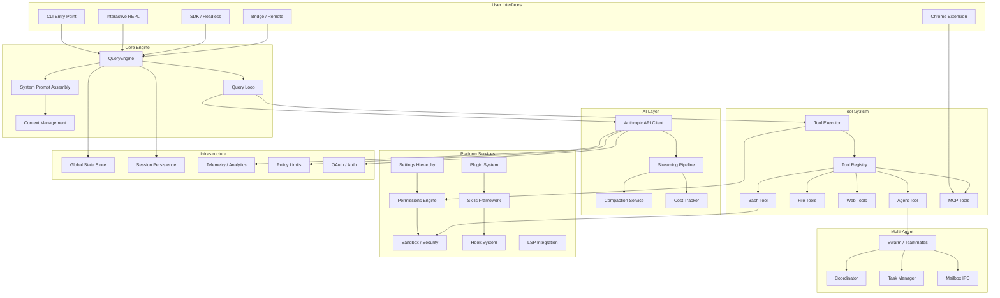
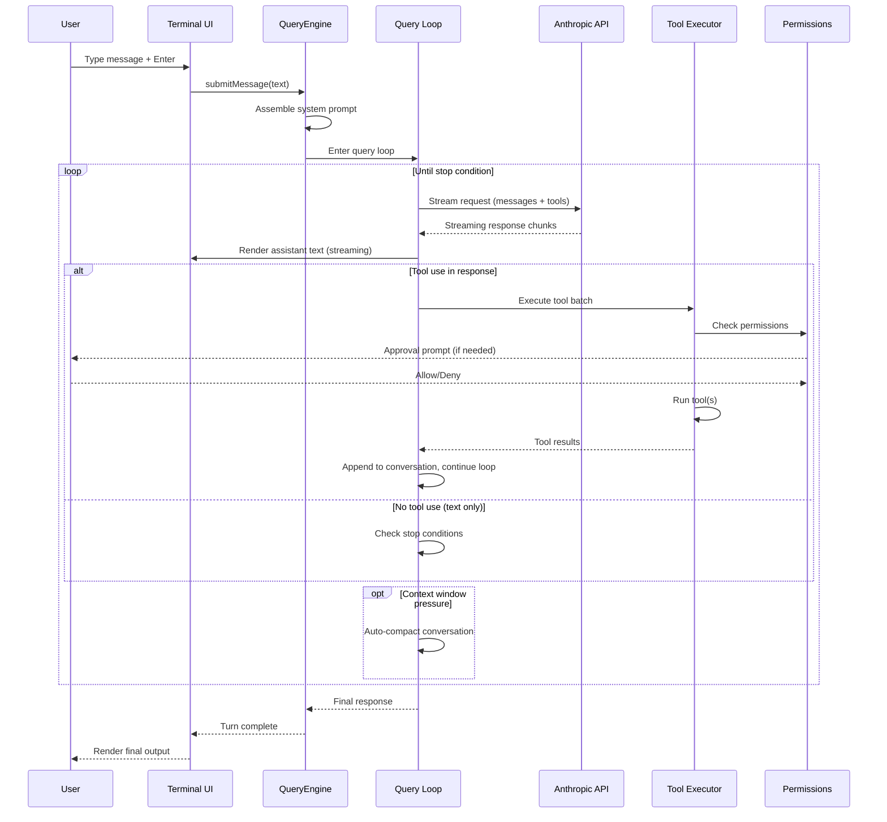

# Claude Code — Complete Technical Documentation

> **Codebase snapshot:** 2026-03-31 npm source map leak  
> **Scale:** ~1,900 TypeScript files, 512,000+ lines of code  
> **Runtime:** Bun  
> **Terminal UI:** React + Ink (React for CLI)  
> **Documentation generated:** 2026-04-03

---

## System-Level Architecture

Claude Code is a **terminal-native agentic AI assistant** that gives a Claude language model direct access to a developer's local environment — file system, shell, git, LSP, browser, and arbitrary MCP servers — through a tool-use loop. It is simultaneously:

- A **CLI application** (Commander.js argument parsing, subcommands)
- A **full-screen terminal UI** (React + Ink rendering to TTY)
- An **agentic runtime** (query loop with tool execution and multi-turn conversation)
- A **multi-agent orchestrator** (teammate spawning via tmux/iTerm/in-process)
- A **remote session host** (bridge protocol for web/mobile clients)
- An **MCP client** (connecting to arbitrary tool servers)
- An **extensible platform** (plugins, skills, hooks)

### High-Level Architecture Diagram

### Request Lifecycle (Single Turn)

---

## Documentation Index

### Architecture & Core

| # | Document | Description | Lines |
|---|----------|-------------|-------|
| [01](01-core-architecture.md) | **Core Architecture & Entry Points** | Application entry (`main.tsx`), bootstrap, state initialization, context assembly, entrypoints (CLI/SDK/MCP server), command registry. The foundation everything else builds on. | 818 |
| [11](11-data-flow-state.md) | **Data Flow & State Management** | Type system, message types, state store (custom Zustand-like), schemas, constants, session persistence (JSONL transcripts), project onboarding state machine, hook event types. | 1,151 |

### AI & LLM

| # | Document | Description | Lines |
|---|----------|-------------|-------|
| [02](02-llm-integration.md) | **LLM Integration Layer** | QueryEngine, the agentic query loop, API client (4 providers: Direct/Bedrock/Vertex/Foundry), streaming pipeline, 5-layer compaction system, prompt caching strategy, cost tracking, system prompt assembly, feature flags. **Critical for AI scientists.** | 1,102 |

### Agent Capabilities

| # | Document | Description | Lines |
|---|----------|-------------|-------|
| [03](03-tool-system.md) | **Tool System** | Tool abstraction (`Tool<I,O,P>` interface), 38+ tool implementations, execution lifecycle, permission model (5-step evaluation chain), deferred loading, MCP tool integration, concurrency control, result handling. | 984 |
| [04](04-multi-agent-system.md) | **Multi-Agent System** | Teammate/swarm orchestration, 3 backends (tmux/iTerm/in-process), file-based mailbox IPC, permission synchronization, coordinator mode, Agent tool spawn modes, git worktree isolation, failure recovery. **Critical for AI scientists.** | 889 |

### Protocol & Connectivity

| # | Document | Description | Lines |
|---|----------|-------------|-------|
| [05](05-bridge-remote-system.md) | **Bridge & Remote Sessions** | Two protocol generations (v1 env-based, v2 env-less), session lifecycle, JWT authentication, SSE transport, poll configuration, capacity management, UI status state machine, remote client, direct-connect server. | 1,239 |
| [06](06-mcp-integration.md) | **MCP Integration** | Model Context Protocol client: 7 config scopes, 6 transport types (stdio/SSE/HTTP/WebSocket/InProcess/SDK), connection lifecycle, OAuth 2.1 + PKCE, XAA enterprise SSO, tool discovery, elicitation, permission model. | 775 |

### User Interface

| # | Document | Description | Lines |
|---|----------|-------------|-------|
| [07](07-terminal-ui.md) | **Terminal UI System** | Custom Ink fork (React for CLI), Yoga layout engine, double-buffered rendering, 13-provider hierarchy, fullscreen layout (5 slots), keyboard pipeline, vim mode state machine, voice input, markdown rendering, virtual scrolling, theming, animation system. | 939 |

### Security

| # | Document | Description | Lines |
|---|----------|-------------|-------|
| [08](08-security-permissions.md) | **Security & Permissions** | 6 adversary threat model, 6 permission modes, rule evaluation engine, 5-tier settings hierarchy, workspace trust, CLAUDE.md trust chain, OS-level sandboxing (bubblewrap/sandbox-exec), bash command safety checks, auto-mode classifier, hook security, auth methods, policy limits, bridge JWT security. | 1,072 |

### Extensibility

| # | Document | Description | Lines |
|---|----------|-------------|-------|
| [09](09-plugins-skills-extensibility.md) | **Plugins, Skills & Extensibility** | Plugin marketplace/loading/caching, manifest schema, enterprise controls, skills framework (markdown+frontmatter), 28 hook events, 4 hook types, settings hierarchy, memory directory system, data migrations. | 1,049 |

### Services & Infrastructure

| # | Document | Description | Lines |
|---|----------|-------------|-------|
| [10](10-services-utilities.md) | **Services & Utilities** | API client deep dive, compaction service, LSP integration, policy limits, remote managed settings, OAuth service, analytics, 40+ utility modules (settings, permissions, swarm, deep link, Chrome integration, session storage). | 934 |

### Product Features

| # | Document | Description | Lines |
|---|----------|-------------|-------|
| [12](12-product-features.md) | **Product Features & Platform Integration** | Buddy companion (gacha system), voice input, vim mode, upstream proxy, deep linking, Chrome native messaging, native-TS ports, CLI subcommands, output styles, 90+ feature flags, server mode, dual-sink telemetry. | 966 |

---

## Key Architectural Patterns

### 1. Agentic Loop with Tool Use
The system runs a **while-loop** (`query.ts`) that repeatedly calls the LLM, executes any requested tools, appends results, and continues until the model produces a text-only response or hits a stop condition. This is the fundamental agentic pattern.

### 2. Multi-Provider API Abstraction
Supports 4 LLM providers (Anthropic Direct, AWS Bedrock, Google Vertex, Azure Foundry) through a unified client factory. Provider selection is transparent to the rest of the system.

### 3. 5-Layer Context Compaction
To manage the finite context window: snip compaction -> microcompact (cached edits) -> context collapse (marble-origami) -> auto-compact (LLM summarization) -> blocking limits. Each layer is progressively more aggressive.

### 4. Defense-in-Depth Security
Six permission modes, OS-level sandboxing, workspace trust dialogs, CLAUDE.md trust hierarchy, bash command pattern detection, auto-mode classifier with denial tracking, and enterprise policy overrides.

### 5. Build-Time Dead Code Elimination
90+ feature flags via `bun:bundle`'s `feature()` function enable tree-shaking of entire subsystems at build time, plus runtime GrowthBook/Statsig flags for gradual rollout.

### 6. Multi-Agent Orchestration
Three backend strategies (tmux panes, iTerm splits, in-process with AsyncLocalStorage isolation), file-based mailbox IPC, leader-based permission synchronization, and git worktree isolation for parallel work.

### 7. Custom React Terminal Renderer
A forked Ink framework with a custom Yoga layout engine (pure-TS port), double-buffered rendering, virtual scrolling, and concurrent React mode for smooth streaming output.

### 8. Layered Extensibility
Plugins (marketplace + bundled) -> Skills (markdown definitions) -> Hooks (28 event types) -> MCP servers (external tools) form a layered extension architecture.

---

## Reading Guide by Role

### For AI Scientists
Start with **[02 LLM Integration](02-llm-integration.md)** to understand the query loop, prompt engineering, and compaction strategies. Then **[04 Multi-Agent](04-multi-agent-system.md)** for orchestration patterns. **[03 Tool System](03-tool-system.md)** shows how the agent's capabilities are defined and constrained. **[08 Security](08-security-permissions.md)** covers the safety boundaries.

### For Principal/Senior Software Engineers
Start with **[01 Core Architecture](01-core-architecture.md)** for the full startup flow. **[11 Data Flow](11-data-flow-state.md)** for the type system and state management. **[03 Tool System](03-tool-system.md)** and **[10 Services](10-services-utilities.md)** for the implementation layer. **[07 Terminal UI](07-terminal-ui.md)** for the rendering architecture.

### For Infrastructure Engineers
Start with **[05 Bridge & Remote](05-bridge-remote-system.md)** for the remote session protocol. **[06 MCP](06-mcp-integration.md)** for external connectivity. **[10 Services](10-services-utilities.md)** for the service layer. **[12 Product Features](12-product-features.md)** for server mode, telemetry, and proxy architecture.

### For Security Engineers
Start with **[08 Security & Permissions](08-security-permissions.md)** — the definitive reference. Then **[05 Bridge](05-bridge-remote-system.md)** for remote auth. **[06 MCP](06-mcp-integration.md)** for OAuth and enterprise SSO. **[09 Extensibility](09-plugins-skills-extensibility.md)** for hook/plugin security controls.

---

## Statistics

| Metric | Value |
|--------|-------|
| Source files | ~1,900 |
| Lines of code | ~512,000+ |
| Language | TypeScript |
| Runtime | Bun |
| UI Framework | React + Ink (custom fork) |
| Tool count | 38+ native + unlimited MCP |
| Feature flags | 90+ build-time + runtime |
| Hook events | 28 |
| Documentation pages | 12 + index |
| Documentation lines | 11,918 |
