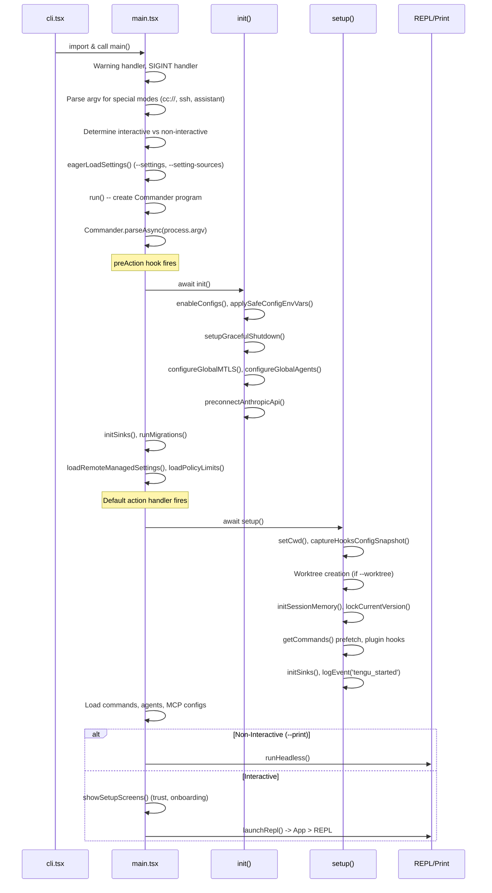
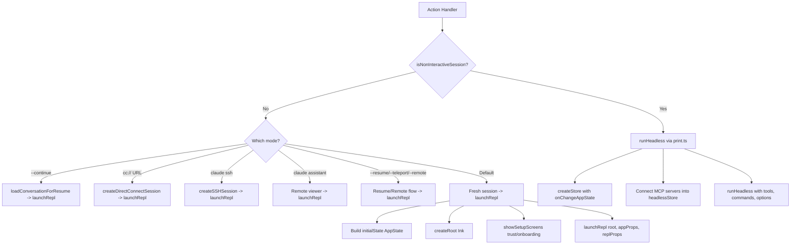
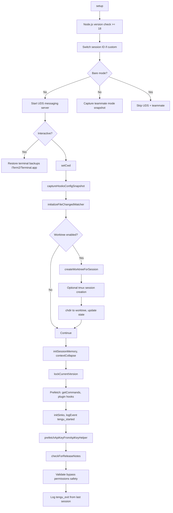
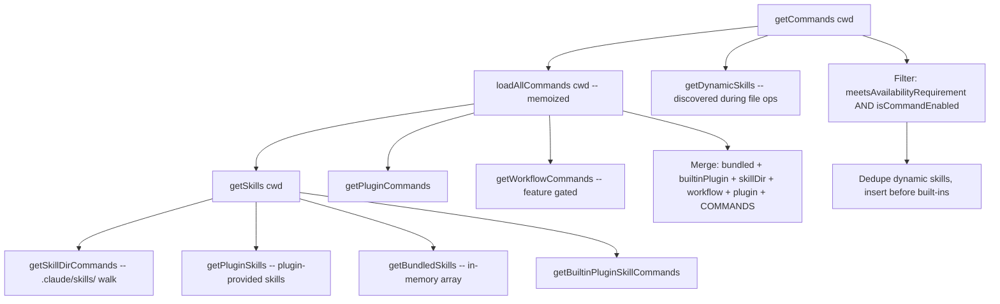

# Core Architecture & Entry Points

## Overview

Claude Code is a ~4,700-line-main-function TypeScript CLI application built on Bun runtime, React+Ink for terminal UI, and Commander.js for CLI argument parsing. The application supports multiple execution modes: interactive REPL, headless print mode (`-p`), MCP server mode, SDK bridge mode, background daemon mode, and SSH remote mode.

The architecture is split into several layers:

```
entrypoints/cli.tsx          -- Process entry: fast-path dispatch
     |
main.tsx                     -- Commander program, option parsing, orchestration
     |
  +--+--+--+--+
  |  |  |  |  |
init setup context commands state
```

---

## 1. `entrypoints/cli.tsx` -- Process Entry Point

**File:** `src/entrypoints/cli.tsx`  
**Responsibility:** Absolute first code that runs. Dispatches fast-path subcommands before loading the heavy `main.tsx` module.

### Top-Level Side Effects (lines 1-26)

Before any function runs, three side effects fire at module evaluation time:

1. **`COREPACK_ENABLE_AUTO_PIN=0`** -- Prevents corepack from modifying `package.json`.
2. **CCR heap size** -- Sets `--max-old-space-size=8192` for child processes in remote containers.
3. **Ablation baseline** -- When `CLAUDE_CODE_ABLATION_BASELINE` is set, disables thinking, compaction, auto-memory, and background tasks for A/B testing.

### Fast-Path Dispatch (`main()` function, line 33)

The `main()` function checks `process.argv` for subcommands that can bypass the full CLI initialization:

| Fast Path | Condition | Module Loaded |
|---|---|---|
| `--version` / `-v` | Single arg check | None -- uses `MACRO.VERSION` inline |
| `--dump-system-prompt` | Ant-only, feature-gated | `constants/prompts.js` |
| `--claude-in-chrome-mcp` | Exact argv match | `claudeInChrome/mcpServer.js` |
| `--chrome-native-host` | Exact argv match | `claudeInChrome/chromeNativeHost.js` |
| `--computer-use-mcp` | Feature-gated (`CHICAGO_MCP`) | `computerUse/mcpServer.js` |
| `--daemon-worker` | Feature-gated (`DAEMON`) | `daemon/workerRegistry.js` |
| `remote-control` / `rc` | Feature-gated (`BRIDGE_MODE`) | `bridge/bridgeMain.js` |
| `daemon` | Feature-gated (`DAEMON`) | `daemon/main.js` |
| `ps` / `logs` / `attach` / `kill` / `--bg` | Feature-gated (`BG_SESSIONS`) | `cli/bg.js` |

Only when no fast path matches does it `await import('../main.js')` and call `main()`.

### Design Pattern: Build-Time Dead Code Elimination

The codebase uses `feature()` from `bun:bundle` extensively. These are compile-time constants that Bun's bundler evaluates, allowing entire code paths (and their transitive imports) to be tree-shaken from external builds:

```typescript
// This entire block is removed from external builds
if (feature('DAEMON') && args[0] === 'daemon') { ... }
```

---

## 2. `main.tsx` -- The Application Core

**File:** `src/main.tsx` (~4,683 lines)  
**Responsibility:** Commander program definition, all CLI options, the preAction initialization hook, and the massive default action handler that branches into headless/interactive/resume/remote/SSH/assistant modes.

### Module-Level Side Effects (lines 1-20)

Three critical operations run during import (before any function call):

```typescript
profileCheckpoint('main_tsx_entry');     // 1. Mark entry time
startMdmRawRead();                       // 2. Fire MDM subprocess reads (plutil/reg)
startKeychainPrefetch();                 // 3. Fire macOS keychain reads in parallel
```

These run during the ~135ms of subsequent import evaluation, overlapping I/O with module loading.

### Startup Flow



### Commander Program Setup (`run()` function, line 884)

The Commander program is created with sorted help output and positional options enabled:

```typescript
const program = new CommanderCommand()
  .configureHelp(createSortedHelpConfig())
  .enablePositionalOptions();
```

#### PreAction Hook (line 907)

Every command (including subcommands) passes through this hook before execution:

1. **MDM + Keychain await** -- Joins async subprocess reads started at module import
2. **`init()`** -- Full initialization (configs, TLS, proxy, graceful shutdown)
3. **`initSinks()`** -- Attaches analytics/error logging sinks
4. **`--plugin-dir` wiring** -- Sets inline plugins for all subcommand paths
5. **`runMigrations()`** -- Runs versioned data migrations
6. **Remote settings** -- Fires non-blocking `loadRemoteManagedSettings()` and `loadPolicyLimits()`

#### Global Options

The program defines ~50+ options on the default command. Key categories:

| Category | Options |
|---|---|
| **Mode** | `-p/--print`, `--bare`, `--init-only`, `--init`, `--maintenance` |
| **Output** | `--output-format`, `--input-format`, `--json-schema`, `--verbose` |
| **Model** | `--model`, `--effort`, `--thinking`, `--fallback-model`, `--betas` |
| **Permissions** | `--permission-mode`, `--dangerously-skip-permissions`, `--allowed-tools`, `--disallowed-tools` |
| **Session** | `-c/--continue`, `-r/--resume`, `--session-id`, `-n/--name`, `--fork-session` |
| **Context** | `--system-prompt`, `--append-system-prompt`, `--add-dir`, `--mcp-config` |
| **Infrastructure** | `--settings`, `--setting-sources`, `--plugin-dir`, `--agents` |
| **Features** | `--chrome`, `--ide`, `--worktree`, `--tmux`, `--remote`, `--teleport` |

#### Subcommands

Registered via `.command()` calls after the default action. Key subcommands include:

- `mcp` -- MCP server management (`add`, `remove`, `list`, `serve`)
- `plugin` -- Plugin management (`install`, `remove`, `list`)
- `doctor` -- Diagnostic checks
- `config` -- Configuration management
- `auth` -- Authentication (`login`, `logout`, `status`)
- `open` -- Direct connect URL handler (feature-gated)
- `ssh` -- SSH remote mode stub (redirects through `_pendingSSH`)
- `assistant` -- Assistant mode stub (redirects through `_pendingAssistantChat`)

### Default Action Handler (line 1006)

The `.action()` handler is ~2,600 lines and is the core orchestration point. It proceeds through these phases:

#### Phase 1: Early Configuration (lines 1006-1260)

- Sets `CLAUDE_CODE_SIMPLE=1` if `--bare`
- Activates assistant/Kairos mode if settings + gate pass
- Extracts all CLI options into typed locals
- Processes worktree, tmux, teammate options
- Auto-sets formats for `--sdk-url` mode

#### Phase 2: Permission & Tool Setup (lines 1390-1780)

- `initialPermissionModeFromCLI()` -- Resolves permission mode from CLI flags + settings
- `initializeToolPermissionContext()` -- Builds the tool permission context (allowed/disallowed tools, mode)
- Parses `--mcp-config` into `dynamicMcpConfig`
- Sets up Chrome integration MCP servers
- Enforces enterprise MCP policies

#### Phase 3: Setup & Prefetch (lines 1900-2000)

```typescript
// Parallelized: setup() with commands + agents loading
const setupPromise = setup(preSetupCwd, ...);
const commandsPromise = getCommands(preSetupCwd);
const agentDefsPromise = getAgentDefinitionsWithOverrides(preSetupCwd);
await setupPromise;
const [commands, agentDefinitionsResult] = await Promise.all([
  commandsPromise ?? getCommands(currentCwd),
  agentDefsPromise ?? getAgentDefinitionsWithOverrides(currentCwd)
]);
```

#### Phase 4: Mode Branching (line 2584+)



### `launchRepl()` (src/replLauncher.tsx)

A thin bridge that dynamically imports `App` and `REPL` components and renders them via Ink:

```typescript
export async function launchRepl(root, appProps, replProps, renderAndRun) {
  const { App } = await import('./components/App.js');
  const { REPL } = await import('./screens/REPL.js');
  await renderAndRun(root, <App {...appProps}><REPL {...replProps} /></App>);
}
```

---

## 3. `bootstrap/state.ts` -- Global Process State

**File:** `src/bootstrap/state.ts`  
**Responsibility:** Singleton mutable state for the process lifetime. The "bootstrap" module is a leaf in the import DAG -- it has minimal dependencies to avoid circular imports.

### State Shape

The `State` type contains ~80+ fields organized into categories:

| Category | Key Fields |
|---|---|
| **Paths** | `originalCwd`, `projectRoot`, `cwd` |
| **Session** | `sessionId`, `parentSessionId`, `startTime`, `lastInteractionTime` |
| **Cost Tracking** | `totalCostUSD`, `totalAPIDuration`, `totalToolDuration`, `modelUsage` |
| **Model** | `mainLoopModelOverride`, `initialMainLoopModel`, `modelStrings` |
| **Mode Flags** | `isInteractive`, `kairosActive`, `isRemoteMode`, `sessionBypassPermissionsMode` |
| **Telemetry** | `meter`, `sessionCounter`, `locCounter`, `prCounter`, `costCounter`, etc. |
| **Hooks** | `registeredHooks` (SDK callbacks + plugin native hooks) |
| **Skills** | `invokedSkills` (Map for preservation across compaction) |
| **Cache** | `cachedClaudeMdContent`, `systemPromptSectionCache`, `planSlugCache` |

### Access Pattern

State is accessed through individual getter/setter functions exported from the module:

```typescript
export function getSessionId(): SessionId { return state.sessionId }
export function setOriginalCwd(cwd: string): void { state.originalCwd = cwd }
export function switchSession(id: SessionId): void { state.sessionId = id }
```

There are also signal-based reactive getters for certain fields:

```typescript
// createSignal provides subscribe/get/set with listener notification
export const [getIsNonInteractiveSession, setIsInteractive] = ...
```

### Design Principle

The file contains a prominent comment: **"DO NOT ADD MORE STATE HERE - BE JUDICIOUS WITH GLOBAL STATE"**. This state is process-scoped and not tied to React's rendering lifecycle. It exists because many subsystems (analytics, hooks, permissions, tools) need access to session identity and configuration without pulling in the full React component tree.

### Initialization

`getInitialState()` (line 260) resolves the real cwd via `realpathSync` with NFC normalization, then initializes all fields to sensible defaults. The session ID is a random UUID generated at process start.

---

## 4. `state/` -- Application State Management

**Directory:** `src/state/`  
**Responsibility:** React-integrated application state for the UI layer. Separate from `bootstrap/state.ts` which is process-level.

### Store (`state/store.ts`)

A minimal custom store implementation (35 lines):

```typescript
export type Store<T> = {
  getState: () => T
  setState: (updater: (prev: T) => T) => void
  subscribe: (listener: Listener) => () => void
}

export function createStore<T>(initialState: T, onChange?: OnChange<T>): Store<T>
```

Uses `Object.is()` for identity comparison. Listeners fire synchronously on state change. The `onChange` callback enables side-effect reactions (see `onChangeAppState`).

### AppState (`state/AppStateStore.ts`)

The `AppState` type is the comprehensive UI state, wrapped in `DeepImmutable<>` for the pure-data portion. Key sections:

| Section | Purpose |
|---|---|
| `settings` | Current `SettingsJson` snapshot |
| `toolPermissionContext` | Permission mode + allowed/disallowed tool rules |
| `mcp` | MCP server connections, tools, commands, resources |
| `plugins` | Enabled/disabled plugins, installation status |
| `tasks` | Active agent tasks (excluded from `DeepImmutable` -- contains functions) |
| `agentDefinitions` | Loaded agent definitions with overrides |
| `fileHistory` | File state snapshots for rewind |
| `attribution` | Git commit attribution state |
| `todos` | Per-agent todo lists |
| `speculation` | Speculative execution state (idle/active with abort handle) |
| `notifications` | Notification queue and current notification |

The `getDefaultAppState()` function provides factory defaults, including reading initial settings and thinking configuration.

### AppState Provider (`state/AppState.tsx`)

React context provider that wraps the store:

```typescript
export const AppStoreContext = React.createContext<AppStateStore | null>(null);

export function AppStateProvider({ children, initialState, onChangeAppState }) {
  const [store] = useState(() => createStore(initialState, onChangeAppState));
  // ...wraps in MailboxProvider, VoiceProvider (ant-only DCE)
}
```

### onChangeAppState (`state/onChangeAppState.ts`)

A side-effect handler called on every state transition. Key reactions:

- **Permission mode changes** -- Notifies CCR (Claude Code Remote) and SDK status stream when `toolPermissionContext.mode` changes
- **Model override changes** -- Syncs `mainLoopModelOverride` to bootstrap state
- **Settings changes** -- Applies config environment variables, reconfigures proxy agents, refreshes auth caches
- **API key changes** -- Clears credential caches for AWS/GCP/API key helper

### Selectors (`state/selectors.ts`)

Pure functions deriving computed state from `AppState`:

- `getViewedTeammateTask()` -- Returns the in-process teammate task being viewed
- `getActiveAgentForInput()` -- Determines input routing (leader vs viewed teammate vs named agent)

### React Context Directory (`src/context/`)

Distinct from `context.ts` (system prompt assembly). This directory contains React context providers for UI concerns:

| File | Purpose |
|---|---|
| `modalContext.tsx` | Tracks whether rendering inside a modal slot (for sizing) |
| `mailbox.tsx` | Message passing between components |
| `notifications.tsx` | Notification queue management |
| `overlayContext.tsx` | Overlay stack management |
| `promptOverlayContext.tsx` | Prompt overlay state |
| `QueuedMessageContext.tsx` | Queued message handling |
| `stats.tsx` | Performance statistics store |
| `voice.tsx` | Voice mode state (ant-only) |
| `fpsMetrics.tsx` | FPS tracking for rendering performance |

---

## 5. `setup.ts` -- Session Setup

**File:** `src/setup.ts`  
**Responsibility:** Post-init session setup. Called from the default action handler after `init()` completes.

### Function Signature

```typescript
export async function setup(
  cwd: string,
  permissionMode: PermissionMode,
  allowDangerouslySkipPermissions: boolean,
  worktreeEnabled: boolean,
  worktreeName: string | undefined,
  tmuxEnabled: boolean,
  customSessionId?: string | null,
  worktreePRNumber?: number,
  messagingSocketPath?: string,
): Promise<void>
```

### Execution Phases



### Key Details

1. **UDS Messaging** (lines 89-101): Creates a Unix Domain Socket for inter-process messaging. Gated on `feature('UDS_INBOX')` and skipped in `--bare` mode. Must complete before hooks fire so `$CLAUDE_CODE_MESSAGING_SOCKET` is available.

2. **Worktree Creation** (lines 175-285): Creates a git worktree for the session, optionally creating a tmux session. Supports both git-native worktrees and hook-delegated VCS worktrees.

3. **Hooks Snapshot** (line 166): `captureHooksConfigSnapshot()` takes a frozen copy of hook configuration so mid-session modifications to settings files can be detected (security measure).

4. **Background Jobs** (lines 287-304): Registers session memory, context collapse, version locking. These are synchronous registrations that execute lazily.

5. **Bypass Permissions Validation** (lines 396-441): Validates that `--dangerously-skip-permissions` is only used in sandboxed environments without internet access (Docker, Bubblewrap, or IS_SANDBOX=1).

---

## 6. `context.ts` -- System/User Context Assembly

**File:** `src/context.ts`  
**Responsibility:** Assembles the context objects prepended to each conversation. Memoized for the conversation lifetime.

### Context Types

#### System Context (`getSystemContext`)

Returns a key-value object cached for the conversation duration:

```typescript
export const getSystemContext = memoize(async (): Promise<{ [k: string]: string }> => {
  const gitStatus = /* skip in CCR or when git instructions disabled */
    ? null : await getGitStatus();
  const injection = feature('BREAK_CACHE_COMMAND') ? getSystemPromptInjection() : null;
  return {
    ...(gitStatus && { gitStatus }),
    ...(injection && { cacheBreaker: `[CACHE_BREAKER: ${injection}]` })
  };
});
```

**`getGitStatus()`** runs 5 parallel git commands:
1. `getBranch()` -- Current branch name
2. `getDefaultBranch()` -- Main/master detection
3. `git status --short` -- Working tree status (truncated at 2000 chars)
4. `git log --oneline -n 5` -- Recent commits
5. `git config user.name` -- Git user

#### User Context (`getUserContext`)

Returns CLAUDE.md content and current date:

```typescript
export const getUserContext = memoize(async (): Promise<{ [k: string]: string }> => {
  const claudeMd = shouldDisableClaudeMd ? null
    : getClaudeMds(filterInjectedMemoryFiles(await getMemoryFiles()));
  setCachedClaudeMdContent(claudeMd || null);
  return {
    ...(claudeMd && { claudeMd }),
    currentDate: `Today's date is ${getLocalISODate()}.`,
  };
});
```

### CLAUDE.md Resolution

The `getMemoryFiles()` function (from `utils/claudemd.js`) performs a directory walk to discover memory files. In `--bare` mode, auto-discovery is skipped but explicit `--add-dir` directories are honored. The cached content is stored in bootstrap state for the auto-mode classifier to read without creating import cycles.

### Cache Invalidation

Both context functions use `lodash/memoize` with clearable caches:

```typescript
export function setSystemPromptInjection(value: string | null): void {
  systemPromptInjection = value;
  getUserContext.cache.clear?.();
  getSystemContext.cache.clear?.();
}
```

---

## 7. `entrypoints/` -- Initialization & Mode Entry Points

**Directory:** `src/entrypoints/`

### `entrypoints/init.ts` -- Application Initialization

**Responsibility:** One-time process initialization. Memoized so it runs exactly once regardless of call count.

```typescript
export const init = memoize(async (): Promise<void> => { ... });
```

#### Initialization Sequence

1. **Enable configs** -- `enableConfigs()` validates and activates the configuration system
2. **Safe environment variables** -- `applySafeConfigEnvironmentVariables()` applies non-dangerous env vars before trust
3. **Extra CA certs** -- `applyExtraCACertsFromConfig()` must run before any TLS connection (Bun caches TLS store at boot)
4. **Graceful shutdown** -- `setupGracefulShutdown()` registers exit handlers
5. **1P event logging** -- Lazy-loaded OpenTelemetry initialization
6. **OAuth population** -- `populateOAuthAccountInfoIfNeeded()` for VSCode extension login path
7. **Remote settings promises** -- Initialized early so other systems can await them
8. **mTLS + Proxy** -- `configureGlobalMTLS()`, `configureGlobalAgents()`
9. **API preconnect** -- TCP+TLS handshake overlap with startup work
10. **Upstream proxy** -- CCR-only CONNECT relay for org-configured upstreams
11. **Windows shell** -- `setShellIfWindows()` for git-bash detection
12. **Cleanup registrations** -- LSP manager, session teams
13. **Scratchpad** -- `ensureScratchpadDir()` if enabled

#### Error Handling

`ConfigParseError` triggers an interactive Ink dialog (in interactive mode) or stderr output (in non-interactive mode).

### `entrypoints/cli.tsx` -- CLI Entry

Described in Section 1 above. The `main()` function is the process entry point.

### `entrypoints/mcp.ts` -- MCP Server Mode

Starts Claude Code as an MCP server (via `claude mcp serve`):

```typescript
export async function startMCPServer(cwd, debug, verbose): Promise<void> {
  const server = new Server({ name: 'claude/tengu', version: MACRO.VERSION }, ...);
  server.setRequestHandler(ListToolsRequestSchema, ...);
  server.setRequestHandler(CallToolRequestSchema, ...);
  await server.connect(new StdioServerTransport());
}
```

Exposes Claude Code's tool set as MCP tools, with a limited command set (`MCP_COMMANDS = [review]`).

### `entrypoints/sdk/` -- SDK Type Definitions

Contains the public SDK API types, split into:

| File | Contents |
|---|---|
| `coreTypes.ts` | Serializable types (messages, configs) |
| `coreSchemas.ts` | Zod schemas for validation |
| `controlSchemas.ts` | Control protocol schemas |

The main re-export hub is `entrypoints/agentSdkTypes.ts`, which re-exports from `sdk/coreTypes.ts` and `sdk/runtimeTypes.ts`.

### `startDeferredPrefetches()` (in main.tsx, line 388)

Called after the REPL has rendered its first frame. Defers non-critical work:

- `initUser()` -- User identity resolution
- `getUserContext()` / `getSystemContext()` -- Context memoization warm
- `getRelevantTips()` -- Tip prefetch
- AWS/GCP credential prefetch
- `countFilesRoundedRg()` -- File count for UI
- Analytics gates, model capabilities refresh
- Settings/skill change detectors
- Event loop stall detector (ant-only)

All skipped in `--bare` mode.

---

## 8. `commands.ts` and `commands/` -- Command System

### `commands.ts` -- Command Registry

**File:** `src/commands.ts` (~755 lines)  
**Responsibility:** Central registry for all slash commands. Handles command loading, filtering, availability checks, and caching.

#### Command Type

Commands use a discriminated union (defined in `types/command.ts`):

```typescript
type Command =
  | { type: 'prompt'; ... }    // Expands to text sent to model
  | { type: 'local'; ... }     // Executes locally, returns text/compact/skip
  | { type: 'local-jsx'; ... } // Renders Ink UI component
```

`PromptCommand` includes:
- `getPromptForCommand(args, context)` -- Returns `ContentBlockParam[]`
- `source` -- Origin: `builtin`, `plugin`, `mcp`, `bundled`, or a `SettingSource`
- `loadedFrom` -- Discovery mechanism: `skills`, `commands_DEPRECATED`, `plugin`, `bundled`
- `availability` -- Auth requirements: `'claude-ai'` or `'console'`
- `context` -- Execution mode: `'inline'` (default) or `'fork'` (sub-agent)

#### Command Loading (`getCommands()`)



The `COMMANDS()` function (line 258) is a memoized factory returning the static built-in command array (~80+ commands). It's a function (not a constant) because it reads config at call time.

#### Availability Filtering

```typescript
export function meetsAvailabilityRequirement(cmd: Command): boolean {
  if (!cmd.availability) return true;
  for (const a of cmd.availability) {
    switch (a) {
      case 'claude-ai': return isClaudeAISubscriber();
      case 'console': return !isClaudeAISubscriber() && !isUsing3PServices() && isFirstPartyAnthropicBaseUrl();
    }
  }
  return false;
}
```

Not memoized because auth state can change mid-session (e.g., after `/login`).

#### Internal-Only Commands

`INTERNAL_ONLY_COMMANDS` (line 225) lists commands available only when `USER_TYPE === 'ant'` and `!IS_DEMO`. These are stripped from external builds.

#### Remote/Bridge Safety

Two allowlists control command availability in remote contexts:

- `REMOTE_SAFE_COMMANDS` -- Commands safe for `--remote` mode (local TUI state only)
- `BRIDGE_SAFE_COMMANDS` -- Commands safe to execute from mobile/web bridge clients

```typescript
export function isBridgeSafeCommand(cmd: Command): boolean {
  if (cmd.type === 'local-jsx') return false;  // Ink UI blocked
  if (cmd.type === 'prompt') return true;       // Skills expand to text
  return BRIDGE_SAFE_COMMANDS.has(cmd);          // Explicit allowlist
}
```

#### Cache Invalidation

```typescript
export function clearCommandsCache(): void {
  clearCommandMemoizationCaches();  // loadAllCommands, skill tool commands
  clearPluginCommandCache();        // Plugin-provided commands
  clearPluginSkillsCache();         // Plugin-provided skills
  clearSkillCaches();               // .claude/skills/ directory cache
}
```

### `commands/` Directory

Contains ~130+ command implementations. Each command exports a `Command` object. Representative categories:

| Category | Commands |
|---|---|
| **Session** | `resume`, `session`, `clear`, `compact`, `exit` |
| **Navigation** | `branch`, `files`, `diff`, `rewind` |
| **Configuration** | `config`, `model`, `theme`, `color`, `vim`, `keybindings` |
| **Development** | `commit`, `review`, `pr_comments`, `autofix-pr` |
| **Infrastructure** | `mcp`, `plugin`, `hooks`, `permissions` |
| **Analysis** | `cost`, `usage`, `stats`, `insights` |
| **Features** | `voice`, `chrome`, `desktop`, `mobile`, `tasks` |

Commands use lazy loading for heavy implementations:

```typescript
const usageReport: Command = {
  type: 'prompt',
  name: 'insights',
  async getPromptForCommand(args, context) {
    const real = (await import('./commands/insights.js')).default;
    return real.getPromptForCommand(args, context);
  },
};
```

Feature-gated commands use conditional `require()` for build-time DCE:

```typescript
const voiceCommand = feature('VOICE_MODE')
  ? require('./commands/voice/index.js').default
  : null;
```

---

## 9. Key Architectural Patterns

### Memoization Strategy

The codebase uses `lodash/memoize` extensively for expensive async operations. Key memoized functions:

| Function | Cache Key | Invalidation |
|---|---|---|
| `getSystemContext()` | None (singleton) | `setSystemPromptInjection()` |
| `getUserContext()` | None (singleton) | `setSystemPromptInjection()` |
| `loadAllCommands()` | `cwd` | `clearCommandsCache()` |
| `getSkillToolCommands()` | `cwd` | `clearCommandMemoizationCaches()` |
| `init()` | None (singleton) | Never -- runs once |

### Parallelization

Startup aggressively parallelizes independent I/O:

```typescript
// MDM reads + keychain reads overlap with module imports (~135ms)
startMdmRawRead();
startKeychainPrefetch();

// setup() overlaps with command/agent loading
const setupPromise = setup(...);
const commandsPromise = getCommands(preSetupCwd);
const agentDefsPromise = getAgentDefinitionsWithOverrides(preSetupCwd);
await setupPromise;
```

### Feature Flags / Dead Code Elimination

Two-tier gating:

1. **Build-time**: `feature('FLAG')` from `bun:bundle` -- evaluated at compile time, enabling tree-shaking of entire code paths and their transitive imports
2. **Runtime**: GrowthBook feature flags -- fetched from server, cached to disk, with stale-while-revalidate semantics

### Bootstrap Isolation

`bootstrap/state.ts` is kept as a leaf module with minimal imports to prevent circular dependencies. The `custom-rules/bootstrap-isolation` ESLint rule enforces this.

### Bare Mode

The `--bare` flag (exposed as `CLAUDE_CODE_SIMPLE=1`) provides a minimal execution mode:

- Skips: hooks, LSP, plugin sync, attribution, auto-memory, background prefetches, keychain reads, CLAUDE.md auto-discovery
- Honors: `--system-prompt`, `--add-dir`, `--mcp-config`, `--settings`, `--agents`, `--plugin-dir`, skill resolution via `/skill-name`
- Auth: Strictly `ANTHROPIC_API_KEY` or `apiKeyHelper` via `--settings` (no OAuth/keychain)

Gating is distributed -- each subsystem checks `isBareMode()` at its entry point.

### Migrations

Versioned migrations run once per `CURRENT_MIGRATION_VERSION` bump (line 325):

```typescript
const CURRENT_MIGRATION_VERSION = 11;
function runMigrations(): void {
  if (getGlobalConfig().migrationVersion !== CURRENT_MIGRATION_VERSION) {
    migrateAutoUpdatesToSettings();
    migrateBypassPermissionsAcceptedToSettings();
    // ... 10 more migrations
    saveGlobalConfig(prev => ({ ...prev, migrationVersion: CURRENT_MIGRATION_VERSION }));
  }
}
```

---

## 10. Configuration Hierarchy

Configuration flows through multiple layers with defined precedence:

```
policySettings (enterprise, highest priority)
  > flagSettings (--settings flag)
    > localSettings (.claude/settings.local.json)
      > projectSettings (.claude/settings.json)
        > userSettings (~/.claude/settings.json, lowest priority)
```

The `--setting-sources` flag can restrict which sources are loaded. `--bare` mode respects all configured sources but skips auto-discovery.

---

## 11. Process Lifecycle Summary

```
1. cli.tsx: Fast-path dispatch or import main.tsx
2. main.tsx: Module-level profiling + MDM/keychain prefetch
3. main(): Warning handler, argv rewriting, interactive detection
4. run(): Commander program creation
5. preAction: init() + sinks + migrations + remote settings
6. action: Option extraction, permission setup, MCP config parsing
7. setup(): CWD, hooks snapshot, worktree, session memory, analytics
8. Branch:
   a. Headless: createStore -> runHeadless (print.ts)
   b. Interactive: createRoot(Ink) -> showSetupScreens -> launchRepl
9. REPL renders -> startDeferredPrefetches()
10. User interaction loop
11. gracefulShutdown: flush analytics, close MCP, cleanup teams
```
