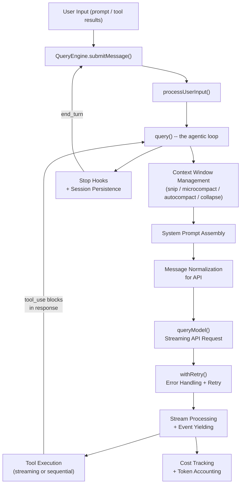
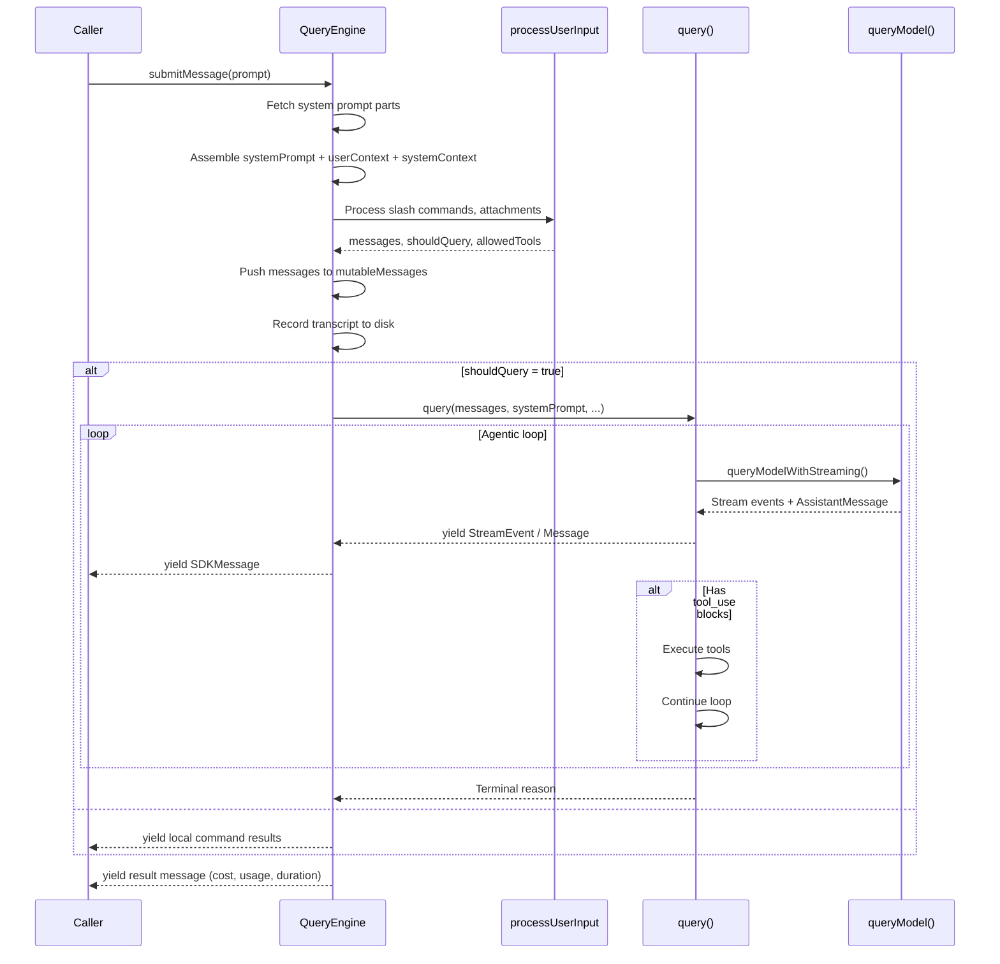
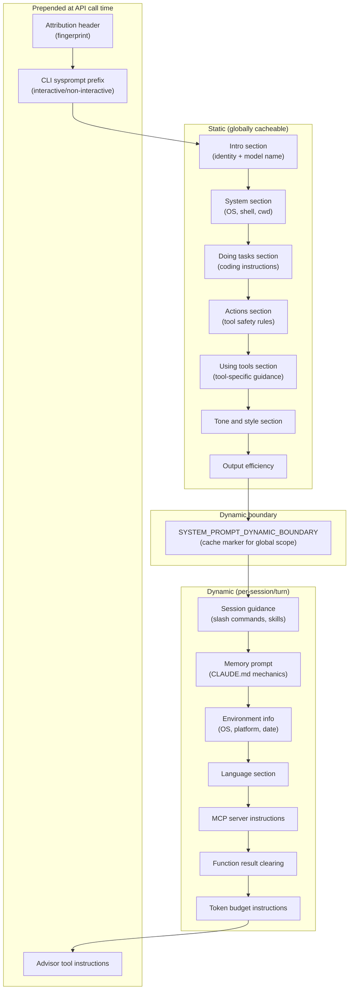
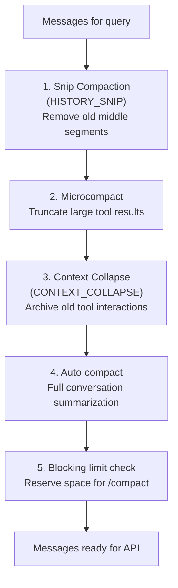
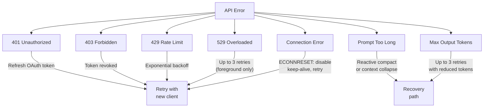

# AI/LLM Integration Layer

This document describes how Claude Code communicates with language models -- the core engine that converts user prompts into API requests, streams responses, manages context windows, tracks costs, and orchestrates multi-turn agentic conversations.

---

## Table of Contents

1. [Architecture Overview](#architecture-overview)
2. [QueryEngine: Conversation Lifecycle Manager](#queryengine-conversation-lifecycle-manager)
3. [The Query Loop](#the-query-loop)
4. [API Client Layer](#api-client-layer)
5. [Message Formatting and Normalization](#message-formatting-and-normalization)
6. [System Prompt Assembly](#system-prompt-assembly)
7. [Context Window Management](#context-window-management)
8. [Token Counting and Cost Tracking](#token-counting-and-cost-tracking)
9. [Error Handling and Retry Logic](#error-handling-and-retry-logic)
10. [Feature Flags and Gating](#feature-flags-and-gating)
11. [Streaming vs Non-Streaming Execution](#streaming-vs-non-streaming-execution)
12. [Session History and Persistence](#session-history-and-persistence)

---

## Architecture Overview

The LLM integration layer is structured as a pipeline from user input to API response. The flow passes through several distinct stages, each with well-defined responsibilities.



### Key source files

| File | Purpose |
|------|---------|
| `src/QueryEngine.ts` | Conversation lifecycle, session state, SDK interface |
| `src/query.ts` | The agentic query loop (streaming, tool execution, compaction) |
| `src/query/config.ts` | Immutable per-query configuration snapshot |
| `src/query/tokenBudget.ts` | Token budget tracking for `+500k` style continuations |
| `src/query/stopHooks.ts` | Post-turn hooks (memory extraction, dreams, prompt suggestions) |
| `src/services/api/claude.ts` | API request construction, streaming, message conversion |
| `src/services/api/client.ts` | Anthropic SDK client instantiation (1P, Bedrock, Vertex, Foundry) |
| `src/services/api/withRetry.ts` | Retry logic with exponential backoff, model fallback |
| `src/services/api/errors.ts` | Error classification and user-facing error messages |
| `src/services/compact/autoCompact.ts` | Automatic compaction trigger logic |
| `src/services/compact/compact.ts` | Conversation summarization (full and partial) |
| `src/services/compact/microCompact.ts` | Per-tool-result token reduction |
| `src/services/compact/prompt.ts` | Compaction prompt templates |
| `src/cost-tracker.ts` | Session-wide cost and token accounting |
| `src/costHook.ts` | React hook for displaying cost on exit |
| `src/context.ts` | User context (CLAUDE.md) and system context (git status) |
| `src/constants/prompts.ts` | System prompt construction and section assembly |
| `src/utils/queryContext.ts` | System prompt parts fetching |
| `src/services/tokenEstimation.ts` | Token count estimation (API and heuristic) |

---

## QueryEngine: Conversation Lifecycle Manager

**File:** `src/QueryEngine.ts`

`QueryEngine` is the top-level class that owns a single conversation's state. It is instantiated once per conversation and exposes `submitMessage()` as an `AsyncGenerator` that yields `SDKMessage` events to the caller (the SDK harness or the REPL).

### Configuration

The `QueryEngineConfig` captures everything needed for a conversation:

```typescript
type QueryEngineConfig = {
  cwd: string
  tools: Tools
  commands: Command[]
  mcpClients: MCPServerConnection[]
  agents: AgentDefinition[]
  canUseTool: CanUseToolFn
  getAppState: () => AppState
  setAppState: (f: (prev: AppState) => AppState) => void
  initialMessages?: Message[]
  readFileCache: FileStateCache
  customSystemPrompt?: string        // Replaces the default system prompt entirely
  appendSystemPrompt?: string        // Appended after the system prompt
  userSpecifiedModel?: string
  fallbackModel?: string
  thinkingConfig?: ThinkingConfig    // 'adaptive', 'enabled', or 'disabled'
  maxTurns?: number
  maxBudgetUsd?: number
  taskBudget?: { total: number }     // API-side task budget (output_config.task_budget)
  jsonSchema?: Record<string, unknown>
  snipReplay?: (msg, store) => ...   // Snip-boundary handler (HISTORY_SNIP)
}
```

### Persistent state across turns

`QueryEngine` maintains the following across multiple `submitMessage()` calls:

- **`mutableMessages: Message[]`** -- The full conversation history. New messages are pushed after `processUserInput()` and after each query loop iteration.
- **`readFileState: FileStateCache`** -- Cache of file contents to avoid redundant disk reads.
- **`totalUsage: NonNullableUsage`** -- Cumulative API usage for the session.
- **`permissionDenials: SDKPermissionDenial[]`** -- All tool permission denials for SDK reporting.
- **`discoveredSkillNames: Set<string>`** -- Turn-scoped skill discovery tracking (cleared at each `submitMessage()` entry).
- **`loadedNestedMemoryPaths: Set<string>`** -- Memory files already loaded (avoids re-injection).

### submitMessage() flow



---

## The Query Loop

**File:** `src/query.ts`

The `query()` function is the core agentic loop. It is an `AsyncGenerator` that yields stream events, messages, and tombstones, and returns a `Terminal` reason when the turn completes.

### Loop structure (per iteration)

1. **Snip compaction** (`HISTORY_SNIP` feature flag) -- Removes old conversation segments from the middle of history, freeing tokens while preserving the most recent context.

2. **Microcompact** -- Reduces token usage within individual tool results by truncating large outputs from specific tools (file reads, bash output, grep results, etc.).

3. **Context collapse** (`CONTEXT_COLLAPSE` feature flag) -- Projects a collapsed view of message history, archiving older tool interactions into summaries without a full recompact.

4. **Auto-compact** -- If total token usage exceeds a threshold (effective context window minus 13K buffer), triggers a full compaction that summarizes the conversation.

5. **Token blocking limit** -- If usage exceeds the blocking limit (effective context window minus 3K), yields an error message and stops. This reserves space for manual `/compact`.

6. **API call** -- Calls `queryModelWithStreaming()` with the processed messages, system prompt, and tool schemas.

7. **Stream processing** -- Iterates over streamed events, yielding them to the caller. Withholds recoverable errors (prompt-too-long, max-output-tokens) until recovery is attempted.

8. **Tool execution** -- If the response contains `tool_use` blocks, executes tools either via `StreamingToolExecutor` (parallel, as blocks arrive) or sequentially (legacy path).

9. **Recovery paths** -- Handles reactive compact (on prompt-too-long from API), max-output-tokens recovery (up to 3 retries), and context collapse overflow draining.

10. **Stop hooks** -- If no tool use, runs post-turn hooks: memory extraction, auto-dream, prompt suggestions, task completion checks, teammate idle checks.

### Mutable state across iterations

```typescript
type State = {
  messages: Message[]
  toolUseContext: ToolUseContext
  autoCompactTracking: AutoCompactTrackingState | undefined
  maxOutputTokensRecoveryCount: number
  hasAttemptedReactiveCompact: boolean
  maxOutputTokensOverride: number | undefined
  pendingToolUseSummary: Promise<ToolUseSummaryMessage | null> | undefined
  stopHookActive: boolean | undefined
  turnCount: number
  transition: Continue | undefined       // Why the previous iteration continued
}
```

### Query configuration snapshot

`buildQueryConfig()` (in `src/query/config.ts`) captures immutable state once at `query()` entry:

```typescript
type QueryConfig = {
  sessionId: SessionId
  gates: {
    streamingToolExecution: boolean   // Statsig: tengu_streaming_tool_execution2
    emitToolUseSummaries: boolean     // CLAUDE_CODE_EMIT_TOOL_USE_SUMMARIES env
    isAnt: boolean                    // USER_TYPE === 'ant'
    fastModeEnabled: boolean          // !CLAUDE_CODE_DISABLE_FAST_MODE
  }
}
```

This is intentionally separate from `feature()` gates, which are tree-shaking boundaries and must stay inline.

### Token budget continuations

When a user specifies a token target (e.g. `+500k`), the `TOKEN_BUDGET` feature enables auto-continuation:

```typescript
// src/query/tokenBudget.ts
function checkTokenBudget(tracker, agentId, budget, globalTurnTokens): TokenBudgetDecision
```

The budget tracker monitors output tokens per turn. If below 90% of the budget, it injects a nudge message and continues the loop. It stops when:
- 90% of the budget is consumed
- Diminishing returns detected (fewer than 500 tokens produced in last two checks after 3+ continuations)
- The agent is a subagent (budgets only apply to the main thread)

---

## API Client Layer

### Client instantiation

**File:** `src/services/api/client.ts`

The `getAnthropicClient()` function creates an `Anthropic` SDK client configured for the current provider:

| Provider | Auth mechanism | Key env vars |
|----------|---------------|-------------|
| **First-party (1P)** | `ANTHROPIC_API_KEY` or OAuth tokens | `ANTHROPIC_API_KEY` |
| **AWS Bedrock** | AWS SDK credentials | `AWS_REGION`, `AWS_DEFAULT_REGION` |
| **Google Vertex AI** | GCP credentials via `google-auth-library` | `ANTHROPIC_VERTEX_PROJECT_ID`, `CLOUD_ML_REGION` |
| **Azure Foundry** | API key or Azure AD `DefaultAzureCredential` | `ANTHROPIC_FOUNDRY_RESOURCE`, `ANTHROPIC_FOUNDRY_API_KEY` |
| **Claude.ai OAuth** | OAuth access token | (automatic via `/login`) |

The client adds standard headers to every request:

```typescript
const defaultHeaders = {
  'x-app': 'cli',
  'User-Agent': getUserAgent(),
  'X-Claude-Code-Session-Id': getSessionId(),
  // Plus: container ID, remote session ID, client app name
}
```

### Request construction

**File:** `src/services/api/claude.ts`

The `queryModel()` generator function builds the full API request. The request construction pipeline:


The `paramsFromContext()` closure (called per retry attempt) assembles the final `BetaMessageStreamParams`:

```typescript
{
  model: normalizeModelStringForAPI(options.model),
  messages: addCacheBreakpoints(messagesForAPI, ...),
  system: buildSystemPromptBlocks(systemPrompt, ...),
  tools: [...toolSchemas, ...extraToolSchemas],
  tool_choice: options.toolChoice,
  betas: betasParams,                     // Feature-gated beta headers
  metadata: getAPIMetadata(),             // device_id, account_uuid, session_id
  max_tokens: maxOutputTokens,
  thinking: { type: 'adaptive' } | { type: 'enabled', budget_tokens: N },
  temperature: undefined | N,             // Omitted when thinking is enabled
  context_management: { ... },            // API-side microcompact (optional)
  output_config: { effort, task_budget, format },
  speed: 'fast' | undefined,             // Fast mode
}
```

### Prompt caching strategy

Prompt caching is a critical optimization. The system places `cache_control: { type: 'ephemeral' }` markers at strategic points:

1. **System prompt** -- The last block of the system prompt array gets a cache marker.
2. **Tool schemas** -- The last tool in the array gets a cache marker (unless MCP tools break global caching).
3. **Messages** -- The last user message and the last assistant message each get cache markers on their final content block.

Cache TTL can be elevated to `1h` for eligible users (subscribers, internal) based on a GrowthBook allowlist of query sources.

**Global cache scope** (`prompt_caching_scope` beta): When enabled, system prompt cache is shared across sessions. Disabled when MCP tools are present (per-user tools break sharing).

**Cached microcompact** (`CACHED_MICROCOMPACT` feature): Uses `cache_edits` blocks to delete tool result content from the server-side cache without re-uploading the full prompt. Latched per-session to avoid cache key changes.

### Sticky beta header latching

Beta headers that affect the server-side cache key are "latched" -- once sent in a session, they continue being sent even if the underlying feature toggles off. This prevents mid-session cache key changes that would bust ~50-70K tokens of cached prompt:

- `afkHeaderLatched` -- AFK/auto mode
- `fastModeHeaderLatched` -- Fast mode
- `cacheEditingHeaderLatched` -- Cached microcompact
- `thinkingClearLatched` -- Thinking block clearing (after 1h cache TTL expiry)

Latches are cleared on `/clear` and `/compact`.

### Thinking configuration

The thinking parameter selection follows strict rules:

1. If `CLAUDE_CODE_DISABLE_THINKING` is set, thinking is disabled entirely.
2. If the model supports adaptive thinking (Sonnet 4.6+), always use `{ type: 'adaptive' }` -- no budget cap.
3. Otherwise, use `{ type: 'enabled', budget_tokens: N }` where N is `min(maxOutputTokens - 1, modelDefault)`.
4. Temperature is omitted when thinking is enabled (API requires `temperature: 1`, which is the default).

### Effort configuration

The `effort` parameter (via `output_config.effort`) controls model reasoning depth:

```typescript
function configureEffortParams(effortValue, outputConfig, extraBodyParams, betas, model)
```

- String effort levels (`'low'`, `'medium'`, `'high'`) are sent directly.
- Numeric overrides (internal only) are sent via `anthropic_internal.effort_override`.

---

## Message Formatting and Normalization

### Internal message types

The internal `Message` type is a discriminated union covering all message roles:

- **`UserMessage`** -- User input, tool results, meta messages. Contains `message.content` as string or `ContentBlockParam[]`.
- **`AssistantMessage`** -- Model responses. Contains `message.content` as `ContentBlock[]` (text, tool_use, thinking, redacted_thinking blocks). Also carries `message.usage` for token accounting.
- **`AttachmentMessage`** -- Context injections (CLAUDE.md, skill discovery, MCP instructions, deferred tools). Normalized into user messages for the API.
- **`SystemMessage`** -- Internal system events (compact boundaries, local commands, warnings). Subtypes include `compact_boundary`, `local_command`, `warning`.
- **`ProgressMessage`** -- Tool execution progress updates. Filtered out before API calls.

### Normalization for the API

`normalizeMessagesForAPI()` transforms internal messages into the alternating user/assistant sequence the API expects:

1. Filters out system messages, progress messages, and attachment messages.
2. Merges consecutive same-role messages (the API requires strict alternation).
3. Injects attachment content into user messages.
4. Strips advisor blocks when the advisor beta is not active.
5. Strips tool_reference blocks when tool search is not supported.
6. Ensures every `tool_use` block has a matching `tool_result` (via `ensureToolResultPairing()`).

### Message conversion for API

```typescript
// User messages
function userMessageToMessageParam(message, addCache, enablePromptCaching, querySource): MessageParam
// -> { role: 'user', content: string | ContentBlockParam[] }

// Assistant messages
function assistantMessageToMessageParam(message, addCache, enablePromptCaching, querySource): MessageParam
// -> { role: 'assistant', content: ContentBlock[] }
//    Cache markers placed on last non-thinking, non-connector block
```

### Tool use format

Tool calls arrive from the model as `tool_use` blocks within assistant messages:

```json
{
  "type": "tool_use",
  "id": "toolu_01ABC...",
  "name": "Read",
  "input": { "file_path": "/path/to/file" }
}
```

Tool results are sent back as `tool_result` blocks within user messages:

```json
{
  "type": "tool_result",
  "tool_use_id": "toolu_01ABC...",
  "content": "file contents...",
  "is_error": false
}
```

### Context injection via user/system messages

The system prepends user context and appends system context to the system prompt:

```typescript
// src/utils/api.ts
function prependUserContext(messages, userContext): Message[]
function appendSystemContext(systemPrompt, systemContext): SystemPrompt
```

User context (CLAUDE.md content, current date) is prepended as a synthetic user message with `isMeta: true`. System context (git status, cache breaker) is appended to the system prompt array.

### Media handling

The API enforces a maximum of 100 media items (images + documents) per request. `stripExcessMediaItems()` removes the oldest media items to stay within this limit. For compaction, `stripImagesFromMessages()` replaces all image/document blocks with `[image]`/`[document]` text markers to avoid the compaction API call itself hitting limits.

---

## System Prompt Assembly

**Files:** `src/constants/prompts.ts`, `src/context.ts`, `src/utils/queryContext.ts`

The system prompt is the largest and most carefully structured part of the API request. It is assembled in layers, with explicit attention to prompt caching -- sections are ordered so that stable content comes first (cached) and dynamic content last (varies per turn).

### Assembly pipeline



### Section caching strategy

Sections are categorized as:

- **`systemPromptSection(name, compute)`** -- Cached. Computed once and reused across turns.
- **`DANGEROUS_uncachedSystemPromptSection(name, compute, reason)`** -- Recomputed every turn. Used for MCP instructions (servers connect/disconnect between turns). The naming convention flags potential cache-busting.

### User context (`context.ts`)

```typescript
getUserContext() -> {
  claudeMd: string | null,    // Concatenated CLAUDE.md files from cwd, parents, ~/.claude/
  currentDate: string          // "Today's date is 2026-04-03."
}

getSystemContext() -> {
  gitStatus: string | null,    // Branch, status, recent commits snapshot
  cacheBreaker?: string        // Ant-only: for debugging cache behavior
}
```

The git status is captured once at session start (memoized) and does not update during the conversation. This is explicitly noted in the prompt itself.

### Custom system prompt behavior

When `customSystemPrompt` is provided (common in SDK usage):
- The entire `defaultSystemPrompt` is skipped.
- `systemContext` (git status) is skipped.
- `userContext` (CLAUDE.md, date) is still loaded.
- Memory mechanics prompt is injected if `CLAUDE_COWORK_MEMORY_PATH_OVERRIDE` is set.
- `appendSystemPrompt` is still appended.

### Simplified mode

When `CLAUDE_CODE_SIMPLE` is set, the system prompt is reduced to a single line:

```
You are Claude Code, Anthropic's official CLI for Claude.

CWD: /path/to/project
Date: 2026-04-03
```

---

## Context Window Management

Context window management is a multi-layered system that keeps the conversation within the model's context limits while preserving as much useful information as possible.



### Layer 1: Snip compaction

**Feature flag:** `HISTORY_SNIP`

Removes entire message segments from the middle of the conversation, keeping the beginning (system context, initial request) and the end (recent work). The `snipTokensFreed` value is propagated downstream so autocompact's threshold check accounts for what snip already removed.

### Layer 2: Microcompact

**File:** `src/services/compact/microCompact.ts`

Operates on individual tool results within messages. Only compacts specific tool types:

- `Read` (file read)
- `Bash` / shell tools
- `Grep`, `Glob`
- `WebSearch`, `WebFetch`
- `Edit`, `Write`

Large tool results are truncated to reduce token usage without losing the conversation structure. Images are estimated at ~2000 tokens each.

**Time-based microcompact** (`timeBasedMCConfig`): Additional configuration for time-based clearing of old tool results, replacing content with `[Old tool result content cleared]`.

**Cached microcompact** (`CACHED_MICROCOMPACT` feature, internal only): Instead of client-side truncation, sends `cache_edits` blocks that instruct the API server to delete content from the cached prompt. This avoids re-uploading the full prompt on each turn.

### Layer 3: Context collapse

**Feature flag:** `CONTEXT_COLLAPSE`

A more granular alternative to full compaction. Collapses old tool interactions into summaries while keeping the REPL's full history intact for UI scrollback. The collapsed view is a read-time projection applied before each API call.

When context collapse is enabled, it suppresses proactive autocompact (since collapse IS the context management system). It triggers at ~90% of the effective context window.

### Layer 4: Auto-compact

**File:** `src/services/compact/autoCompact.ts`

The primary context management mechanism. Triggers when token usage exceeds the auto-compact threshold.

**Threshold calculation:**

```
effectiveContextWindow = contextWindowForModel - min(maxOutputTokens, 20_000)
autoCompactThreshold   = effectiveContextWindow - 13_000   (AUTOCOMPACT_BUFFER_TOKENS)
```

The threshold can be overridden via `CLAUDE_AUTOCOMPACT_PCT_OVERRIDE` (percentage of effective window).

**Guard conditions:**

- Disabled if `DISABLE_COMPACT` or `DISABLE_AUTO_COMPACT` env vars are set
- Disabled if `autoCompactEnabled` is false in user settings
- Skipped for `compact` and `session_memory` query sources (would deadlock)
- Skipped when `CONTEXT_COLLAPSE` is enabled (collapse owns context management)
- Skipped when `REACTIVE_COMPACT` reactive-only mode is active
- Circuit breaker: stops after 3 consecutive failures (`MAX_CONSECUTIVE_AUTOCOMPACT_FAILURES`)

**Compaction process** (`compactConversation()` in `src/services/compact/compact.ts`):

1. Execute pre-compact hooks
2. Strip images from messages (replace with `[image]` markers)
3. Strip re-injected attachments (skill discovery, etc.)
4. Build the compaction prompt with analysis instructions
5. Send to the model via `runForkedAgent()` (uses the main conversation's prompt cache)
6. Parse the summary from the response
7. If prompt-too-long, truncate oldest message groups and retry (up to 3 attempts)
8. Build post-compact messages: boundary marker + summary + preserved messages + attachments + hook results
9. Execute post-compact hooks
10. Notify prompt cache break detection

**Compaction prompt** (`src/services/compact/prompt.ts`):

The compaction prompt instructs the model to produce a structured summary with explicit sections:
- Primary Request and Intent
- Key Technical Concepts
- Files and Code Sections (with full code snippets)
- Errors and Fixes
- Problem Solving
- All user messages (verbatim)
- Pending Tasks
- Current Work (with direct quotes)
- Optional Next Step

The prompt includes a `NO_TOOLS_PREAMBLE` that aggressively prevents tool calls during summarization (tool calls would be rejected by `maxTurns: 1`).

### Layer 5: Blocking limit

When auto-compact is disabled, a hard blocking limit kicks in:

```
blockingLimit = effectiveContextWindow - 3_000   (MANUAL_COMPACT_BUFFER_TOKENS)
```

This reserves enough space for the user to manually run `/compact`. The check is skipped if:
- A compaction just completed
- The query source is `compact` or `session_memory`
- Reactive compact or context collapse is enabled with auto-compact on

### Reactive compact

**Feature flag:** `REACTIVE_COMPACT`

A fallback mechanism that triggers when the API itself returns a prompt-too-long error. Rather than preemptively compacting, it waits for the actual 413 response and then:
1. Withholds the error from the SDK caller
2. Performs emergency compaction
3. Retries the API request with the compacted context

This avoids unnecessary compaction in cases where the client-side token estimation is overly conservative.

### Post-compact restoration

After compaction, certain context is re-injected:

- **Files:** Up to 5 recently-read files (50K token budget, 5K per file)
- **Skills:** Previously-invoked skills (25K token budget, 5K per skill)
- **Attachments:** MCP instruction deltas, deferred tool deltas, agent listing deltas

---

## Token Counting and Cost Tracking

### Token estimation

**File:** `src/services/tokenEstimation.ts`

Two estimation strategies:

1. **API-based counting** -- Calls the Anthropic `countTokens` endpoint (or Bedrock/Vertex equivalents). Used for precise counts.

2. **Heuristic estimation** -- `roughTokenCountEstimation()` estimates tokens from string length. Used as a fast fallback.

The `tokenCountWithEstimation()` utility in `src/utils/tokens.ts` combines actual API-reported usage from the last response with rough estimates for new messages added since.

### Cost tracking

**File:** `src/cost-tracker.ts`

Cost is tracked at multiple granularities:

**Per-model usage (`ModelUsage`):**
```typescript
type ModelUsage = {
  inputTokens: number
  outputTokens: number
  cacheReadInputTokens: number
  cacheCreationInputTokens: number
  webSearchRequests: number
  costUSD: number
  contextWindow: number
  maxOutputTokens: number
}
```

**Session-wide tracking:**

The `addToTotalSessionCost()` function is called after each API response:

```typescript
function addToTotalSessionCost(cost: number, usage: Usage, model: string): number
```

It:
1. Accumulates per-model usage statistics
2. Updates global cost state in bootstrap state
3. Reports to OpenTelemetry counters (cost and token counters)
4. Recursively processes advisor tool usage (model-within-model costs)

**Cost calculation** uses `calculateUSDCost()` from `src/utils/modelCost.ts`, which looks up per-model pricing for input, output, cache read, and cache creation tokens.

**Session persistence:**

Costs are persisted to project config via `saveCurrentSessionCosts()` so they survive process restarts:

```typescript
function saveCurrentSessionCosts(fpsMetrics?: FpsMetrics): void
// Writes to: lastCost, lastAPIDuration, lastModelUsage, lastSessionId, etc.
```

On session resume, `restoreCostStateForSession()` checks if the stored session ID matches and restores the accumulated costs.

### Cost display

The `costHook.ts` React hook (`useCostSummary`) registers a process exit handler that:
1. Prints `formatTotalCost()` to stdout (if user has console billing access)
2. Calls `saveCurrentSessionCosts()` to persist for potential resume

The formatted output includes per-model breakdowns:

```
Total cost:            $0.1234
Total duration (API):  45.2s
Total duration (wall): 1m 23s
Total code changes:    42 lines added, 7 lines removed
Usage by model:
  claude-sonnet-4-20250514:  125.4K input, 12.3K output, 89.1K cache read, 15.2K cache write ($0.0987)
```

### Unknown model costs

When an unrecognized model string is encountered, `setHasUnknownModelCost(true)` is called and the cost display appends a warning: `"(costs may be inaccurate due to usage of unknown models)"`.

---

## Error Handling and Retry Logic

### Retry framework

**File:** `src/services/api/withRetry.ts`

`withRetry()` is an `AsyncGenerator` that wraps API operations with configurable retry behavior:

```typescript
async function* withRetry<T>(
  getClient: () => Promise<Anthropic>,
  operation: (client, attempt, context: RetryContext) => Promise<T>,
  options: RetryOptions,
): AsyncGenerator<SystemAPIErrorMessage, T>
```

It yields `SystemAPIErrorMessage` events for rate limits and errors, then returns the final result.

**Retry configuration:**

| Parameter | Default | Description |
|-----------|---------|-------------|
| `maxRetries` | 10 | Maximum retry attempts |
| `BASE_DELAY_MS` | 500ms | Base delay for exponential backoff |
| `MAX_529_RETRIES` | 3 | Maximum retries for 529 (overloaded) errors |
| `FLOOR_OUTPUT_TOKENS` | 3000 | Minimum max_tokens on retry |

### Error categories and handling



**529 error handling:**

Only foreground query sources retry on 529 (overloaded):

```typescript
const FOREGROUND_529_RETRY_SOURCES = new Set([
  'repl_main_thread', 'sdk', 'agent:custom', 'agent:default', 'agent:builtin',
  'compact', 'hook_agent', 'hook_prompt', 'verification_agent', 'side_question',
  'auto_mode', /* 'bash_classifier' -- ant-only */
])
```

Background sources (summaries, titles, suggestions, classifiers) bail immediately -- during capacity cascades, each retry is 3-10x gateway amplification, and the user never sees these fail.

**Fast mode fallback:**

When fast mode is active and a 429/529 occurs:
- Short retry-after (<threshold): Wait and retry with fast mode still active (preserves prompt cache).
- Long retry-after: Enter cooldown (switch to standard speed model) with a minimum floor to avoid flip-flopping.
- Overage disabled: Permanently disable fast mode if the API reports overage is not available.

**Persistent retry mode:**

`CLAUDE_CODE_UNATTENDED_RETRY` enables indefinite retries for unattended sessions with:
- Higher backoff ceiling (5 minutes)
- Periodic heartbeat yields every 30 seconds (prevents host idle-kill)
- 6-hour retry-after cap

### Model fallback

**File:** `src/services/api/withRetry.ts`

`FallbackTriggeredError` signals that the primary model is unavailable and the system should switch to the `fallbackModel`. In the query loop (`query.ts`), this triggers:

1. Tombstone all orphaned messages from the failed attempt
2. Reset tool execution state
3. Strip thinking signature blocks (model-bound, would cause 400 on different model)
4. Yield a warning system message
5. Continue the loop with the fallback model

### Error classification

`categorizeRetryableAPIError()` classifies errors for the query loop:
- **Retryable:** Rate limits, transient server errors
- **Fatal:** Authentication failures, invalid requests
- **Recoverable:** Prompt too long (triggers compaction), max output tokens (triggers retry with reduced tokens)

---

## Feature Flags and Gating

The codebase uses two distinct gating mechanisms:

### Build-time flags: `feature()`

From `bun:bundle`, these enable dead-code elimination. Gated code is completely removed from external builds:

| Flag | Description |
|------|-------------|
| `HISTORY_SNIP` | Snip-based compaction of old conversation segments |
| `CONTEXT_COLLAPSE` | Context collapse as an alternative to full compaction |
| `REACTIVE_COMPACT` | Reactive compaction on API prompt-too-long errors |
| `CACHED_MICROCOMPACT` | Server-side cache editing for microcompact |
| `TOKEN_BUDGET` | `+500k` token budget continuation feature |
| `KAIROS` | Assistant mode / session history features |
| `KAIROS_BRIEF` | Brief section in system prompt |
| `COORDINATOR_MODE` | Multi-agent coordinator mode |
| `EXPERIMENTAL_SKILL_SEARCH` | Skill discovery and search |
| `TRANSCRIPT_CLASSIFIER` | Auto-mode / AFK mode classification |
| `BASH_CLASSIFIER` | Bash command safety classification (ant-only) |
| `ANTI_DISTILLATION_CC` | Anti-distillation fake tool injection |
| `PROACTIVE` | Proactive autonomous agent mode |
| `BG_SESSIONS` | Background session task summaries |
| `BREAK_CACHE_COMMAND` | `/break-cache` debugging command (ant-only) |
| `TEMPLATES` | Job template classification |
| `CHICAGO_MCP` | Computer use via MCP (Chrome browser tools) |
| `UNATTENDED_RETRY` | Indefinite retry for unattended sessions |
| `CONNECTOR_TEXT` | Connector text block support |
| `PROMPT_CACHE_BREAK_DETECTION` | Track and report prompt cache breaks |

### Runtime flags: GrowthBook / Statsig

Checked via `getFeatureValue_CACHED_MAY_BE_STALE()` or `checkStatsigFeatureGate_CACHED_MAY_BE_STALE()`:

| Flag | Description |
|------|-------------|
| `tengu_streaming_tool_execution2` | Enable parallel streaming tool execution |
| `tengu_compact_cache_prefix` | Cache sharing for compaction fork |
| `tengu_cobalt_raccoon` | Reactive-only mode (suppress proactive autocompact) |
| `tengu_prompt_cache_1h_config` | 1-hour cache TTL configuration |
| `tengu_anti_distill_fake_tool_injection` | Anti-distillation opt-in |
| `tengu_disable_keepalive_on_econnreset` | Connection pooling kill switch |

### Environment variables

| Variable | Description |
|----------|-------------|
| `DISABLE_COMPACT` | Disable all compaction |
| `DISABLE_AUTO_COMPACT` | Disable only automatic compaction (manual `/compact` works) |
| `DISABLE_PROMPT_CACHING` | Disable prompt caching globally |
| `CLAUDE_CODE_DISABLE_THINKING` | Disable thinking entirely |
| `CLAUDE_CODE_DISABLE_ADAPTIVE_THINKING` | Force budget-based thinking |
| `CLAUDE_CODE_DISABLE_FAST_MODE` | Disable fast mode |
| `CLAUDE_CODE_SIMPLE` | Minimal system prompt mode |
| `CLAUDE_CODE_AUTO_COMPACT_WINDOW` | Override context window for autocompact |
| `CLAUDE_AUTOCOMPACT_PCT_OVERRIDE` | Override autocompact threshold as percentage |
| `CLAUDE_CODE_EXTRA_BODY` | Extra JSON parameters for API requests |
| `CLAUDE_CODE_UNATTENDED_RETRY` | Enable persistent retry for unattended sessions |
| `API_TIMEOUT_MS` | Per-attempt timeout for non-streaming fallback |

---

## Streaming vs Non-Streaming Execution

### Streaming path (primary)

`queryModelWithStreaming()` creates a streaming request via the Anthropic SDK:

```typescript
const stream = await anthropic.beta.messages.stream(params, { signal })
```

The stream yields `BetaRawMessageStreamEvent` objects. The `queryModel()` generator processes these into:

1. **`content_block_start`** -- Initializes a new content block (text, tool_use, thinking).
2. **`content_block_delta`** -- Appends delta content. For text blocks, yields `StreamEvent { type: 'text' }`. For tool_use blocks, accumulates JSON input.
3. **`content_block_stop`** -- Finalizes the block.
4. **`message_delta`** -- Carries usage delta and stop reason.
5. **`message_stop`** -- Final event. Triggers cost tracking, logging, and yields the complete `AssistantMessage`.

### Non-streaming fallback

When streaming fails (connection issues, certain error patterns), the system falls back to a non-streaming request via `executeNonStreamingRequest()`:

```typescript
const result = await anthropic.beta.messages.create(adjustedParams, {
  signal,
  timeout: fallbackTimeoutMs,
})
```

Key differences:
- `max_tokens` is capped at `MAX_NON_STREAMING_TOKENS` to prevent long-running requests.
- Timeout defaults to 120s for remote sessions, 300s otherwise.
- The `onStreamingFallback` callback notifies the query loop, which:
  - Tombstones all orphaned messages from the streaming attempt
  - Resets tool execution state
  - Creates a fresh `StreamingToolExecutor`

### Streaming tool execution

**Feature gate:** `tengu_streaming_tool_execution2`

`StreamingToolExecutor` enables parallel tool execution during streaming:

1. As `tool_use` blocks complete during streaming, they are added to the executor.
2. The executor starts tool execution immediately (permission check + execution).
3. Completed results are yielded between stream events.
4. After the stream completes, `getRemainingResults()` drains any still-in-progress tools.

This overlaps tool execution with model output, reducing wall-clock time for multi-tool responses.

### VCR (record/replay)

Both paths are wrapped with `withStreamingVCR()` / `withVCR()` from `src/services/vcr.ts`, which can record API interactions for replay in testing.

---

## Session History and Persistence

### Local transcript storage

The query loop records messages to disk via `recordTranscript()` at key points:
- After processing user input (before the API call)
- After each query loop iteration
- On local slash command execution
- On session completion

This enables `--resume` to restore conversations after process termination.

### Remote session history (KAIROS)

**Feature flag:** `KAIROS`  
**File:** `src/assistant/sessionHistory.ts`

When KAIROS is enabled, session events are stored server-side and can be fetched via the Sessions API:

```typescript
async function fetchLatestEvents(ctx: HistoryAuthCtx, limit = 100): Promise<HistoryPage | null>
async function fetchOlderEvents(ctx: HistoryAuthCtx, beforeId: string, limit = 100): Promise<HistoryPage | null>
```

The `HistoryPage` contains:
- `events: SDKMessage[]` -- Chronological events within the page
- `firstId: string | null` -- Cursor for pagination (before_id for next-older page)
- `hasMore: boolean` -- Whether older events exist

Authentication uses OAuth tokens with the `ccr-byoc-2025-07-29` beta header.

### Session cost persistence

Costs are persisted per-session in the project config:

```typescript
// On exit / session save
saveCurrentSessionCosts() -> writes to project config:
  lastCost, lastAPIDuration, lastModelUsage, lastSessionId, etc.

// On session resume
restoreCostStateForSession(sessionId) -> reads from project config
  Only restores if sessionId matches lastSessionId
```

This ensures that `--resume` shows accurate cumulative costs.

### Conversation history across compaction

Compaction boundaries are recorded as `SystemCompactBoundaryMessage` with metadata:

```typescript
type CompactMetadata = {
  preservedSegment?: {
    headUuid: UUID
    anchorUuid: UUID
    tailUuid: UUID
  }
}
```

The `getMessagesAfterCompactBoundary()` utility returns only messages after the most recent compaction boundary, which is what the API sees. The full history remains on disk for UI display and potential re-expansion.

### Task budget tracking across compaction

When `taskBudget` is set, the query loop tracks remaining budget across compaction boundaries:

```typescript
let taskBudgetRemaining: number | undefined = undefined

// On each compact:
if (params.taskBudget) {
  const preCompactContext = finalContextTokensFromLastResponse(messagesForQuery)
  taskBudgetRemaining = Math.max(
    0,
    (taskBudgetRemaining ?? params.taskBudget.total) - preCompactContext
  )
}
```

Before compaction, the API can see the full history and tracks the countdown from `total` itself. After compaction, the server only sees the summary, so `remaining` tells it how much was consumed before the summary.

---

## Appendix: Request lifecycle trace

A complete trace of a single API request, from query loop entry to response processing:

```
1. query_fn_entry                     -- Enter query loop iteration
2. query_snip_start/end               -- Snip compaction
3. query_microcompact_start/end       -- Microcompact tool results
4. query_autocompact_start/end        -- Auto-compact check + execution
5. query_setup_start/end              -- Model selection, executor init
6. query_tool_schema_build_start/end  -- Build tool schemas
7. query_message_normalization_start/end -- Normalize for API
8. query_api_loop_start               -- Enter streaming loop
9. query_api_streaming_start          -- Start streaming request
   -> withRetry: attempt 1..N
      -> getAnthropicClient() (with auth)
      -> anthropic.beta.messages.stream(params)
      -> Process stream events
         -> yield StreamEvent to caller
         -> Push to assistantMessages
         -> Feed to StreamingToolExecutor
10. query_api_streaming_end           -- Stream complete
11. Tool execution (sequential or streaming results drain)
12. Post-sampling hooks (fire-and-forget)
13. Stop hooks / continue decision
```
