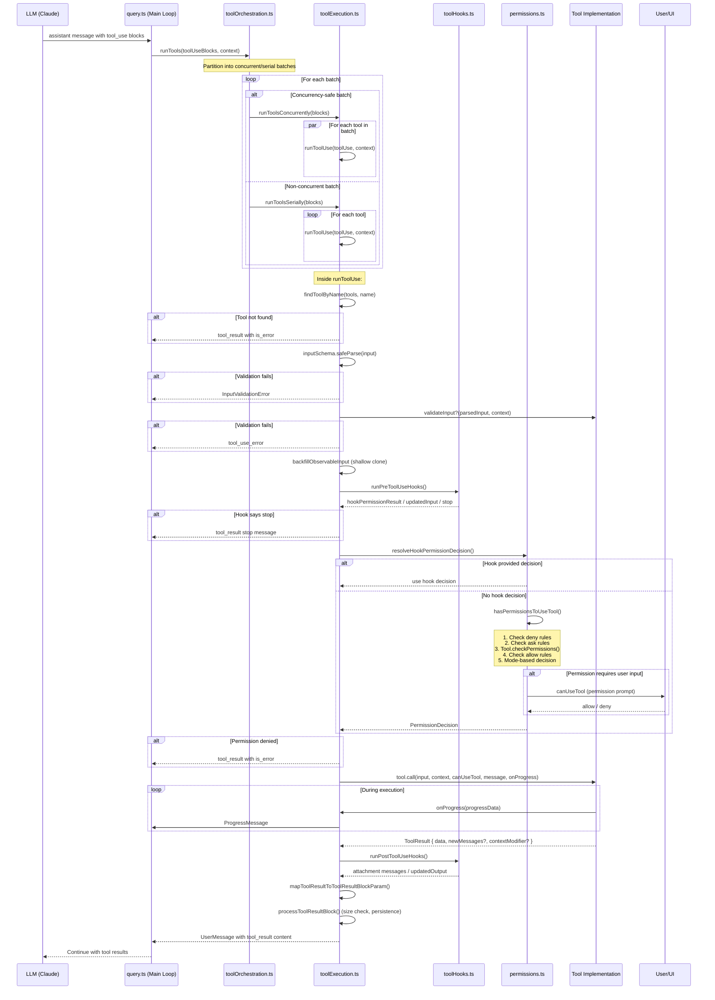

# Tool System Architecture

This document provides a comprehensive architectural reference for the Claude Code tool system -- the mechanism by which the LLM agent discovers, selects, validates, and executes tools against the local environment.

---

## Table of Contents

1. [Core Abstractions](#1-core-abstractions)
2. [Tool Registry and Assembly](#2-tool-registry-and-assembly)
3. [Complete Tool Inventory](#3-complete-tool-inventory)
4. [Tool Implementations](#4-tool-implementations)
5. [Tool Execution Lifecycle](#5-tool-execution-lifecycle)
6. [Permission Model](#6-permission-model)
7. [Tool Parameter Schemas](#7-tool-parameter-schemas)
8. [Deferred Tool Loading (ToolSearch)](#8-deferred-tool-loading-toolsearch)
9. [MCP Tool Integration](#9-mcp-tool-integration)
10. [Concurrency Model](#10-concurrency-model)
11. [Tool Result Handling](#11-tool-result-handling)

---

## 1. Core Abstractions

### 1.1 The `Tool` Type (`src/Tool.ts`)

The `Tool` type is the central interface for all tool implementations. It is a generic TypeScript type, not a class -- tools are plain objects that conform to this shape. The type is parameterized over three generics:

```
Tool<Input extends AnyObject, Output, P extends ToolProgressData>
```

- **`Input`**: A Zod schema type describing the tool's parameters.
- **`Output`**: The type of data returned by the tool.
- **`P`**: The progress event type emitted during execution.

Key fields and methods on `Tool`:

| Field/Method | Purpose |
|---|---|
| `name: string` | Primary tool identifier sent to the model |
| `aliases?: string[]` | Deprecated names for backward compatibility |
| `searchHint?: string` | 3-10 word phrase for ToolSearch keyword matching |
| `inputSchema: Input` | Zod schema for parameter validation |
| `inputJSONSchema?: ToolInputJSONSchema` | Raw JSON Schema (used by MCP tools) |
| `outputSchema?: z.ZodType` | Zod schema for the output type |
| `shouldDefer?: boolean` | When true, tool requires ToolSearch before use |
| `alwaysLoad?: boolean` | When true, tool is never deferred |
| `isMcp?: boolean` | Marks MCP-originated tools |
| `isLsp?: boolean` | Marks LSP tools |
| `mcpInfo?` | Server and tool names for MCP tools |
| `maxResultSizeChars: number` | Threshold before results get persisted to disk |
| `strict?: boolean` | Enables strict schema adherence via API |
| `call(...)` | Executes the tool |
| `description(...)` | Returns the human-readable description |
| `prompt(...)` | Returns the full prompt text sent to the model |
| `checkPermissions(...)` | Tool-specific permission logic |
| `validateInput?(...)` | Input validation beyond schema parsing |
| `isEnabled()` | Whether the tool is available in current environment |
| `isConcurrencySafe(input)` | Whether this call can run concurrently |
| `isReadOnly(input)` | Whether this call only reads (no writes) |
| `isDestructive?(input)` | Whether this call performs irreversible operations |
| `interruptBehavior?()` | `'cancel'` or `'block'` on user interrupt |
| `isSearchOrReadCommand?(input)` | Classifies for UI collapsing |
| `isOpenWorld?(input)` | Whether the tool accesses external resources |
| `preparePermissionMatcher?(input)` | Factory for hook `if` pattern matching |
| `getPath?(input)` | Extracts file path from input |
| `backfillObservableInput?(input)` | Adds legacy/derived fields for observers |
| `toAutoClassifierInput(input)` | Compact representation for security classifier |
| `mapToolResultToToolResultBlockParam(...)` | Converts output to API format |
| `userFacingName(input)` | Display name in UI |
| `renderToolUseMessage(...)` | React component for tool invocation display |
| `renderToolResultMessage?(...)` | React component for result display |
| `renderToolUseProgressMessage?(...)` | React component for progress display |
| `renderGroupedToolUse?(...)` | Renders parallel instances as a group |

### 1.2 The `ToolDef` Type and `buildTool()`

`ToolDef` is identical to `Tool` except several methods are optional. The `buildTool()` function accepts a `ToolDef` and returns a complete `Tool` by merging in fail-safe defaults:

| Default | Value |
|---|---|
| `isEnabled` | `() => true` |
| `isConcurrencySafe` | `() => false` (conservative) |
| `isReadOnly` | `() => false` (conservative) |
| `isDestructive` | `() => false` |
| `checkPermissions` | `{ behavior: 'allow', updatedInput }` (defers to general permission system) |
| `toAutoClassifierInput` | `''` (skip classifier) |
| `userFacingName` | `() => tool.name` |

All tool implementations should go through `buildTool()`. The defaults are fail-closed where it matters for security.

### 1.3 The `Tools` Type

```typescript
type Tools = readonly Tool[]
```

An alias for a read-only array of `Tool` objects. Used throughout the codebase wherever tool collections are passed, enabling easy grep-ability.

### 1.4 Helper Functions

- **`toolMatchesName(tool, name)`**: Checks primary name or any alias.
- **`findToolByName(tools, name)`**: Locates a tool by name or alias from a collection.

---

## 2. Tool Registry and Assembly

### 2.1 `getAllBaseTools()` (`src/tools.ts`)

This is the source of truth for all built-in tools. It returns a flat array of all tools that could be available in the current environment, gated by feature flags and environment variables:

```
AgentTool, TaskOutputTool, BashTool, GlobTool, GrepTool,
ExitPlanModeV2Tool, FileReadTool, FileEditTool, FileWriteTool,
NotebookEditTool, WebFetchTool, TodoWriteTool, WebSearchTool,
TaskStopTool, AskUserQuestionTool, SkillTool, EnterPlanModeTool,
SendMessageTool, BriefTool, ListMcpResourcesTool, ReadMcpResourceTool,
ToolSearchTool, ...and conditionally many more
```

Conditional tools include:
- **ConfigTool**, **TungstenTool**: Ant-only (`USER_TYPE === 'ant'`)
- **REPLTool**: Ant-only + REPL mode enabled
- **PowerShellTool**: Windows environments
- **LSPTool**: `ENABLE_LSP_TOOL` env var
- **EnterWorktreeTool/ExitWorktreeTool**: Worktree mode enabled
- **TeamCreateTool/TeamDeleteTool**: Agent swarms enabled
- **TaskCreate/Get/Update/ListTool**: Todo v2 enabled
- **SleepTool**: Proactive/Kairos features
- **CronCreate/Delete/ListTool**: Agent triggers feature
- **RemoteTriggerTool**: Remote agent triggers
- **ToolSearchTool**: Tool search enabled (optimistic check)
- **GlobTool/GrepTool**: Excluded when embedded search tools are available (ant builds)

### 2.2 `getTools()` -- Built-in Filtering

`getTools(permissionContext)` applies three layers of filtering:

1. **Simple mode** (`CLAUDE_CODE_SIMPLE`): Returns only `BashTool`, `FileReadTool`, `FileEditTool` (plus coordinator tools if applicable).
2. **Deny-rule filtering**: `filterToolsByDenyRules()` removes tools blanket-denied by the permission context. Uses the same matcher as runtime permission checks.
3. **REPL mode filtering**: When REPL mode is active, hides primitive tools (`REPL_ONLY_TOOLS`) -- they remain accessible inside the REPL VM.
4. **`isEnabled()` check**: Final filter on each tool's runtime availability.

### 2.3 `assembleToolPool()` -- Merging Built-in and MCP Tools

```typescript
function assembleToolPool(permissionContext, mcpTools): Tools
```

The single source of truth for combining built-in and MCP tools:

1. Gets built-in tools via `getTools()`.
2. Filters MCP tools by deny rules.
3. Sorts each partition alphabetically (built-ins as contiguous prefix for prompt-cache stability).
4. Deduplicates by name via `uniqBy` (built-in tools take precedence).

This is used by both the REPL UI (`useMergedTools`) and the coordinator worker (`runAgent.ts`).

### 2.4 Tool Disallow Lists (`src/constants/tools.ts`)

Several constants control which tools are available in subagent contexts:

| Constant | Purpose |
|---|---|
| `ALL_AGENT_DISALLOWED_TOOLS` | Tools never available to any agent (TaskOutput, ExitPlanMode, EnterPlanMode, AskUserQuestion, TaskStop; AgentTool unless ant) |
| `CUSTOM_AGENT_DISALLOWED_TOOLS` | Same as above (used for custom agent definitions) |
| `ASYNC_AGENT_ALLOWED_TOOLS` | Allowlist for async background agents (file ops, search, shell, skill, worktree, ToolSearch) |
| `IN_PROCESS_TEAMMATE_ALLOWED_TOOLS` | Additional tools for in-process teammates (task CRUD, SendMessage, cron tools) |
| `COORDINATOR_MODE_ALLOWED_TOOLS` | Coordinator only gets Agent, TaskStop, SendMessage, StructuredOutput |

---

## 3. Complete Tool Inventory

| Tool Name | Category | Source File | Read-Only | Deferred | Description |
|---|---|---|---|---|---|
| `Bash` | Shell | `BashTool/BashTool.tsx` | Input-dependent | No | Execute shell commands with timeout, background, sandbox support |
| `PowerShell` | Shell | `PowerShellTool/PowerShellTool.tsx` | Input-dependent | No | Windows PowerShell execution (conditional) |
| `Read` | File | `FileReadTool/FileReadTool.ts` | Yes | No | Read files with line ranges, images, PDFs, notebooks |
| `Edit` | File | `FileEditTool/FileEditTool.ts` | No | No | Exact string replacement in files |
| `Write` | File | `FileWriteTool/FileWriteTool.ts` | No | No | Create or overwrite files |
| `Glob` | Search | `GlobTool/GlobTool.ts` | Yes | No | Fast file pattern matching |
| `Grep` | Search | `GrepTool/GrepTool.ts` | Yes | No | Content search via ripgrep |
| `WebSearch` | Web | `WebSearchTool/WebSearchTool.ts` | Yes | No | Web search via Anthropic API |
| `WebFetch` | Web | `WebFetchTool/WebFetchTool.ts` | Yes | Yes | Fetch and process URL content |
| `NotebookEdit` | File | `NotebookEditTool/NotebookEditTool.ts` | No | Yes | Edit Jupyter notebook cells |
| `TodoWrite` | Task | `TodoWriteTool/TodoWriteTool.ts` | No | Yes | Manage session task checklist |
| `TaskCreate` | Task v2 | `TaskCreateTool/TaskCreateTool.ts` | No | -- | Create task items |
| `TaskGet` | Task v2 | `TaskGetTool/TaskGetTool.ts` | Yes | -- | Get task details |
| `TaskUpdate` | Task v2 | `TaskUpdateTool/TaskUpdateTool.ts` | No | -- | Update task status |
| `TaskList` | Task v2 | `TaskListTool/TaskListTool.ts` | Yes | -- | List all tasks |
| `Agent` | Agent | `AgentTool/AgentTool.tsx` | No | Conditional | Spawn subagents for parallel work |
| `TaskOutput` | Agent | `TaskOutputTool/TaskOutputTool.tsx` | No | -- | Return result from agent to parent |
| `TaskStop` | Agent | `TaskStopTool/TaskStopTool.ts` | No | -- | Stop a background task |
| `SendMessage` | Communication | `SendMessageTool/SendMessageTool.ts` | No | -- | Send messages between agents/user |
| `TeamCreate` | Swarm | `TeamCreateTool/TeamCreateTool.ts` | No | -- | Create agent teams |
| `TeamDelete` | Swarm | `TeamDeleteTool/TeamDeleteTool.ts` | No | -- | Delete agent teams |
| `Skill` | Meta | `SkillTool/SkillTool.ts` | Input-dependent | No | Execute registered skills/commands |
| `ToolSearch` | Meta | `ToolSearchTool/ToolSearchTool.ts` | Yes | Never | Fetch schemas for deferred tools |
| `AskUserQuestion` | Interaction | `AskUserQuestionTool/AskUserQuestionTool.tsx` | Yes | No | Ask the user a clarifying question |
| `Brief` | Communication | `BriefTool/BriefTool.ts` | No | Never | Send markdown messages to the user (Kairos) |
| `EnterPlanMode` | Mode | `EnterPlanModeTool/EnterPlanModeTool.ts` | No | -- | Switch to plan mode |
| `ExitPlanMode` | Mode | `ExitPlanModeTool/ExitPlanModeV2Tool.ts` | No | -- | Exit plan mode |
| `EnterWorktree` | Worktree | `EnterWorktreeTool/EnterWorktreeTool.ts` | No | -- | Create git worktree for isolated work |
| `ExitWorktree` | Worktree | `ExitWorktreeTool/ExitWorktreeTool.ts` | No | -- | Exit worktree |
| `Config` | Settings | `ConfigTool/ConfigTool.ts` | No | -- | Read/write configuration (ant-only) |
| `LSP` | IDE | `LSPTool/LSPTool.ts` | Yes | -- | Language Server Protocol operations |
| `ListMcpResources` | MCP | `ListMcpResourcesTool/ListMcpResourcesTool.ts` | Yes | Yes | List MCP server resources |
| `ReadMcpResource` | MCP | `ReadMcpResourceTool/ReadMcpResourceTool.ts` | Yes | Yes | Read MCP server resources |
| `Sleep` | Utility | `SleepTool/` | Yes | -- | Wait for specified duration (Kairos) |
| `CronCreate` | Scheduling | `ScheduleCronTool/CronCreateTool.ts` | No | -- | Create scheduled remote agents |
| `CronDelete` | Scheduling | `ScheduleCronTool/CronDeleteTool.ts` | No | -- | Delete scheduled agents |
| `CronList` | Scheduling | `ScheduleCronTool/CronListTool.ts` | Yes | -- | List scheduled agents |
| `RemoteTrigger` | Scheduling | `RemoteTriggerTool/RemoteTriggerTool.ts` | No | -- | Trigger remote agent execution |
| `REPL` | VM | `REPLTool/` | No | -- | Batch execution VM wrapping primitives (ant-only) |
| `StructuredOutput` | Synthetic | `SyntheticOutputTool/SyntheticOutputTool.ts` | Yes | -- | Structured JSON output for SDK mode |
| `mcp__*` | MCP | `MCPTool/MCPTool.ts` (base) | Varies | Always | Dynamically created from MCP servers |

---

## 4. Tool Implementations

### 4.1 Shell Execution -- `BashTool`

**Source**: `src/tools/BashTool/BashTool.tsx` + 17 supporting files

The most complex tool in the system. Executes arbitrary shell commands via `utils/Shell.ts`.

**Parameters**:
- `command` (string, required): The shell command to execute.
- `timeout` (number, optional): Timeout in milliseconds (default ~120s, max ~600s).
- `description` (string, optional): Human-readable description of the command's purpose.
- `run_in_background` (boolean, optional): Run in background, return task ID.
- `dangerouslyDisableSandbox` (boolean, optional): Override sandbox containment.

**Key behaviors**:
- **Sandbox integration**: Uses `SandboxManager` to optionally run commands in a sandboxed environment. The `shouldUseSandbox()` function determines per-command eligibility.
- **Background tasks**: Commands can be backgrounded via `run_in_background`. They register as `LocalShellTask` instances and the agent is notified on completion.
- **Command classification**: `isSearchOrReadBashCommand()` categorizes commands as search, read, or list operations for UI collapsing. Maintains sets of search commands (find, grep, rg), read commands (cat, head, wc, jq), and list commands (ls, tree, du).
- **Security**: `bashSecurity.ts` provides deprecated command safety checks. `bashPermissions.ts` contains the full permission logic including speculative classifier checks, wildcard pattern matching, and subcommand-level permission analysis.
- **Progress reporting**: Shows output after a 2-second threshold. Reports `bash_progress` events with stdout/stderr content.
- **Image output**: Detects and processes image output from commands (e.g., screenshots).
- **Sed edit parsing**: `sedEditParser.ts` parses `sed` commands to extract file edit semantics for permission checking.

**Permission model**: The bash permission system is the most elaborate. It supports:
- Prefix-based rules (e.g., `git *`, `npm run *`)
- Wildcard pattern matching
- Subcommand decomposition for compound commands (`&&`, `||`, `;`, `|`)
- Speculative classifier pre-checking (starts in parallel with hooks)
- Mode-specific validation (`modeValidation.ts`)
- Path constraint checking (`pathValidation.ts`)
- Read-only validation (`readOnlyValidation.ts`)

### 4.2 File Tools

#### `FileReadTool` (`src/tools/FileReadTool/FileReadTool.ts`)

Reads files with extensive format support.

**Parameters**:
- `file_path` (string, required): Absolute path.
- `offset` (number, optional): Starting line number.
- `limit` (number, optional): Number of lines to read.
- `pages` (string, optional): Page range for PDFs (e.g., "1-5").

**Capabilities**: Plain text with line numbers, images (PNG, JPG -- resized for token limits), PDFs (via `extractPDFPages`), Jupyter notebooks (`.ipynb`), binary detection via extension check, memory files (CLAUDE.md) with freshness notes.

**Concurrency**: Always safe (`isConcurrencySafe: true`).

**Result size**: `maxResultSizeChars: Infinity` -- results are never persisted to disk (would create circular read loops).

#### `FileEditTool` (`src/tools/FileEditTool/FileEditTool.ts`)

Performs exact string replacement in files.

**Parameters**:
- `file_path` (string, required): Absolute path.
- `old_string` (string, required): Text to find.
- `new_string` (string, required): Replacement text.
- `replace_all` (boolean, optional): Replace all occurrences.

**Security constraints**: Validates the file was read before editing (via `readFileState` cache). Detects concurrent modifications (`FILE_UNEXPECTEDLY_MODIFIED_ERROR`). Runs `checkWritePermissionForTool()`. Integrates with LSP diagnostics and file history tracking. Generates git diffs for display.

#### `FileWriteTool` (`src/tools/FileWriteTool/FileWriteTool.ts`)

Creates new files or completely overwrites existing ones.

**Parameters**:
- `file_path` (string, required): Absolute path.
- `content` (string, required): File content.

**Security**: Requires read before overwrite (enforced in validation). Checks write permissions. Creates parent directories as needed. Tracks in file history.

### 4.3 Search Tools

#### `GlobTool` (`src/tools/GlobTool/GlobTool.ts`)

Fast file pattern matching using the internal `glob()` utility.

**Parameters**:
- `pattern` (string, required): Glob pattern (e.g., `**/*.ts`).
- `path` (string, optional): Directory to search in (defaults to cwd).

**Output**: `{ durationMs, numFiles, filenames[], truncated }`. Results sorted by modification time. Default limit of 100 files (configurable via `globLimits`).

#### `GrepTool` (`src/tools/GrepTool/GrepTool.ts`)

Content search powered by ripgrep.

**Parameters**:
- `pattern` (string, required): Regex pattern.
- `path` (string, optional): Search path.
- `glob` (string, optional): File filter pattern.
- `output_mode` (enum, optional): `content`, `files_with_matches`, `count`.
- `-A`, `-B`, `-C`, `-n` (number/boolean, optional): Context lines and line numbers.
- `head_limit` (number, optional): Limit output (default 250).
- `offset` (number, optional): Skip first N results.
- `type` (string, optional): File type filter.
- `multiline` (boolean, optional): Enable multiline matching.
- `-i` (boolean, optional): Case insensitive.

Uses `semanticNumber` and `semanticBoolean` wrappers to handle model's tendency to emit strings for numeric/boolean fields.

### 4.4 Web Tools

#### `WebSearchTool` (`src/tools/WebSearchTool/WebSearchTool.ts`)

Performs web searches through the Anthropic API's built-in web search tool.

**Parameters**:
- `query` (string, required, min 2 chars): Search query.
- `allowed_domains` (string[], optional): Domain allowlist.
- `blocked_domains` (string[], optional): Domain blocklist.

**Implementation**: Creates a nested API call using `queryModelWithStreaming()` with a `BetaWebSearchTool` parameter. Processes the response to extract `web_search_tool_result` blocks.

#### `WebFetchTool` (`src/tools/WebFetchTool/WebFetchTool.ts`)

Fetches and processes URL content.

**Parameters**:
- `url` (string, required): URL to fetch.
- `prompt` (string, required): Instruction for processing fetched content.

**Permission model**: Domain-based permissions. Pre-approved hosts skip permission prompts (`isPreapprovedHost`, `isPreapprovedUrl`). Permission suggestions are scoped to `domain:{hostname}`.

### 4.5 Task/Todo Tools

#### `TodoWriteTool` (`src/tools/TodoWriteTool/TodoWriteTool.ts`)

Manages the session-level task checklist.

**Parameters**:
- `todos` (TodoListSchema, required): The complete updated todo list.

**Behavior**: Compares old and new todo lists. Uses `strict: true` for schema adherence. Disabled when Todo v2 is enabled. Always deferred (`shouldDefer: true`).

#### Task v2 Tools (`TaskCreate`, `TaskGet`, `TaskUpdate`, `TaskList`)

Structured task management replacing TodoWrite. Each tool maps to CRUD operations on a persistent task store (`utils/tasks.ts`).

### 4.6 Agent/Multi-Agent Tools

#### `AgentTool` (`src/tools/AgentTool/AgentTool.tsx`)

The primary mechanism for spawning subagents. The most complex tool after BashTool.

**Parameters** (simplified):
- `prompt` (string, required): Instructions for the subagent.
- `agent_type` (string, optional): Type of agent to spawn.
- `name` (string, optional): Agent identifier.
- `run_in_background` (boolean, optional): Background execution.
- `mode` (string, optional): Permission mode for the subagent.
- `team_name` (string, optional): Team affiliation.

**Execution modes**:
1. **Foreground**: Blocks the parent agent until completion.
2. **Background**: Registers as `LocalAgentTask`, returns immediately.
3. **Remote**: Teleports execution to a remote environment.
4. **Fork subagent**: Creates a lightweight fork sharing the parent's context.

**Supporting modules**: `runAgent.ts` (core execution loop), `forkSubagent.ts` (forking), `resumeAgent.ts` (session resume), `loadAgentsDir.ts` (agent definition loading), `builtInAgents.ts` (built-in agent types).

#### `TaskOutputTool` (`src/tools/TaskOutputTool/`)

Returns structured results from a subagent to its parent. Only available to agents, not the main thread.

#### `TaskStopTool` (`src/tools/TaskStopTool/TaskStopTool.ts`)

Stops a running background task (agent or shell). Aliases: `KillShell` (deprecated).

#### `SendMessageTool` (`src/tools/SendMessageTool/SendMessageTool.ts`)

Inter-agent and agent-to-user messaging. Supports structured messages including shutdown requests/approvals.

#### `TeamCreateTool` / `TeamDeleteTool`

Swarm management tools for creating and deleting agent teams. Requires the agent swarms feature flag.

### 4.7 MCP Tools (`src/tools/MCPTool/MCPTool.ts`)

`MCPTool` is a base template that gets spread-copied and overridden for each tool exposed by connected MCP servers. See [Section 9](#9-mcp-tool-integration) for details.

### 4.8 Meta/Utility Tools

#### `ToolSearchTool` (`src/tools/ToolSearchTool/ToolSearchTool.ts`)

Fetches full schema definitions for deferred tools. See [Section 8](#8-deferred-tool-loading-toolsearch).

**Parameters**:
- `query` (string, required): `"select:Name1,Name2"` for exact selection, keywords for search, `"+keyword other"` to require keyword in name.
- `max_results` (number, optional, default 5): Result limit.

**Output**: `{ matches[], query, total_deferred_tools, pending_mcp_servers[] }`. The `matches` array contains `<function>...</function>` blocks in the same format as the prompt's tool definitions.

#### `SkillTool` (`src/tools/SkillTool/SkillTool.ts`)

Executes registered skills (slash commands). Maps skill names to `Command` definitions. Supports forked execution with custom model overrides, frontmatter-based configuration, and plugin commands.

#### `AskUserQuestionTool`

Asks the user a clarifying question. Requires user interaction (`requiresUserInteraction: true`). Not available to subagents.

#### `EnterPlanModeTool` / `ExitPlanModeV2Tool`

Toggle plan mode, which changes the permission model and instructs the LLM to design before executing.

#### `EnterWorktreeTool` / `ExitWorktreeTool`

Create and exit git worktrees for isolated development work.

#### `SleepTool`

Simple duration-based wait. Preferred over `Bash(sleep N)` because it does not hold a shell process. Feature-gated to Proactive/Kairos.

#### `BriefTool`

Primary communication channel in Kairos mode. Sends markdown messages with optional file attachments to the user.

#### `ConfigTool`

Ant-only tool for reading and writing configuration settings.

#### `LSPTool` (`src/tools/LSPTool/LSPTool.ts`)

Language Server Protocol operations. Supports multiple actions as a unified tool:
- `find_definition`, `find_references`, `find_implementation`
- `find_workspace_symbols`, `get_hover`, `get_diagnostics`
- `prepare_call_hierarchy`, `get_incoming_calls`, `get_outgoing_calls`
- `rename_symbol`, `restart_server`

Requires `ENABLE_LSP_TOOL` environment variable. Validates against a discriminated union schema internally.

#### `NotebookEditTool`

Edits Jupyter notebook (`.ipynb`) cells.

**Parameters**:
- `notebook_path` (string, required): Absolute path.
- `cell_id` (string, optional): Target cell ID.
- `new_source` (string, required): New cell content.
- `cell_type` (`code` | `markdown`, optional): Cell type.
- `edit_mode` (`replace` | `insert` | `delete`, optional): Operation type.

#### `SyntheticOutputTool` (`StructuredOutput`)

A synthetic tool injected in non-interactive (SDK) mode. The model calls it to emit structured JSON output matching a caller-provided schema. Uses Ajv for runtime validation of the dynamic schema.

#### `ListMcpResourcesTool` / `ReadMcpResourceTool`

MCP resource access tools. List available resources across connected MCP servers and read specific resources by URI.

---

## 5. Tool Execution Lifecycle

### 5.1 Sequence Diagram



### 5.2 Detailed Execution Flow

#### Phase 1: Tool Resolution

In `runToolUse()` (`src/services/tools/toolExecution.ts`):

1. Look up tool by name in `toolUseContext.options.tools`.
2. If not found, check `getAllBaseTools()` for deprecated aliases.
3. If still not found, return error: `"No such tool available: {name}"`.

#### Phase 2: Input Validation

Two-stage validation:

1. **Schema validation**: `tool.inputSchema.safeParse(input)` via Zod. If this fails and the tool is deferred but was never loaded via ToolSearch, a hint is appended telling the model to call ToolSearch first.
2. **Semantic validation**: `tool.validateInput?(parsedInput, context)` for tool-specific checks (e.g., file read before edit, file size limits, valid LSP actions).

#### Phase 3: Input Backfill

If the tool defines `backfillObservableInput`, a shallow clone of the parsed input is created and backfilled with legacy/derived fields. This clone is used for hooks and permission checks. The original input is preserved for `tool.call()` to maintain transcript/VCR hash stability.

#### Phase 4: Pre-Tool Hooks

`runPreToolUseHooks()` executes configured `PreToolUse` hooks. Results can:
- Provide a `hookPermissionResult` (overrides normal permission flow)
- Provide `updatedInput` (modifies input without deciding permission)
- Request `preventContinuation` (stop the tool)
- Emit progress messages, attachment messages, or context additions

For Bash tools, speculative classifier checks are started in parallel here.

#### Phase 5: Permission Resolution

`resolveHookPermissionDecision()` in `toolHooks.ts` reconciles the hook result with the normal permission system:

1. If a hook provided a decision, use it (respecting `requireCanUseTool` override).
2. Otherwise, call `canUseTool()` which invokes `hasPermissionsToUseTool()`.
3. The full permission chain runs (see [Section 6](#6-permission-model)).

#### Phase 6: Tool Execution

If permitted, `tool.call()` is invoked with:
- The processed input (potentially modified by hooks/permissions)
- The `ToolUseContext` (with `toolUseId` added)
- The `canUseTool` function (for recursive permission checks)
- The parent `AssistantMessage`
- An `onProgress` callback

Progress events flow through a `Stream` abstraction that interleaves progress messages with the final result.

#### Phase 7: Post-Tool Hooks

`runPostToolUseHooks()` executes `PostToolUse` hooks with the tool output. Hooks can:
- Modify the output (for MCP tools)
- Emit attachment messages
- Report failures

#### Phase 8: Result Mapping

1. `tool.mapToolResultToToolResultBlockParam()` converts the output to the API's `ToolResultBlockParam` format.
2. `processToolResultBlock()` checks if the result exceeds `maxResultSizeChars`. If so, it persists the full content to disk and returns a preview with a file path.
3. New messages from `result.newMessages` are appended.
4. `contextModifier` from the result is applied (only for non-concurrent tools).

---

## 6. Permission Model

### 6.1 Permission Modes

The system supports multiple permission modes defined in `ToolPermissionContext.mode`:

| Mode | Behavior |
|---|---|
| `default` | Interactive prompts for unsafe operations |
| `auto` | Classifier-based automatic approval with fallback to deny |
| `plan` | Read-only operations only; writes prompt for plan mode exit |
| `bypassPermissions` | All operations auto-approved (dangerous) |

### 6.2 Permission Check Flow (`hasPermissionsToUseTool`)

Located in `src/utils/permissions/permissions.ts`, the check proceeds in order:

1. **Deny rules** (`getDenyRuleForTool`): If the tool has a blanket deny rule, immediately deny. Rules are matched against tool name and MCP server prefix.

2. **Ask rules** (`getAskRuleForTool`): If the tool has a blanket ask rule, prompt the user (unless sandbox auto-allow applies for Bash).

3. **Tool-specific check** (`tool.checkPermissions()`): Each tool implements its own logic. Return values:
   - `{ behavior: 'allow', updatedInput }`: Proceed.
   - `{ behavior: 'passthrough', message }`: Defer to general permission system.
   - `{ behavior: 'deny', message }`: Block.

4. **Allow rules** (`checkRuleBasedPermissions`): Match against configured allow rules with optional content patterns (e.g., `Bash(git *)` allows git commands).

5. **Mode-based decision**: Based on the current permission mode.

### 6.3 Tool-Specific Permission Implementations

**BashTool** (`bashPermissions.ts`): The most complex. Decomposes compound commands, checks each subcommand against rules. Supports:
- Prefix matching: `git *` matches `git status`, `git commit`, etc.
- Exact command matching
- Path-based constraints
- Sed edit detection and validation
- Speculative classifier checks (starts in parallel with hooks)
- Sandbox override when auto-allow-if-sandboxed is enabled

**File tools** (`permissions/filesystem.ts`): Check `checkReadPermissionForTool()` or `checkWritePermissionForTool()` against the working directory and additional allowed directories.

**WebFetchTool**: Domain-based rules. Pre-approved hosts bypass prompts. Permission suggestions scope to `domain:{hostname}`.

**MCPTool**: Always returns `{ behavior: 'passthrough' }` with suggestions for adding allow rules.

**TodoWriteTool/TaskTools**: Always allow (no permission checks).

### 6.4 Permission Rule Sources

Rules come from multiple sources with different precedence:
- `session`: Temporary session-scoped grants
- `localSettings`: Project-level `.claude/settings.json`
- `userSettings`: User-level `~/.claude/settings.json`
- `cliArg`: Command-line flags
- `policySettings`: Organization policies
- `flagSettings`: Feature flag overrides

### 6.5 Hook Integration

The hook system provides three extension points for permissions:
- **PreToolUse**: Can approve, deny, or modify tool calls before permission checks
- **PostToolUse**: Can modify results after execution
- **PermissionDenied**: Can grant retry after classifier denial

---

## 7. Tool Parameter Schemas

### 7.1 Schema Definition Pattern

All tools use `lazySchema()` to defer Zod schema construction from module init to first access:

```typescript
const inputSchema = lazySchema(() =>
  z.strictObject({
    file_path: z.string().describe('The absolute path to the file'),
    content: z.string().describe('The content to write'),
  }),
)
```

`lazySchema()` (`src/utils/lazySchema.ts`) is a simple memoized factory:

```typescript
function lazySchema<T>(factory: () => T): () => T {
  let cached: T | undefined
  return () => (cached ??= factory())
}
```

### 7.2 Conversion to API Format

`toolToAPISchema()` in `src/utils/api.ts` converts `Tool` objects to the Anthropic API's `BetaToolUnion` format:

1. **Schema source selection**: If `tool.inputJSONSchema` is defined (MCP tools, SyntheticOutputTool), use it directly. Otherwise convert via `zodToJsonSchema(tool.inputSchema)`.
2. **Description**: Calls `tool.prompt()` with the current permission context, tools, and agent definitions.
3. **Strict mode**: Adds `strict: true` when `tool.strict === true`, the `tengu_tool_pear` feature gate is on, and the model supports structured outputs.
4. **Fine-grained tool streaming**: Adds `eager_input_streaming: true` for first-party Anthropic API when feature-gated.
5. **Deferred loading**: Adds `defer_loading: true` when ToolSearch is active and the tool is deferred.
6. **Cache control**: Adds `cache_control` markers for prompt caching.
7. **Swarm field filtering**: Removes swarm-related fields when swarms are not enabled.

The result is cached per session in `getToolSchemaCache()` (keyed by tool name + inputJSONSchema for dynamic tools) to prevent GrowthBook flips from churning serialized bytes mid-session.

### 7.3 Semantic Type Wrappers

The GrepTool uses `semanticNumber()` and `semanticBoolean()` wrappers around Zod types. These handle the model's tendency to emit string representations of numbers and booleans (e.g., `"-A": "3"` instead of `"-A": 3`).

---

## 8. Deferred Tool Loading (ToolSearch)

### 8.1 Mechanism

When the tool pool exceeds a size threshold, less frequently used tools are sent to the model with `defer_loading: true`. The model sees only the tool name -- no schema, no description. To use a deferred tool, the model must first call `ToolSearch` to fetch the full schema.

### 8.2 Deferral Rules (`isDeferredTool()` in `src/tools/ToolSearchTool/prompt.ts`)

A tool is deferred if:
1. `tool.alwaysLoad === true` -- **never deferred** (opt-out). MCP tools set this via `_meta['anthropic/alwaysLoad']`.
2. `tool.isMcp === true` -- **always deferred** (workflow-specific tools).
3. `tool.name === TOOL_SEARCH_TOOL_NAME` -- **never deferred** (bootstrap tool).
4. `tool.shouldDefer === true` -- **deferred** (opt-in).

Special exemptions: AgentTool when fork subagent is enabled, BriefTool (primary communication channel), SendUserFileTool in bridge mode.

### 8.3 ToolSearch Execution

When called, `ToolSearchTool` performs:

1. Filters the full tool list to deferred-only tools.
2. Parses the query:
   - `"select:Name1,Name2"` -- exact name matching.
   - `"+keyword other"` -- require keyword in name, rank by remaining terms.
   - Free-text keywords -- rank by relevance across name, description, and `searchHint`.
3. For keyword search, scores tools by:
   - Exact name match (weighted heavily)
   - searchHint match
   - Tool description/prompt match (memoized)
4. Returns up to `max_results` tool definitions formatted as `<function>...</function>` blocks -- the same format as the initial tool list in the prompt.
5. Also reports `pending_mcp_servers` -- servers still connecting whose tools might appear later.

### 8.4 Deferred Tool Announcement

Deferred tools are announced to the model via `<system-reminder>` messages (when the delta feature is enabled) or a prepended `<available-deferred-tools>` block. Each entry is just the tool name (search hints are not rendered per A/B test results).

---

## 9. MCP Tool Integration

### 9.1 Tool Creation (`src/services/mcp/client.ts`)

Each MCP server connection creates tools by spreading `MCPTool` (the base template) and overriding:

```typescript
return {
  ...MCPTool,
  name: skipPrefix ? tool.name : `mcp__${normalizedServerName}__${tool.name}`,
  mcpInfo: { serverName, toolName },
  isMcp: true,
  searchHint: tool._meta?.['anthropic/searchHint'],
  alwaysLoad: tool._meta?.['anthropic/alwaysLoad'] === true,
  inputJSONSchema: tool.inputSchema,
  description: () => tool.description ?? '',
  prompt: () => tool.description ?? '',
  isConcurrencySafe: () => tool.annotations?.readOnlyHint ?? false,
  isReadOnly: () => tool.annotations?.readOnlyHint ?? false,
  isDestructive: () => tool.annotations?.destructiveHint ?? false,
  isOpenWorld: () => tool.annotations?.openWorldHint ?? false,
  checkPermissions: () => ({ behavior: 'passthrough' }),
  call: (args, context, ...) => callMCPToolWithUrlElicitationRetry({...}),
}
```

### 9.2 MCP Tool Naming

- **Default**: `mcp__<normalized_server_name>__<tool_name>` (e.g., `mcp__github__create_pull_request`)
- **SDK no-prefix mode** (`CLAUDE_AGENT_SDK_MCP_NO_PREFIX`): Uses raw tool name, allowing MCP tools to override built-ins.
- **mcpInfo**: Always preserved for permission checking regardless of naming mode.

### 9.3 MCP Tool Execution

The `call()` method for MCP tools invokes `callMCPToolWithUrlElicitationRetry()`, which:
1. Calls the MCP server via the client connection.
2. Handles URL elicitation errors (-32042) for OAuth flows.
3. Processes the result content (text, images, binary blobs).
4. Reports progress via `MCPProgress` events.

### 9.4 MCP Resource Tools

Two dedicated tools provide access to MCP resources:
- **ListMcpResources**: Lists resources from all connected servers (optionally filtered by server name).
- **ReadMcpResource**: Reads a specific resource by URI. Binary content is persisted to disk.

---

## 10. Concurrency Model

### 10.1 Partitioning (`partitionToolCalls` in `toolOrchestration.ts`)

When the model emits multiple `tool_use` blocks in a single message, the orchestrator partitions them into batches:

1. For each tool call, check `tool.isConcurrencySafe(parsedInput)`.
2. Group consecutive concurrency-safe calls into one batch.
3. Each non-concurrent call gets its own batch.
4. Max concurrency: `CLAUDE_CODE_MAX_TOOL_USE_CONCURRENCY` env var (default 10).

**Concurrency-safe tools** (always):
- GlobTool, GrepTool, FileReadTool, ListMcpResourcesTool, ReadMcpResourceTool, ToolSearchTool, SyntheticOutputTool, SleepTool

**Conditionally concurrent**: BashTool, MCP tools (based on `readOnlyHint` annotation).

### 10.2 Context Modifiers

Non-concurrent tools can return a `contextModifier` in their `ToolResult`. This function transforms the `ToolUseContext` between sequential calls (e.g., changing the working directory after `cd`). Context modifiers from concurrent tools are queued and applied after the batch completes.

---

## 11. Tool Result Handling

### 11.1 Result Size Management

Each tool declares `maxResultSizeChars`. When a result exceeds this threshold:

1. The full content is written to a temp file via `processToolResultBlock()`.
2. A preview (first `PREVIEW_SIZE_BYTES` bytes) plus the file path is returned instead.
3. `FileReadTool` sets `maxResultSizeChars: Infinity` -- its results are never persisted (would create circular read loops).

### 11.2 Result-to-API Mapping

`tool.mapToolResultToToolResultBlockParam(content, toolUseID)` converts the tool's typed output into the API's `ToolResultBlockParam` format. Most tools return:

```typescript
{
  tool_use_id: toolUseID,
  type: 'tool_result',
  content: serializedOutput,  // string or content blocks
}
```

File tools and Bash include structured data (diffs, exit codes). Image-producing tools include `image` content blocks.

### 11.3 Error Formatting

Errors are wrapped in `<tool_use_error>` XML tags:
- `InputValidationError`: Zod schema parse failures.
- Tool-specific validation errors from `validateInput()`.
- Permission denials.
- Runtime execution errors.
- Abort/cancellation with `CANCEL_MESSAGE`.

The `formatZodValidationError()` and `formatError()` utilities in `utils/toolErrors.ts` produce model-friendly error descriptions.

---

## Appendix: Type Hierarchy Diagram

```
Tool<Input, Output, Progress>
  |
  |-- name, aliases, searchHint
  |-- inputSchema (Zod), inputJSONSchema (JSON Schema)
  |-- outputSchema (Zod)
  |-- shouldDefer, alwaysLoad, strict
  |-- isMcp, isLsp, mcpInfo
  |-- maxResultSizeChars
  |
  |-- Lifecycle Methods:
  |   |-- call(input, context, canUseTool, message, onProgress) -> ToolResult<Output>
  |   |-- validateInput?(input, context) -> ValidationResult
  |   |-- checkPermissions(input, context) -> PermissionResult
  |   |-- description(input, options) -> string
  |   |-- prompt(options) -> string
  |
  |-- Classification Methods:
  |   |-- isEnabled() -> boolean
  |   |-- isConcurrencySafe(input) -> boolean
  |   |-- isReadOnly(input) -> boolean
  |   |-- isDestructive?(input) -> boolean
  |   |-- isOpenWorld?(input) -> boolean
  |   |-- isSearchOrReadCommand?(input) -> { isSearch, isRead, isList? }
  |   |-- interruptBehavior?() -> 'cancel' | 'block'
  |
  |-- Rendering Methods:
  |   |-- renderToolUseMessage(input, options) -> ReactNode
  |   |-- renderToolResultMessage?(output, progress, options) -> ReactNode
  |   |-- renderToolUseProgressMessage?(progress, options) -> ReactNode
  |   |-- renderToolUseRejectedMessage?(input, options) -> ReactNode
  |   |-- renderToolUseErrorMessage?(result, options) -> ReactNode
  |   |-- renderGroupedToolUse?(toolUses, options) -> ReactNode | null
  |   |-- renderToolUseTag?(input) -> ReactNode
  |   |-- renderToolUseQueuedMessage?() -> ReactNode
  |
  |-- Utility Methods:
      |-- userFacingName(input) -> string
      |-- getPath?(input) -> string
      |-- getToolUseSummary?(input) -> string | null
      |-- getActivityDescription?(input) -> string | null
      |-- toAutoClassifierInput(input) -> unknown
      |-- mapToolResultToToolResultBlockParam(output, id) -> ToolResultBlockParam
      |-- backfillObservableInput?(input) -> void
      |-- preparePermissionMatcher?(input) -> (pattern) => boolean
      |-- inputsEquivalent?(a, b) -> boolean
      |-- extractSearchText?(output) -> string
      |-- isResultTruncated?(output) -> boolean

ToolDef<Input, Output, Progress>
  = Omit<Tool, DefaultableKeys> & Partial<Pick<Tool, DefaultableKeys>>
  (Same as Tool but isEnabled, isConcurrencySafe, isReadOnly, isDestructive,
   checkPermissions, toAutoClassifierInput, userFacingName are optional)

buildTool(def: ToolDef) -> Tool
  Merges TOOL_DEFAULTS into def, producing a complete Tool.

ToolResult<T>
  |-- data: T
  |-- newMessages?: Message[]
  |-- contextModifier?: (context) => context
  |-- mcpMeta?: { _meta?, structuredContent? }

ToolUseContext
  |-- options: { commands, tools, mcpClients, mcpResources, model, ... }
  |-- abortController: AbortController
  |-- readFileState: FileStateCache
  |-- messages: Message[]
  |-- getAppState() / setAppState()
  |-- setToolJSX?, addNotification?, sendOSNotification?
  |-- toolDecisions, queryTracking, contentReplacementState
  |-- agentId?, agentType?
  |-- fileReadingLimits?, globLimits?
  |-- ... (many more session/agent context fields)

ToolPermissionContext
  |-- mode: 'default' | 'auto' | 'plan' | 'bypassPermissions'
  |-- additionalWorkingDirectories: Map
  |-- alwaysAllowRules, alwaysDenyRules, alwaysAskRules: ToolPermissionRulesBySource
  |-- isBypassPermissionsModeAvailable: boolean
  |-- shouldAvoidPermissionPrompts?: boolean
  |-- awaitAutomatedChecksBeforeDialog?: boolean
  |-- prePlanMode?: PermissionMode
```
