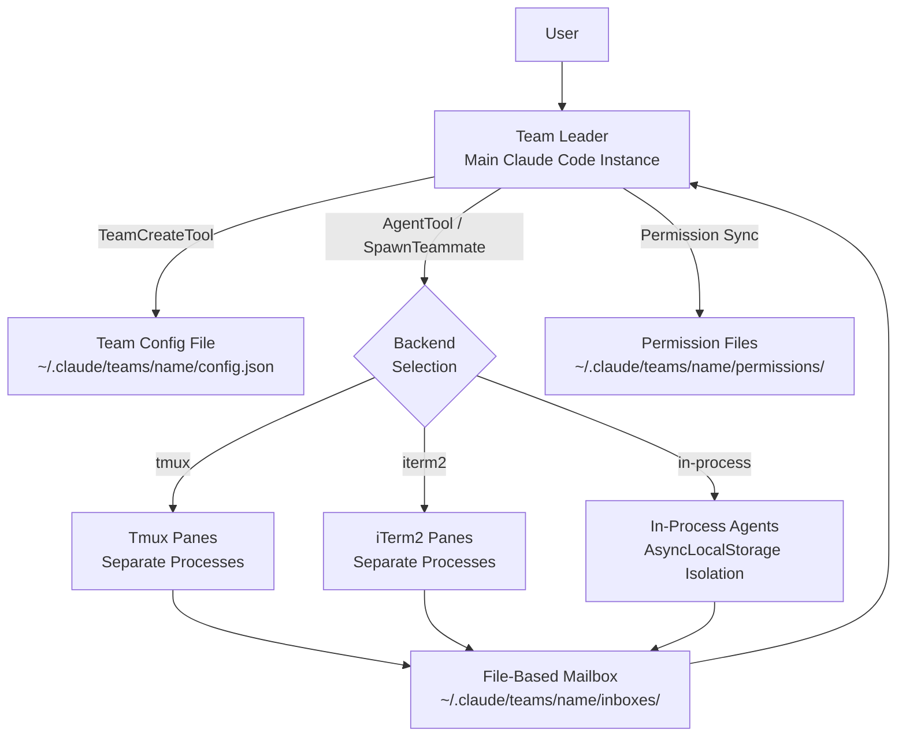
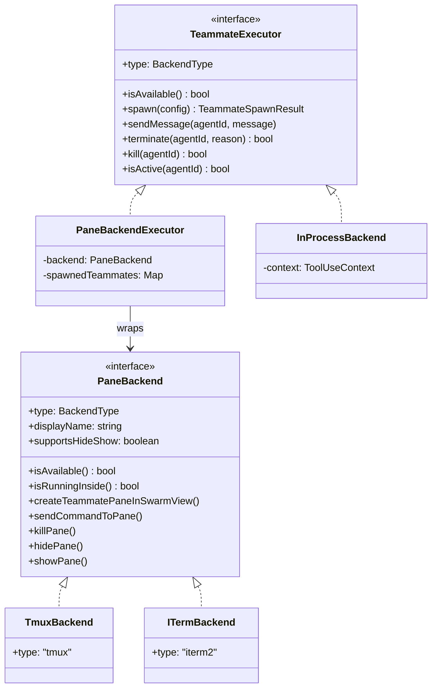
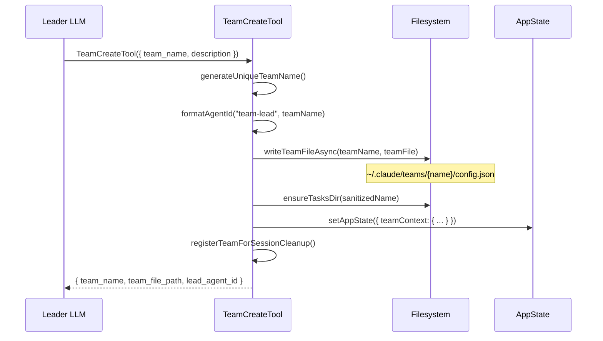
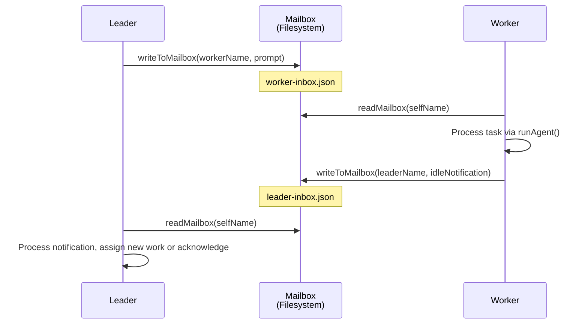
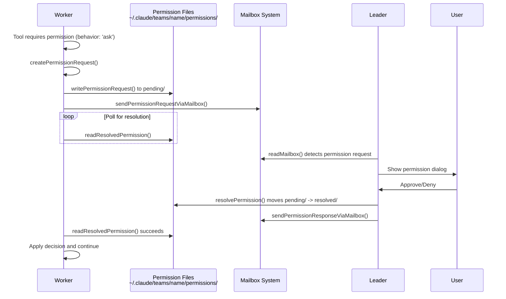
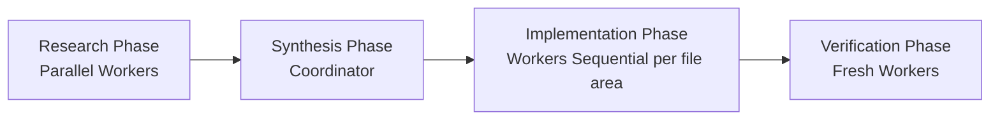
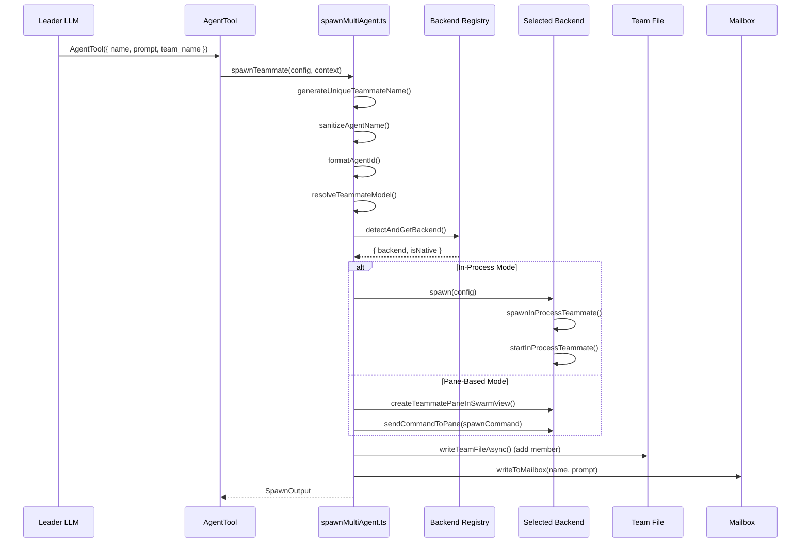
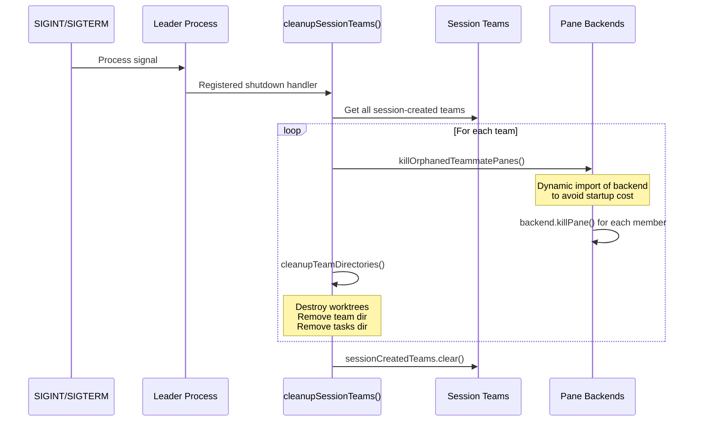

# Multi-Agent System Architecture

This document describes how Claude Code implements multi-agent orchestration -- spawning, managing, and coordinating multiple agent instances that work concurrently on subtasks. The system supports two distinct execution paradigms (in-process and pane-based), a coordinator mode for pure orchestration workflows, and a file-based communication layer that unifies messaging across all backends.

---

## Table of Contents

1. [System Overview](#1-system-overview)
2. [Backend Architecture](#2-backend-architecture)
3. [Team Lifecycle](#3-team-lifecycle)
4. [Communication Protocols](#4-communication-protocols)
5. [Permission Synchronization](#5-permission-synchronization)
6. [Task Management](#6-task-management)
7. [Coordinator Mode](#7-coordinator-mode)
8. [Agent Tool and Subagent Spawning](#8-agent-tool-and-subagent-spawning)
9. [Worktree Isolation](#9-worktree-isolation)
10. [Reconnection and Recovery](#10-reconnection-and-recovery)
11. [Concurrency and State Management](#11-concurrency-and-state-management)
12. [Failure Modes and Cleanup](#12-failure-modes-and-cleanup)

---

## 1. System Overview

The multi-agent system is organized around four key abstractions:

| Concept | Description | Primary Location |
|---------|-------------|------------------|
| **Team** | A named group of agents with a leader and N members | `utils/swarm/teamHelpers.ts` |
| **Backend** | Execution environment for teammates (tmux, iTerm2, in-process) | `utils/swarm/backends/` |
| **Mailbox** | File-based message queue for inter-agent communication | `utils/teammateMailbox.ts` |
| **Task** | AppState-tracked unit of work with lifecycle management | `Task.ts`, `tasks/` |



### Identity Model

Every agent in the system has a deterministic identity:

- **Agent ID**: `{agentName}@{teamName}` (e.g., `researcher@my-team`)
- **Agent Name**: Human-readable role name (e.g., `researcher`, `tester`)
- **Team Name**: Namespace for the group of collaborating agents

The leader always has the agent name `team-lead` and agent ID `team-lead@{teamName}`.

Identity resolution follows a three-tier precedence (implemented in `utils/teammate.ts`):

1. **AsyncLocalStorage** (in-process teammates via `TeammateContext`)
2. **Dynamic team context** (set at startup from CLI args)
3. **Environment variables** (`CLAUDE_CODE_AGENT_ID`, `CLAUDE_CODE_AGENT_NAME`)

---

## 2. Backend Architecture

### 2.1 Backend Type Hierarchy

The system defines two interface hierarchies for teammate execution:



**`BackendType`** is one of `'tmux' | 'iterm2' | 'in-process'`.

**`PaneBackend`** (`utils/swarm/backends/types.ts`) handles low-level terminal pane operations: creating panes, sending commands, setting border colors, killing panes, and hide/show operations.

**`TeammateExecutor`** (`utils/swarm/backends/types.ts`) is the high-level interface: spawn, send message, terminate, kill, check active status. It works across all backends uniformly.

**`PaneBackendExecutor`** (`utils/swarm/backends/PaneBackendExecutor.ts`) is an adapter that wraps a `PaneBackend` to expose it as a `TeammateExecutor`. It builds the CLI command to launch a new Claude Code process in the pane, manages a `Map<agentId, {paneId, insideTmux}>` for lifecycle operations, and registers cleanup handlers for graceful shutdown.

### 2.2 Backend Detection and Selection

Backend selection is managed by the registry (`utils/swarm/backends/registry.ts`). The detection logic runs once per process and is cached:

```
Detection Priority:
1. If --teammate-mode is 'in-process' -> always in-process
2. If --teammate-mode is 'tmux' -> always pane-based (tmux)
3. If --teammate-mode is 'auto' (default):
   a. If inside tmux session -> TmuxBackend (native)
   b. If in iTerm2 with it2 CLI -> ITermBackend (native)
   c. If in iTerm2 without it2 -> TmuxBackend (fallback, prompt for it2 setup)
   d. If tmux available -> TmuxBackend (external session mode)
   e. If non-interactive session (-p mode) -> in-process
   f. If nothing available -> in-process (fallback)
```

The `isInProcessEnabled()` function resolves `'auto'` mode by checking `isInsideTmuxSync()` and `isInITerm2()`. Once a pane backend fails and falls back to in-process, `markInProcessFallback()` is called and subsequent spawns stay in-process for the rest of the session.

### 2.3 TmuxBackend

**File**: `utils/swarm/backends/TmuxBackend.ts`

Operates in two modes:

**Inside tmux (leader is in tmux):**
- Splits the leader's current window horizontally
- Leader takes 30% width (left), teammates share 70% (right)
- Uses `main-vertical` layout with teammates stacked vertically on the right
- Pane IDs are tmux pane identifiers (e.g., `%1`, `%2`)

**Outside tmux (external session):**
- Creates a dedicated `claude-swarm-{PID}` socket to isolate from user's tmux
- Creates a `claude-swarm` session with a `swarm-view` window
- All teammates are arranged in `tiled` layout (no leader pane)
- User can attach to view with `tmux -L claude-swarm-{PID} attach`

Key implementation details:
- **Pane creation lock**: A promise-chain lock (`acquirePaneCreationLock()`) serializes pane creation to prevent race conditions when spawning multiple teammates in parallel
- **Shell init delay**: 200ms delay after pane creation (`PANE_SHELL_INIT_DELAY_MS`) to allow shell initialization before sending commands
- **Leader pane caching**: The leader's `TMUX_PANE` is captured at startup and cached, so it's always correct even if the user switches panes
- **Hide/show**: Panes can be broken out to a `claude-hidden` session and joined back via `break-pane`/`join-pane`

### 2.4 ITermBackend

**File**: `utils/swarm/backends/ITermBackend.ts`

Uses the `it2` CLI tool (Python-based iTerm2 integration) for native iTerm2 split panes. Same lock mechanism as TmuxBackend. Falls back to tmux if `it2` is not installed (with a setup prompt dialog).

### 2.5 InProcessBackend

**File**: `utils/swarm/backends/InProcessBackend.ts`

Runs teammates within the same Node.js process using `AsyncLocalStorage` for context isolation. Key characteristics:

- **No external dependencies**: Always available
- **Shared resources**: API client, MCP connections, and tool pool are shared with the leader
- **AbortController lifecycle**: Each teammate gets an independent `AbortController` (not linked to the leader's query abort)
- **Context isolation**: `TeammateContext` in `AsyncLocalStorage` provides identity, team membership, and color without global state conflicts
- Requires `setContext(ToolUseContext)` before spawn to provide AppState access

Spawn flow:
1. `spawnInProcessTeammate()` creates `TeammateContext`, `AbortController`, and registers `InProcessTeammateTaskState` in AppState
2. `startInProcessTeammate()` fires off the agent execution loop (fire-and-forget)
3. The execution loop runs via `runWithTeammateContext()` which wraps `runAgent()` inside `AsyncLocalStorage`

---

## 3. Team Lifecycle

### 3.1 Team Creation



The **team file** (`config.json`) is the source of truth for team membership. Its schema (`TeamFile` in `teamHelpers.ts`):

```typescript
type TeamFile = {
  name: string
  description?: string
  createdAt: number
  leadAgentId: string              // e.g., "team-lead@my-team"
  leadSessionId?: string           // Leader's session UUID
  hiddenPaneIds?: string[]         // Panes hidden from the UI
  teamAllowedPaths?: TeamAllowedPath[] // Paths all teammates can edit
  members: Array<{
    agentId: string                // "researcher@my-team"
    name: string                   // "researcher"
    agentType?: string
    model?: string
    prompt?: string
    color?: string
    planModeRequired?: boolean
    joinedAt: number
    tmuxPaneId: string
    cwd: string
    worktreePath?: string
    sessionId?: string
    subscriptions: string[]
    backendType?: BackendType      // 'tmux' | 'iterm2' | 'in-process'
    isActive?: boolean
    mode?: PermissionMode
  }>
}
```

### 3.2 Teammate Spawning

Teammates are spawned via the `spawnTeammate()` function in `tools/shared/spawnMultiAgent.ts`. The flow differs by backend:

**Pane-based (tmux/iTerm2):**
1. Detect backend via `detectAndGetBackend()`
2. Generate unique name, sanitize, format agent ID
3. Assign color via `assignTeammateColor()`
4. Create pane via backend's `createTeammatePaneInSwarmView()`
5. Build CLI command with inherited flags: `cd {cwd} && env {envVars} {binary} --agent-id ... --agent-name ... --team-name ... --agent-color ... --parent-session-id ...`
6. Send command to pane via `sendCommandToPane()`
7. Register member in team file and AppState
8. Send initial prompt via mailbox (`writeToMailbox()`)

The spawned process starts a new Claude Code instance that detects its teammate role from CLI args, computes initial team context (`computeInitialTeamContext()`), and begins polling its mailbox for work.

**In-process:**
1. `spawnInProcessTeammate()` creates `TeammateContext`, `AbortController`, `InProcessTeammateTaskState`
2. Registers task in AppState via `registerTask()`
3. `startInProcessTeammate()` runs the agent loop in the background
4. The agent loop wraps `runAgent()` inside `runWithTeammateContext()` for identity isolation

### 3.3 Team Cleanup

Cleanup is multi-layered:

1. **Explicit deletion**: `TeamDeleteTool` triggers `cleanupTeamDirectories()` which destroys worktrees, removes team directory, and removes task directory
2. **Session cleanup**: `registerTeamForSessionCleanup()` tracks teams created in the current session. On exit, `cleanupSessionTeams()` kills orphaned panes and cleans up directories
3. **Pane-based cleanup**: `killOrphanedTeammatePanes()` iterates team members, dynamically imports backend implementations, and kills each pane
4. **In-process cleanup**: Each teammate's `AbortController` is aborted, triggering the execution loop to exit

---

## 4. Communication Protocols

### 4.1 File-Based Mailbox System

**File**: `utils/teammateMailbox.ts`

Every agent has an inbox file at `~/.claude/teams/{team_name}/inboxes/{agent_name}.json`. Messages are JSON arrays of `TeammateMessage` objects:

```typescript
type TeammateMessage = {
  from: string       // Sender's agent name
  text: string       // Message content (may be JSON for structured messages)
  timestamp: string  // ISO timestamp
  read: boolean      // Whether the recipient has processed this message
  color?: string     // Sender's UI color
  summary?: string   // 5-10 word preview for UI
}
```

**Concurrency control**: File locks (`utils/lockfile.ts`) with exponential backoff (10 retries, 5-100ms timeout) ensure atomic read-modify-write operations when multiple agents write to the same inbox concurrently.

### 4.2 Message Types

The `text` field of a mailbox message may contain structured JSON for different message types:

| Message Type | Direction | Purpose |
|-------------|-----------|---------|
| Plain text prompt | Leader -> Worker | Initial task assignment or follow-up |
| `idle_notification` | Worker -> Leader | Worker has finished its turn and is available |
| `permission_request` | Worker -> Leader | Worker needs tool permission approval |
| `permission_response` | Leader -> Worker | Approval/denial of permission request |
| `sandbox_permission_request` | Worker -> Leader | Sandbox network access request |
| `sandbox_permission_response` | Leader -> Worker | Sandbox network access response |
| `shutdown_request` | Leader -> Worker | Graceful shutdown request |
| `teammate_mode_change` | Leader -> Worker | Permission mode update |

### 4.3 Message Flow



### 4.4 Idle Notification Protocol

When a teammate completes a turn, it sends an idle notification to the leader. This is implemented via a **Stop hook** registered in `teammateInit.ts`:

```typescript
// Registered as a Stop hook on teammate initialization
addFunctionHook(setAppState, sessionId, 'Stop', '', async (messages) => {
  void setMemberActive(teamName, agentName, false)  // Mark idle in team file
  const notification = createIdleNotification(agentName, {
    idleReason: 'available',
    summary: getLastPeerDmSummary(messages),
  })
  await writeToMailbox(leadAgentName, { from: agentName, text: JSON.stringify(notification), ... })
})
```

The leader's inbox poller detects idle notifications and can assign new work or acknowledge completion.

### 4.5 SendMessage Tool

The `SendMessageTool` (`tools/SendMessageTool/`) allows agents to send messages to specific teammates by name, or broadcast to all (`to: "*"`). The teammate prompt addendum (`utils/swarm/teammatePromptAddendum.ts`) instructs teammates that plain text responses are not visible to the team -- they must use `SendMessage` for inter-agent communication.

---

## 5. Permission Synchronization

### 5.1 Overview

Permission synchronization is critical for multi-agent safety. When a worker agent encounters a tool that requires user approval, it cannot prompt the user directly -- it must route the request through the team leader.

**File**: `utils/swarm/permissionSync.ts`

### 5.2 File-Based Permission Flow



### 5.3 In-Process Permission Bridge

For in-process teammates, a more efficient path exists via the **Leader Permission Bridge** (`utils/swarm/leaderPermissionBridge.ts`). This module stores references to the leader's `setToolUseConfirmQueue` and `setToolPermissionContext` functions:

```typescript
// Leader registers its permission queue setter
registerLeaderToolUseConfirmQueue(setToolUseConfirmQueue)

// In-process teammate uses it directly
const setQueue = getLeaderToolUseConfirmQueue()
if (setQueue) {
  // Add permission request to leader's UI queue with worker badge
  setQueue(queue => [...queue, {
    tool, input, description,
    workerBadge: { name: identity.agentName, color: identity.color },
    onDecision: (decision) => resolve(decision)
  }])
}
```

This gives in-process teammates the same tool-specific permission UI (bash confirmation, file edit diff view, etc.) as the leader's own tools, with a colored worker badge showing which teammate is requesting permission.

If the bridge is unavailable, in-process teammates fall back to the mailbox-based system with polling at `PERMISSION_POLL_INTERVAL_MS = 500ms`.

### 5.4 Permission Request Schema

```typescript
type SwarmPermissionRequest = {
  id: string                    // e.g., "perm-1712345678-abc1234"
  workerId: string              // Worker's agent ID
  workerName: string            // Worker's display name
  workerColor?: string          // Worker's UI color
  teamName: string
  toolName: string              // e.g., "Bash", "Edit"
  toolUseId: string
  description: string           // Human-readable description
  input: Record<string, unknown>
  permissionSuggestions: unknown[]
  status: 'pending' | 'approved' | 'rejected'
  resolvedBy?: 'worker' | 'leader'
  resolvedAt?: number
  feedback?: string             // Rejection reason
  updatedInput?: Record<string, unknown>
  permissionUpdates?: unknown[] // "Always allow" rules
  createdAt: number
}
```

### 5.5 Team-Wide Allowed Paths

The team file supports `teamAllowedPaths` -- paths that all teammates can edit without permission prompts. These are applied during teammate initialization (`teammateInit.ts`) by adding permission rules to the teammate's `toolPermissionContext`:

```typescript
for (const allowedPath of teamFile.teamAllowedPaths) {
  setAppState(prev => ({
    ...prev,
    toolPermissionContext: applyPermissionUpdate(prev.toolPermissionContext, {
      type: 'addRules',
      rules: [{ toolName: allowedPath.toolName, ruleContent: `/${allowedPath.path}/**` }],
      behavior: 'allow',
      destination: 'session',
    })
  }))
}
```

### 5.6 Permission Mode Synchronization

Teammates track their permission mode in the team file via `syncTeammateMode()`. The leader can change a teammate's mode via `setMemberMode()` or batch-update multiple teammates with `setMultipleMemberModes()`. These are atomic file operations to avoid race conditions.

---

## 6. Task Management

### 6.1 Task Type System

**File**: `Task.ts`

All background work units in Claude Code are tracked as tasks in `AppState.tasks`. The type system:

```typescript
type TaskType =
  | 'local_bash'            // Shell command execution
  | 'local_agent'           // Foreground/background subagent (AgentTool)
  | 'remote_agent'          // Remote CCR-hosted agent
  | 'in_process_teammate'   // In-process swarm teammate
  | 'local_workflow'        // Workflow script execution
  | 'monitor_mcp'           // MCP server monitoring
  | 'dream'                 // Dream/background processing

type TaskStatus = 'pending' | 'running' | 'completed' | 'failed' | 'killed'
```

Task IDs are generated with a type prefix + 8 random characters: `t` for in-process teammates, `a` for local agents, `b` for bash, etc.

### 6.2 Task State Types

The union `TaskState` (`tasks/types.ts`) covers all concrete task types. For multi-agent work, the key types are:

**`InProcessTeammateTaskState`** (`tasks/InProcessTeammateTask/types.ts`):
```typescript
type InProcessTeammateTaskState = TaskStateBase & {
  type: 'in_process_teammate'
  identity: TeammateIdentity      // agentId, agentName, teamName, color, etc.
  prompt: string                  // Initial task prompt
  model?: string                  // Model override
  abortController?: AbortController
  currentWorkAbortController?: AbortController  // Abort current turn only
  awaitingPlanApproval: boolean
  permissionMode: PermissionMode
  isIdle: boolean
  shutdownRequested: boolean
  messages?: Message[]            // Capped at 50 for UI (TEAMMATE_MESSAGES_UI_CAP)
  pendingUserMessages: string[]   // Queue for user-injected messages
  onIdleCallbacks?: Array<() => void>  // Efficient idle-wait without polling
  lastReportedToolCount: number
  lastReportedTokenCount: number
}
```

**`LocalAgentTaskState`** (from `tasks/LocalAgentTask/LocalAgentTask.ts`): Used for standard `AgentTool` subagents (both foreground and background).

### 6.3 Task-Team Relationship

Each team has a corresponding task directory at `~/.claude/tasks/{sanitized-team-name}/`. Tasks within this directory are shared among all team members. The task list ID is the sanitized team name, set via `setLeaderTeamName()` at team creation.

The task system (`utils/tasks.ts`) provides CRUD operations (`createTask`, `updateTask`, `listTasks`, `claimTask`) that teammates use for coordinated work tracking.

### 6.4 Memory Management

In-process teammate messages are capped at `TEAMMATE_MESSAGES_UI_CAP = 50` entries in AppState to prevent memory bloat. Analysis showed ~20MB RSS per agent at 500+ turns, with a whale session launching 292 agents in 2 minutes reaching 36.8GB. The cap ensures only recent context is held in memory; full conversation history is maintained in the runner's local `allMessages` array and on disk.

---

## 7. Coordinator Mode

### 7.1 Feature Gate

**File**: `coordinator/coordinatorMode.ts`

Coordinator mode is gated behind the `COORDINATOR_MODE` bundle feature flag and the `CLAUDE_CODE_COORDINATOR_MODE` environment variable:

```typescript
function isCoordinatorMode(): boolean {
  if (feature('COORDINATOR_MODE')) {
    return isEnvTruthy(process.env.CLAUDE_CODE_COORDINATOR_MODE)
  }
  return false
}
```

### 7.2 Coordinator System Prompt

When coordinator mode is active, the system prompt is replaced with a specialized coordinator prompt that defines the agent's role as a pure orchestrator. Key aspects:

**Available tools**:
- `AgentTool` -- Spawn a new worker
- `SendMessageTool` -- Continue an existing worker
- `TaskStopTool` -- Stop a running worker
- `subscribe_pr_activity` / `unsubscribe_pr_activity` -- GitHub PR event subscriptions

**Prohibited tools**: The coordinator itself cannot use Bash, Edit, Read, or other filesystem tools. Workers have access to standard tools plus MCP tools.

**Worker tools context**: `getCoordinatorUserContext()` generates a context message listing which tools workers have access to, including MCP server tools. If a scratchpad directory is available (gated by `tengu_scratch`), it's included as a shared cross-worker knowledge store.

### 7.3 Task Distribution Strategy

The coordinator prompt encodes a phase-based workflow:



**Concurrency rules**:
- Read-only tasks (research) run in parallel freely
- Write-heavy tasks (implementation) are serialized per file area
- Verification should use fresh workers (not the implementer) for independent assessment

**Worker continuation**: The coordinator decides whether to continue an existing worker (`SendMessageTool`) or spawn a fresh one (`AgentTool`) based on context overlap:
- High overlap with next task -> continue (reuse loaded context)
- Low overlap or verification -> spawn fresh (avoid context pollution)
- Failure correction -> continue (worker has error context)

### 7.4 Session Mode Persistence

`matchSessionMode()` handles session resume by checking if the stored mode (`'coordinator'` or `'normal'`) matches the current environment variable. If mismatched, it flips `CLAUDE_CODE_COORDINATOR_MODE` to match the resumed session.

---

## 8. Agent Tool and Subagent Spawning

### 8.1 AgentTool Overview

**File**: `tools/AgentTool/AgentTool.tsx`

The `AgentTool` is the primary mechanism for spawning subagents. It supports multiple execution modes:

- **Foreground agent**: Standard subagent that runs in the main conversation flow
- **Background agent**: Runs asynchronously, notifies via `<task-notification>` XML when complete
- **Teammate spawn**: When in a team context, spawns via `spawnTeammate()` using the team's backend
- **Remote agent**: Launches on a remote CCR environment (internal feature)
- **Fork agent**: Creates a worktree-isolated agent for parallel code changes

### 8.2 Subagent Type Resolution

The `subagent_type` parameter selects a specialized agent definition. The system supports:
- Built-in agents (e.g., `worker` for coordinator mode)
- Custom agents defined in `.claude/agents/` directory with YAML/markdown frontmatter
- The general-purpose agent (default fallback)

### 8.3 Multi-Agent Spawn Path

When `isAgentSwarmsEnabled()` and a team context exists, the AgentTool delegates to `spawnTeammate()`:



### 8.4 Model Resolution

Teammate model selection (`resolveTeammateModel()` in `spawnMultiAgent.ts`):
1. If input model is `'inherit'` -> use leader's model
2. If input model is specified -> use that model
3. If user configured `teammateDefaultModel` in global config -> use that
4. If user set it to `null` ("Default") -> follow leader's model
5. Fallback -> `getHardcodedTeammateModelFallback()` (Claude Opus 4.6, provider-aware)

---

## 9. Worktree Isolation

### 9.1 Purpose

Git worktrees provide filesystem isolation for agents that need to make code changes without interfering with each other or the user's working tree.

**File**: `utils/worktree.ts`

### 9.2 Agent Worktree Creation

`createAgentWorktree(slug)`:

1. Validates the slug (alphanumeric, dashes, dots, underscores; max 64 chars; no path traversal)
2. Checks for user-configured `WorktreeCreate` hooks first (supports non-git VCS)
3. Falls back to git: finds the **canonical** git root (not the worktree root, to avoid nesting)
4. Creates worktree at `{gitRoot}/.claude/worktrees/{slug}/`
5. Creates a branch from the current HEAD: `claude/worktree-{slug}`
6. Performs post-creation setup:
   - Copies `.claude/settings.local.json` if it exists
   - Symlinks `node_modules` and other large directories to avoid disk bloat
   - Applies sparse checkout if configured

### 9.3 Worktree Lifecycle in Teams

When a teammate is spawned with a worktree:
- The `worktreePath` is recorded in the team file's member entry
- The teammate's `cwd` is set to the worktree path
- On team cleanup (`cleanupTeamDirectories()`), all member worktrees are destroyed via `destroyWorktree()`
- `destroyWorktree()` first tries `git worktree remove --force`, then falls back to `rm -rf`

### 9.4 Agent Worktree vs Session Worktree

The system distinguishes between:
- **Session worktrees**: Created for the main session via the `EnterWorktree` tool or at startup. Stored in `currentWorktreeSession` module state.
- **Agent worktrees**: Created for individual subagents via `createAgentWorktree()`. Lightweight, ephemeral, cleaned up when the agent completes.

Agent worktrees always land in the main repo's `.claude/worktrees/` (using `findCanonicalGitRoot`) to ensure the periodic stale-worktree cleanup can find them.

---

## 10. Reconnection and Recovery

### 10.1 Context Reconstruction

**File**: `utils/swarm/reconnection.ts`

When a teammate session is resumed, the system reconstructs team context from two sources:

**Fresh spawn**: CLI args (`--agent-id`, `--agent-name`, `--team-name`) are parsed in `main.tsx` and stored via `setDynamicTeamContext()`. `computeInitialTeamContext()` reads the team file and builds the initial `AppState.teamContext` synchronously before the first render.

**Resumed session**: `initializeTeammateContextFromSession()` takes `teamName` and `agentName` from the stored transcript, reads the team file, finds the member entry to get the `agentId`, and sets up `teamContext` in AppState.

### 10.2 In-Process Teammate Recovery

In-process teammates do not survive process restarts -- they exist only in memory via `AsyncLocalStorage`. If the leader process exits:
- `cleanupSessionTeams()` runs as a shutdown handler
- All teammate `AbortControllers` are aborted
- Team directories are cleaned up

Pane-based teammates are independent processes and may survive leader exit (their tmux/iTerm2 panes remain). However, the cleanup logic (`killOrphanedTeammatePanes()`) attempts to kill them during leader shutdown.

### 10.3 Active Status Tracking

`setMemberActive()` in `teamHelpers.ts` updates the `isActive` flag in the team file. Teammates mark themselves idle when their Stop hook fires, and active when processing a new turn. The leader can query this flag to understand team state without mailbox polling.

---

## 11. Concurrency and State Management

### 11.1 AppState Coordination

All task state mutations go through `setAppState()`, which is a React-style functional updater. This ensures:
- Atomic reads: `getAppState()` returns a consistent snapshot
- Immutable updates: State is replaced, not mutated in place
- Thread safety (within Node.js event loop): No concurrent mutation

### 11.2 File-System Concurrency

Multiple agents writing to shared files (team config, mailboxes, permission files) use:
- **File locks** (`utils/lockfile.ts`): Proper `flock`-based locking with configurable retry/backoff
- **Atomic writes**: Write to temp file, then rename (not directly implemented everywhere, but the lock ensures serialization)
- **Lock scope**: Directory-level lock files (e.g., `pending/.lock` for permissions)

### 11.3 Pane Creation Serialization

Both TmuxBackend and ITermBackend use a promise-chain lock to serialize pane creation:

```typescript
let paneCreationLock: Promise<void> = Promise.resolve()

function acquirePaneCreationLock(): Promise<() => void> {
  let release: () => void
  const newLock = new Promise<void>(resolve => { release = resolve })
  const previousLock = paneCreationLock
  paneCreationLock = newLock
  return previousLock.then(() => release!)
}
```

This prevents race conditions when the leader spawns multiple teammates in parallel.

### 11.4 AsyncLocalStorage Isolation

In-process teammates use `AsyncLocalStorage<TeammateContext>` to maintain identity isolation. Every async operation within a teammate's execution context can access its identity via `getTeammateContext()`. This is the mechanism that allows multiple in-process teammates to share the same Node.js process without conflicting global state.

The resolution priority in `teammate.ts` helpers:
1. `getTeammateContext()` (AsyncLocalStorage -- in-process)
2. `getDynamicTeamContext()` (module-level -- pane-based)
3. `process.env.CLAUDE_CODE_AGENT_ID` (environment variable -- pane-based fallback)

---

## 12. Failure Modes and Cleanup

### 12.1 Teammate Spawn Failures

- **Backend unavailable**: Falls back to in-process mode, marks `inProcessFallbackActive`
- **Pane creation fails**: Error propagated to the calling tool, which reports it to the LLM
- **In-process spawn fails**: Returns `{ success: false, error: message }`, task is not registered

### 12.2 Teammate Execution Failures

- **API errors**: The in-process runner catches errors, marks task as `'failed'`, sends idle notification with error summary
- **Abort signal**: `AbortController.abort()` causes the execution loop to exit cleanly, task transitions to `'killed'`
- **Unhandled exceptions**: Caught by the runner's top-level try/catch, logged, task marked failed

### 12.3 Permission Request Timeout

Worker permission requests have no built-in timeout -- they poll indefinitely at 500ms intervals until either:
- The leader resolves the request (approved/denied)
- The worker's `AbortController` is aborted
- The process exits

Old resolved permission files are cleaned up by `cleanupOldResolutions()` (default max age: 1 hour).

### 12.4 Graceful Shutdown Flow



### 12.5 Orphan Prevention

- Teams are tracked in `sessionCreatedTeams` (a `Set<string>` in bootstrap state)
- `registerTeamForSessionCleanup()` is called on creation
- `unregisterTeamForSessionCleanup()` is called on explicit `TeamDelete`
- On process exit, any teams still in the set are cleaned up
- This prevents orphaned team directories and tmux sessions from accumulating

### 12.6 In-Process Teammate Kill Flow

`killInProcessTeammate()`:
1. Reads the task from AppState
2. Aborts the `AbortController` (cancels all async operations)
3. Calls `unregisterCleanup()` to prevent double-cleanup
4. Fires `onIdleCallbacks` to unblock any waiters
5. Removes from `teamContext.teammates` in AppState
6. Sets task status to `'killed'`
7. Removes from team file via `removeMemberByAgentId()`
8. Evicts task output from disk
9. Emits SDK task terminated event
10. Schedules UI eviction after `STOPPED_DISPLAY_MS`

---

## Appendix: Key File Reference

| File | Purpose |
|------|---------|
| `utils/swarm/teamHelpers.ts` | Team file CRUD, member management, cleanup |
| `utils/swarm/backends/types.ts` | `PaneBackend` and `TeammateExecutor` interfaces |
| `utils/swarm/backends/registry.ts` | Backend detection, selection, caching |
| `utils/swarm/backends/TmuxBackend.ts` | Tmux pane management |
| `utils/swarm/backends/ITermBackend.ts` | iTerm2 pane management |
| `utils/swarm/backends/InProcessBackend.ts` | In-process teammate executor |
| `utils/swarm/backends/PaneBackendExecutor.ts` | Adapter: PaneBackend -> TeammateExecutor |
| `utils/swarm/spawnInProcess.ts` | In-process teammate creation and killing |
| `utils/swarm/inProcessRunner.ts` | In-process agent execution loop |
| `utils/swarm/permissionSync.ts` | Permission request/response file system |
| `utils/swarm/leaderPermissionBridge.ts` | In-process permission UI bridge |
| `utils/swarm/reconnection.ts` | Session resume / context reconstruction |
| `utils/swarm/spawnUtils.ts` | CLI flag and env var propagation |
| `utils/swarm/constants.ts` | Session names, env var names |
| `utils/swarm/teammateInit.ts` | Stop hook registration, team path application |
| `utils/swarm/teammatePromptAddendum.ts` | System prompt additions for teammates |
| `utils/swarm/teammateModel.ts` | Default model resolution |
| `utils/teammateMailbox.ts` | File-based mailbox read/write |
| `utils/teammateContext.ts` | AsyncLocalStorage context for in-process teammates |
| `utils/worktree.ts` | Git worktree creation and removal |
| `coordinator/coordinatorMode.ts` | Coordinator mode gate, system prompt, worker tools |
| `tools/AgentTool/AgentTool.tsx` | Primary subagent spawning tool |
| `tools/TeamCreateTool/TeamCreateTool.ts` | Team creation tool |
| `tools/TeamDeleteTool/TeamDeleteTool.ts` | Team deletion tool |
| `tools/SendMessageTool/SendMessageTool.ts` | Inter-agent messaging tool |
| `tools/shared/spawnMultiAgent.ts` | Shared teammate spawn logic |
| `Task.ts` | Task type definitions and base state |
| `tasks/types.ts` | Union of all task state types |
| `tasks/InProcessTeammateTask/types.ts` | In-process teammate task state |
| `tasks/InProcessTeammateTask/InProcessTeammateTask.tsx` | Task lifecycle management |
| `tasks/LocalAgentTask/LocalAgentTask.tsx` | Standard subagent task management |
