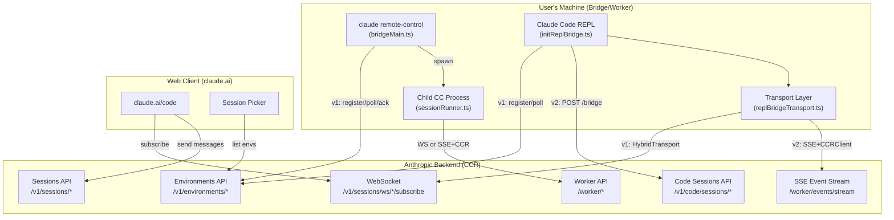
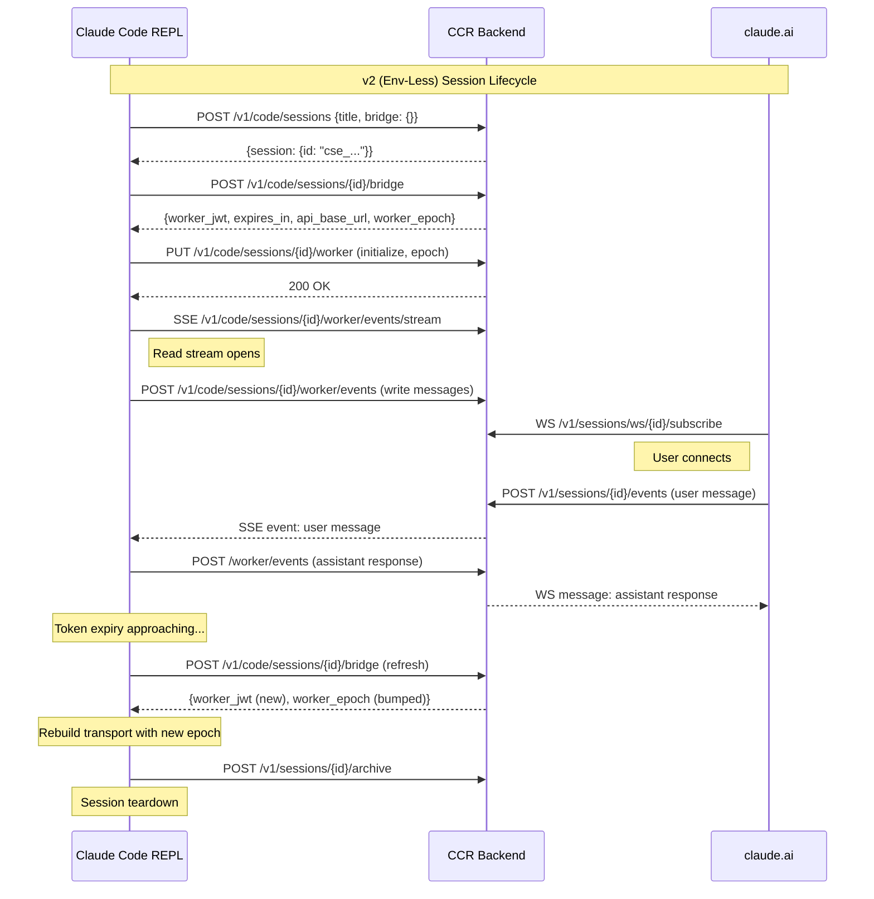
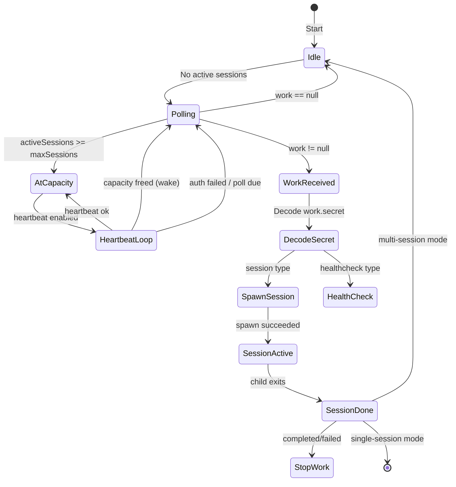
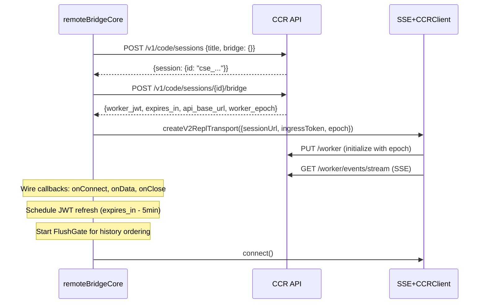
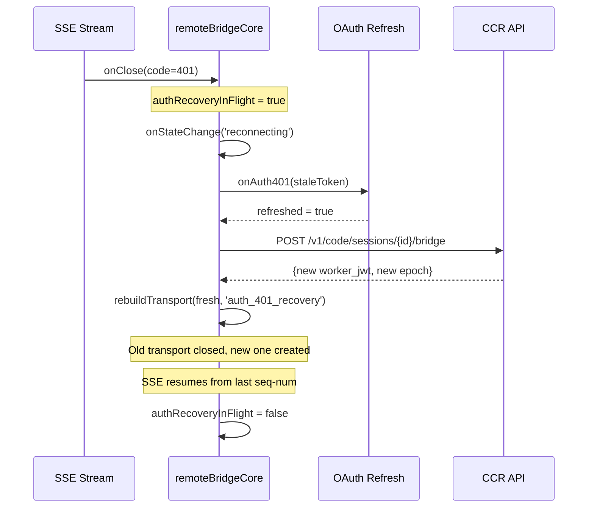
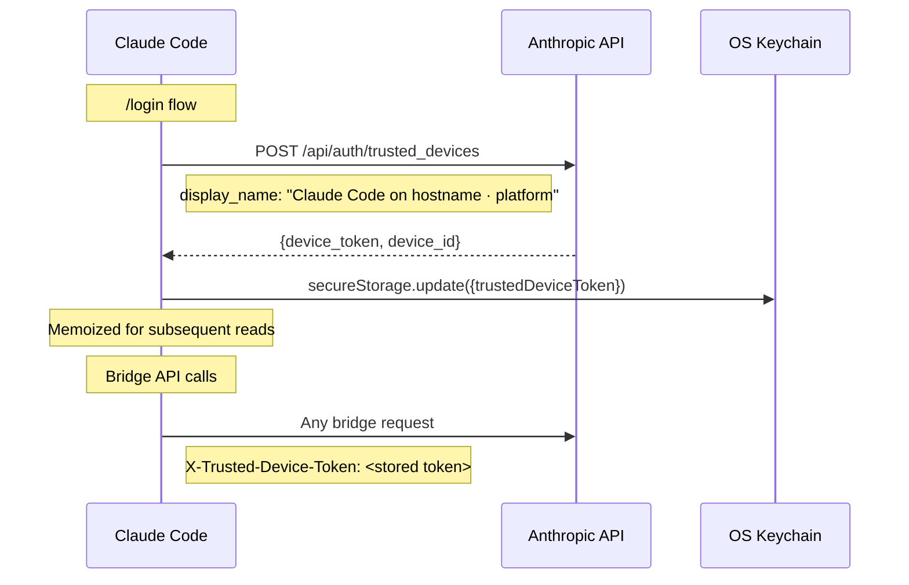
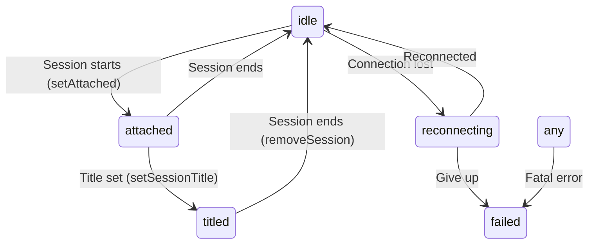

# Bridge System: Remote Sessions and Cross-Device Connectivity

## Table of Contents

1. [Overview](#overview)
2. [Architecture Summary](#architecture-summary)
3. [Two Protocol Generations: v1 (Env-Based) and v2 (Env-Less)](#two-protocol-generations)
4. [Core Bridge Types and Configuration](#core-bridge-types-and-configuration)
5. [Bridge API Client (bridgeApi.ts)](#bridge-api-client)
6. [Standalone Bridge Loop (bridgeMain.ts)](#standalone-bridge-loop)
7. [REPL Bridge (replBridge.ts + initReplBridge.ts)](#repl-bridge)
8. [Env-Less Bridge Core (remoteBridgeCore.ts)](#env-less-bridge-core)
9. [Transport Layer (replBridgeTransport.ts)](#transport-layer)
10. [Session Management](#session-management)
11. [Messaging System](#messaging-system)
12. [Authentication and Security](#authentication-and-security)
13. [Poll Configuration and Timing](#poll-configuration-and-timing)
14. [Infrastructure Primitives](#infrastructure-primitives)
15. [Bridge UI and Status Display](#bridge-ui-and-status-display)
16. [Remote Client Components](#remote-client-components)
17. [Direct Connect Server Components](#direct-connect-server-components)
18. [Feature Gating and Entitlements](#feature-gating-and-entitlements)
19. [Debugging and Fault Injection](#debugging-and-fault-injection)
20. [Error Handling and Recovery Strategies](#error-handling-and-recovery-strategies)

---

## Overview

The Bridge System is Claude Code's mechanism for remote sessions -- it enables users to start a Claude Code session on one machine (the "bridge" or "worker") and interact with it from another device via the claude.ai web interface. The system is called "Remote Control" in the user-facing product.

There are two distinct operational modes:

1. **Standalone bridge** (`claude remote-control`) -- a dedicated server process that registers an environment with the backend, polls for work items, and spawns child Claude Code processes to handle sessions. Supports multi-session configurations (worktree, same-dir) and single-session mode.

2. **REPL bridge** (`/remote-control` slash command) -- an in-process bridge that connects an already-running Claude Code REPL to the cloud backend so the same conversation is accessible from the web. No child process spawning; messages flow through the existing REPL's message loop.

Both modes connect to the same server-side infrastructure (Anthropic's CCR -- Claude Code Remote) and appear as the same entity to the claude.ai frontend.

---

## Architecture Summary



---

## Two Protocol Generations

The bridge system has two protocol generations running concurrently, gated by GrowthBook feature flags.

### v1: Environment-Based (Env-Based)

The original protocol, used by both standalone bridge and REPL bridge. Flow:

1. **Register** -- `POST /v1/environments/bridge` returns `environment_id` and `environment_secret`
2. **Poll** -- `GET /v1/environments/{id}/work/poll` long-polls for work items
3. **Acknowledge** -- `POST /v1/environments/{id}/work/{workId}/ack`
4. **Work** -- Decode work secret (base64url JSON), extract `session_ingress_token`, connect transport
5. **Heartbeat** -- `POST /v1/environments/{id}/work/{workId}/heartbeat` extends work lease
6. **Stop** -- `POST /v1/environments/{id}/work/{workId}/stop` when session ends
7. **Deregister** -- `DELETE /v1/environments/bridge/{id}` on shutdown

The work secret contains the session JWT, API base URL, git sources, auth tokens, and optional MCP config.

### v2: Env-Less (Direct Bridge)

Gated by `tengu_bridge_repl_v2`. Removes the Environments API layer entirely:

1. **Create session** -- `POST /v1/code/sessions` (OAuth auth, no environment_id) returns `cse_*` session ID
2. **Bridge credentials** -- `POST /v1/code/sessions/{id}/bridge` (OAuth) returns `{worker_jwt, expires_in, api_base_url, worker_epoch}`. Each call bumps epoch -- it IS the worker registration.
3. **Connect transport** -- `createV2ReplTransport(worker_jwt, worker_epoch)` creates SSE read stream + CCRClient write path
4. **Token refresh** -- Proactive scheduler fires 5 minutes before expiry, re-calls `/bridge` to get fresh JWT + new epoch, rebuilds transport
5. **401 recovery** -- SSE 401 triggers OAuth refresh, then `/bridge` re-call, then transport rebuild

No register/poll/ack/stop/heartbeat/deregister environment lifecycle.



---

## Core Bridge Types and Configuration

**File: `src/bridge/types.ts`**

Central type definitions for the entire bridge system.

### Key Types

| Type | Purpose |
|------|---------|
| `WorkData` | Work item payload: `{type: 'session'\|'healthcheck', id: string}` |
| `WorkResponse` | Full poll response: environment_id, state, data, secret, created_at |
| `WorkSecret` | Decoded base64url payload: session_ingress_token, api_base_url, sources, auth, mcp_config, `use_code_sessions` flag |
| `BridgeConfig` | Bridge instance config: dir, machineName, branch, maxSessions, spawnMode, workerType, environmentId, apiBaseUrl, sessionIngressUrl, sessionTimeoutMs |
| `SpawnMode` | `'single-session' \| 'worktree' \| 'same-dir'` -- how multi-session bridge allocates working directories |
| `BridgeWorkerType` | `'claude_code' \| 'claude_code_assistant'` -- sent as metadata.worker_type for web filtering |
| `SessionHandle` | Running session: sessionId, done promise, kill/forceKill, activities ring buffer, accessToken, writeStdin, updateAccessToken |
| `SessionSpawnOpts` | Spawn params: sessionId, sdkUrl, accessToken, useCcrV2 flag, workerEpoch, onFirstUserMessage callback |
| `BridgeApiClient` | Interface for all bridge API calls: register, poll, ack, stop, deregister, sendPermissionResponseEvent, archiveSession, reconnectSession, heartbeatWork |
| `BridgeLogger` | Full UI logging interface: banner, session lifecycle, status display, QR code, multi-session bullet list |
| `PermissionResponseEvent` | `{type: 'control_response', response: {subtype: 'success', request_id, response}}` |
| `SessionActivity` | `{type: 'tool_start'\|'text'\|'result'\|'error', summary, timestamp}` |
| `SessionDoneStatus` | `'completed' \| 'failed' \| 'interrupted'` |

### BridgeConfig Fields

**File: `src/bridge/bridgeConfig.ts`**

Shared auth/URL resolution with Anthropic-internal dev overrides:

- `getBridgeTokenOverride()` -- reads `CLAUDE_BRIDGE_OAUTH_TOKEN` (ant-only)
- `getBridgeBaseUrlOverride()` -- reads `CLAUDE_BRIDGE_BASE_URL` (ant-only)
- `getBridgeAccessToken()` -- dev override, then OAuth keychain
- `getBridgeBaseUrl()` -- dev override, then production OAuth config

---

## Bridge API Client

**File: `src/bridge/bridgeApi.ts`**

Factory function `createBridgeApiClient(deps)` returns a `BridgeApiClient` implementation. All API calls:

### Endpoints

| Method | Endpoint | Auth | Purpose |
|--------|----------|------|---------|
| `registerBridgeEnvironment` | `POST /v1/environments/bridge` | OAuth | Register bridge, returns environment_id + environment_secret |
| `pollForWork` | `GET /v1/environments/{id}/work/poll` | environment_secret | Long-poll for work items. Accepts `reclaim_older_than_ms` query param |
| `acknowledgeWork` | `POST /v1/environments/{id}/work/{workId}/ack` | session_ingress_token | Acknowledge receipt of work item |
| `stopWork` | `POST /v1/environments/{id}/work/{workId}/stop` | OAuth | Mark work as done (with `force` flag) |
| `deregisterEnvironment` | `DELETE /v1/environments/bridge/{id}` | OAuth | Remove environment on shutdown |
| `archiveSession` | `POST /v1/sessions/{id}/archive` | OAuth | Archive session (409 if already archived) |
| `reconnectSession` | `POST /v1/environments/{id}/bridge/reconnect` | OAuth | Re-queue session after bridge death |
| `heartbeatWork` | `POST /v1/environments/{id}/work/{workId}/heartbeat` | session_ingress_token (JWT) | Extend work lease, returns `{lease_extended, state}` |
| `sendPermissionResponseEvent` | `POST /v1/sessions/{id}/events` | session_ingress_token | Send control_response for permission decisions |

### Headers

Every request includes:
```
Authorization: Bearer <token>
Content-Type: application/json
anthropic-version: 2023-06-01
anthropic-beta: environments-2025-11-01
x-environment-runner-version: <CLI_VERSION>
X-Trusted-Device-Token: <device_token> (when available)
```

### Error Handling

`handleErrorStatus` maps HTTP status codes:
- **200/204** -- success
- **401** -- `BridgeFatalError` with login instructions
- **403** -- `BridgeFatalError`, checks for `expired` error type
- **404** -- `BridgeFatalError`
- **410** -- `BridgeFatalError` (environment expired)
- **429** -- transient `Error` (rate limited)
- **Other** -- transient `Error`

### OAuth 401 Retry

`withOAuthRetry` wraps OAuth-authenticated requests. On 401:
1. Calls `deps.onAuth401(staleAccessToken)` to attempt token refresh
2. If refreshed, retries request once with new token
3. If retry also 401s, returns the 401 for `handleErrorStatus` to throw `BridgeFatalError`

### ID Validation

`validateBridgeId` enforces `^[a-zA-Z0-9_-]+$` pattern on all server-provided IDs before URL interpolation, preventing path traversal attacks.

---

## Standalone Bridge Loop

**File: `src/bridge/bridgeMain.ts`** (115KB, ~2400 lines)

The largest file in the bridge system. `runBridgeLoop()` is the main entry point for `claude remote-control`.

### State Management

The loop maintains several concurrent maps:

| Map | Key | Value | Purpose |
|-----|-----|-------|---------|
| `activeSessions` | sessionId | `SessionHandle` | Currently running sessions |
| `sessionStartTimes` | sessionId | `number` | Spawn timestamp for duration tracking |
| `sessionWorkIds` | sessionId | workId | Maps sessions to their work items |
| `sessionCompatIds` | sessionId | compatSessionId | Cached `cse_*` to `session_*` translation |
| `sessionIngressTokens` | sessionId | JWT string | Per-session ingress tokens for heartbeat auth |
| `sessionTimers` | sessionId | timeout handle | Per-session timeout watchdogs |
| `completedWorkIds` | -- | Set\<string\> | Already-stopped work items (dedup stale re-deliveries) |
| `sessionWorktrees` | sessionId | `{worktreePath, branch, gitRoot}` | Worktree cleanup metadata |
| `timedOutSessions` | -- | Set\<string\> | Sessions killed by timeout watchdog |
| `titledSessions` | -- | Set\<string\> | Sessions that already have a title |

### Backoff Configuration

```typescript
const DEFAULT_BACKOFF = {
  connInitialMs: 2_000,
  connCapMs: 120_000,       // 2 minutes
  connGiveUpMs: 600_000,    // 10 minutes
  generalInitialMs: 500,
  generalCapMs: 30_000,
  generalGiveUpMs: 600_000, // 10 minutes
  shutdownGraceMs: 30_000,  // SIGTERM -> SIGKILL grace
  stopWorkBaseDelayMs: 1000, // stopWork retry base
}
```

### Poll Loop Flow



### Work Processing

When `pollForWork` returns a work item:

1. **Skip completed** -- if `completedWorkIds.has(work.id)`, skip (stale re-delivery)
2. **Decode secret** -- `decodeWorkSecret(work.secret)` extracts JWT, api_base_url, sources
3. **Check type** -- `work.data.type === 'session'` or `'healthcheck'`
4. **Healthcheck** -- acknowledge and continue
5. **Existing session** -- if `activeSessions.has(sessionId)`, update token (reconnect after JWT expiry)
6. **At capacity** -- acknowledge but don't spawn, wait for capacity
7. **New session** -- acknowledge, build SDK URL, spawn child process

### Session Spawning

For new sessions:
1. Acknowledge work via `api.acknowledgeWork()`
2. If CCR v2 (`secret.use_code_sessions`), call `registerWorker()` for epoch
3. Build SDK URL: v1 uses `buildSdkUrl()` (ws://), v2 uses `buildCCRv2SdkUrl()` (http://)
4. In worktree mode, call `createAgentWorktree()` for isolated git worktree
5. Call `spawner.spawn(opts, dir)` to start child process
6. Wire `onSessionDone` handler for cleanup
7. Start per-session timeout watchdog
8. Schedule token refresh via `tokenRefresh.schedule()`

### Shutdown Sequence

1. Kill all active sessions (SIGTERM)
2. Wait `shutdownGraceMs` (30s default)
3. Force-kill survivors (SIGKILL)
4. Stop all work items (with retry)
5. Archive all sessions
6. Clean up worktrees
7. Deregister environment
8. Shutdown analytics (Datadog, first-party logging)

---

## REPL Bridge

### initReplBridge.ts (Entry Point)

**File: `src/bridge/initReplBridge.ts`**

REPL-specific wrapper that reads bootstrap state, then delegates to the bootstrap-free core.

**Initialization sequence:**

1. Wire `setCseShimGate(isCseShimEnabled)` for session ID translation
2. Check `isBridgeEnabledBlocking()` -- GrowthBook gate
3. Check OAuth tokens -- `getBridgeAccessToken()`
4. Wait for policy limits to load
5. Check policy: `isPolicyAllowed('remote_control')`
6. Check minimum version (`checkBridgeMinVersion` or `checkEnvLessBridgeMinVersion`)
7. Gather git context (branch, remote URL)
8. Derive session title (from conversation or explicit name)
9. **Branch on `isEnvLessBridgeEnabled()`:**
   - **v2 path** -- call `initEnvLessBridgeCore()` from `remoteBridgeCore.ts`
   - **v1 path** -- call `initBridgeCore()` from `replBridge.ts`

### replBridge.ts (v1 Core)

**File: `src/bridge/replBridge.ts`** (100KB, ~2500 lines)

`initBridgeCore()` implements the env-based REPL bridge.

**Key types:**

```typescript
type ReplBridgeHandle = {
  bridgeSessionId: string
  environmentId: string
  sessionIngressUrl: string
  writeMessages(messages: Message[]): void
  writeSdkMessages(messages: SDKMessage[]): void
  sendControlRequest(request: SDKControlRequest): void
  sendControlResponse(response: SDKControlResponse): void
  sendControlCancelRequest(requestId: string): void
  sendResult(): void
  teardown(): Promise<void>
}

type BridgeState = 'ready' | 'connected' | 'reconnecting' | 'failed'
```

**Lifecycle:**

1. Register bridge environment
2. Create session via `createSession()` callback
3. Write bridge pointer for crash recovery
4. Enter poll loop for work items
5. On work received: decode secret, build transport (v1 or v2), connect
6. On connect: flush initial history, drain queued messages
7. On close: attempt reconnect, or fall through to `doReconnect()` environment recovery
8. On teardown: archive session, deregister environment, clear pointer

**Reconnection strategy (`doReconnect()`):**

The v1 core has a sophisticated reconnection strategy when the environment is lost:

- **Strategy 1:** Re-register with `reuseEnvironmentId`, call `reconnectSession()` if env ID matches
- **Strategy 2:** Fresh environment + fresh session creation
- Both strategies reuse the same transport callbacks and state

### replBridgeHandle.ts (Global Handle)

**File: `src/bridge/replBridgeHandle.ts`**

Global pointer to the active REPL bridge handle. Set when init completes; cleared on teardown. Allows tools and slash commands outside the React tree to invoke bridge methods (e.g., for PR subscriptions).

```typescript
let handle: ReplBridgeHandle | null = null
export function setReplBridgeHandle(h: ReplBridgeHandle | null): void
export function getReplBridgeHandle(): ReplBridgeHandle | null
export function getSelfBridgeCompatId(): string | undefined
```

---

## Env-Less Bridge Core

**File: `src/bridge/remoteBridgeCore.ts`** (~1000 lines)

`initEnvLessBridgeCore()` implements the v2 protocol. Architecturally simpler than v1 -- no poll loop, no environment registration, no work dispatch.

### Initialization Sequence



### State Variables

| Variable | Type | Purpose |
|----------|------|---------|
| `recentPostedUUIDs` | `BoundedUUIDSet(2000)` | Echo dedup -- messages we POST come back on SSE |
| `initialMessageUUIDs` | `Set<string>` | Unbounded fallback for initial history UUIDs |
| `recentInboundUUIDs` | `BoundedUUIDSet(2000)` | Re-delivery dedup for inbound prompts |
| `flushGate` | `FlushGate<Message>` | Queues live writes during history flush POST |
| `initialFlushDone` | `boolean` | Latch for one-time history flush |
| `tornDown` | `boolean` | Teardown guard |
| `authRecoveryInFlight` | `boolean` | Serializes JWT refresh + 401 recovery (prevents double epoch bump) |
| `userMessageCallbackDone` | `boolean` | Latch for title derivation callback |
| `connectCause` | `ConnectCause` | Telemetry: 'initial' / 'proactive_refresh' / 'auth_401_recovery' |

### Transport Rebuild

Both proactive refresh and 401 recovery share `rebuildTransport()`:

1. Set `connectCause` for telemetry
2. Start `flushGate` (queue writes during rebuild)
3. Get `seq` from old transport's `getLastSequenceNum()`
4. Close old transport
5. Create new transport with `initialSequenceNum: seq` (SSE resumes from old position)
6. Wire callbacks
7. Connect new transport
8. Schedule new token refresh
9. Drain flush gate into new transport

### 401 Recovery Flow



### Teardown Sequence

1. Set `tornDown = true`, cancel refresh timers, clear connect deadline
2. Drop flush gate
3. Report state 'idle' + write result message (before archive, giving uploader drain window)
4. Archive session via `POST /v1/sessions/{compatId}/archive`
5. Retry once on 401 (OAuth refresh)
6. Close transport
7. Emit telemetry

---

## Transport Layer

**File: `src/bridge/replBridgeTransport.ts`**

Abstraction over two transport implementations:

### ReplBridgeTransport Interface

```typescript
type ReplBridgeTransport = {
  write(message: StdoutMessage): Promise<void>
  writeBatch(messages: StdoutMessage[]): Promise<void>
  close(): void
  isConnectedStatus(): boolean
  getStateLabel(): string
  setOnData(callback: (data: string) => void): void
  setOnClose(callback: (closeCode?: number) => void): void
  setOnConnect(callback: () => void): void
  connect(): void
  getLastSequenceNum(): number      // SSE high-water mark for resume
  readonly droppedBatchCount: number // Silent drop detection
  reportState(state: SessionState): void      // PUT /worker state
  reportMetadata(metadata): void              // PUT /worker metadata
  reportDelivery(eventId, status): void       // POST delivery ACK
  flush(): Promise<void>                       // Drain write queue
}
```

### v1 Transport (HybridTransport)

`createV1ReplTransport(hybrid)` -- thin wrapper around `HybridTransport`:
- **Reads:** WebSocket connection to session-ingress
- **Writes:** HTTP POST to session-ingress
- `getLastSequenceNum()` always returns 0 (WS doesn't use SSE seq-nums)
- `reportState`, `reportMetadata`, `reportDelivery` are no-ops
- `flush()` resolves immediately

### v2 Transport (SSE + CCRClient)

`createV2ReplTransport(opts)` -- wraps `SSETransport` (reads) + `CCRClient` (writes):

**Authentication:** v2 endpoints validate the JWT's `session_id` claim + worker role. OAuth tokens do not have these -- this is the inverse of v1's OAuth-authenticated path.

**Construction sequence:**

1. Set up auth header builder (per-instance closure or process-wide env var)
2. Register worker: `POST /worker/register` returns `worker_epoch` (unless epoch already provided from `/bridge` response)
3. Create `SSETransport` with initial sequence number
4. Create `CCRClient` wrapping SSE + session URL
5. Wire `onEpochMismatch` handler (409 from server -- epoch superseded, close everything)
6. Wire auto-ACK: `reportDelivery('received')` + `reportDelivery('processed')` on every SSE event
7. Defer `sse.connect()` and `ccr.initialize()` until `.connect()` is called

**Close codes:**

| Code | Meaning | Recovery |
|------|---------|----------|
| 401 | JWT expired | Recoverable (refresh OAuth, rebuild transport) |
| 4090 | CCR epoch mismatch | Terminal (another worker took over) |
| 4091 | CCR init failed | Terminal (server rejected initialization) |
| 4092 | SSE reconnect budget exhausted | Terminal (10min auto-reconnect failed) |

---

## Session Management

### createSession.ts

**File: `src/bridge/createSession.ts`**

Session lifecycle API calls (all use OAuth + org-scoped headers):

#### `createBridgeSession()`
- `POST /v1/sessions` with `environment_id`, title, events, git source/outcome context, model, permission_mode
- Returns session ID string or null

#### `getBridgeSession()`
- `GET /v1/sessions/{id}` returns `{environment_id, title}`
- Used by `--session-id` resume to discover the environment

#### `archiveBridgeSession()`
- `POST /v1/sessions/{id}/archive`
- Idempotent (409 = already archived)
- Best-effort -- callers wrap with `.catch()`

#### `updateBridgeSessionTitle()`
- `PATCH /v1/sessions/{id}` with `{title}`
- Re-tags `cse_*` to `session_*` via `toCompatSessionId()` for compat gateway

### codeSessionApi.ts

**File: `src/bridge/codeSessionApi.ts`**

Thin HTTP wrappers for the v2 code-session API. Separate file to avoid bundling the heavy CLI tree.

#### `createCodeSession()`
- `POST /v1/code/sessions` with `{title, bridge: {}}`
- Validates response has `session.id` starting with `cse_`

#### `fetchRemoteCredentials()`
- `POST /v1/code/sessions/{id}/bridge`
- Returns `RemoteCredentials: {worker_jwt, api_base_url, expires_in, worker_epoch}`
- Each call bumps epoch server-side

### sessionRunner.ts

**File: `src/bridge/sessionRunner.ts`**

`createSessionSpawner(deps)` returns a `SessionSpawner` that spawns child Claude Code processes.

**Child process configuration:**
- `--print --sdk-url <url> --session-id <id> --input-format stream-json --output-format stream-json --replay-user-messages`
- Environment: `CLAUDE_CODE_ENVIRONMENT_KIND=bridge`, `CLAUDE_CODE_SESSION_ACCESS_TOKEN=<jwt>`
- v2 additionally sets: `CLAUDE_CODE_USE_CCR_V2=1`, `CLAUDE_CODE_WORKER_EPOCH=<epoch>`

**Output parsing:** Reads NDJSON from child stdout, extracts:
- `SessionActivity` (tool_start, text, result, error) for status display
- `control_request` messages (permission prompts) forwarded to server
- First user message text (for session title derivation)

**Token refresh:** `updateAccessToken()` writes `update_environment_variables` message to child stdin, which the child's `StructuredIO` handler picks up to update `process.env.CLAUDE_CODE_SESSION_ACCESS_TOKEN`.

### sessionIdCompat.ts

**File: `src/bridge/sessionIdCompat.ts`**

Session ID tag translation for the CCR v2 compat layer:

- `toCompatSessionId(id)` -- `cse_*` to `session_*` (for compat API endpoints like `/v1/sessions/*`)
- `toInfraSessionId(id)` -- `session_*` to `cse_*` (for infrastructure-layer calls like `/bridge/reconnect`)
- `setCseShimGate(gate)` -- register GrowthBook kill switch (`tengu_bridge_repl_v2_cse_shim_enabled`)

Both transformations preserve the UUID body -- same entity, different "tag" prefix.

---

## Messaging System

### bridgeMessaging.ts

**File: `src/bridge/bridgeMessaging.ts`**

Shared transport-layer helpers for both v1 and v2 cores. Everything is pure -- no closure over bridge-specific state.

#### Message Eligibility

`isEligibleBridgeMessage(m)` -- only forward:
- `user` messages (not virtual)
- `assistant` messages (not virtual)
- `system` messages with `subtype === 'local_command'`

Excluded: tool_result, progress, virtual (inner REPL calls), etc.

#### Ingress Message Routing

`handleIngressMessage(data, recentPostedUUIDs, recentInboundUUIDs, callbacks)`:

1. Parse JSON, apply `normalizeControlMessageKeys()`
2. Check `isSDKControlResponse` -- route to `onPermissionResponse`
3. Check `isSDKControlRequest` -- route to `onControlRequest`
4. Check `isSDKMessage` -- apply dedup filters:
   - Skip if UUID in `recentPostedUUIDs` (echo of our own message)
   - Skip if UUID in `recentInboundUUIDs` (re-delivered inbound)
5. Only forward `type === 'user'` messages to `onInboundMessage`

#### Server Control Request Handling

`handleServerControlRequest(request, handlers)`:

| Subtype | Action |
|---------|--------|
| `initialize` | Reply with minimal capabilities (commands: [], models: [], account: {}) |
| `set_model` | Call `onSetModel`, reply success |
| `set_max_thinking_tokens` | Call `onSetMaxThinkingTokens`, reply success |
| `set_permission_mode` | Call `onSetPermissionMode`, reply success or error |
| `interrupt` | Call `onInterrupt`, reply success |
| Unknown | Reply with error (prevents server timeout) |

In `outboundOnly` mode, all mutable requests reply with error except `initialize` (server kills connection on init failure).

#### BoundedUUIDSet

FIFO-bounded set backed by a circular buffer for echo dedup. `O(capacity)` memory:

```typescript
class BoundedUUIDSet {
  constructor(capacity: number)
  add(uuid: string): void    // Evicts oldest at capacity
  has(uuid: string): boolean
  clear(): void
}
```

### inboundMessages.ts

**File: `src/bridge/inboundMessages.ts`**

`extractInboundMessageFields(msg)` -- process inbound user messages:
- Skip non-user types
- Extract `content` (string or ContentBlockParam[])
- Extract UUID
- Normalize image blocks (fix camelCase `mediaType` from mobile clients to snake_case `media_type`)

### inboundAttachments.ts

**File: `src/bridge/inboundAttachments.ts`**

Resolves `file_uuid` attachments on inbound bridge user messages:

1. Web composer uploads via cookie-authed `/api/{org}/upload`
2. Message arrives with `file_attachments: [{file_uuid, file_name}]`
3. Bridge fetches each via `GET /api/oauth/files/{uuid}/content` (OAuth-authed)
4. Writes to `~/.claude/uploads/{sessionId}/`
5. Prepends `@"path"` refs to message content
6. Claude's Read tool takes it from there

All failures are best-effort -- logged and skipped. File names are sanitized with UUID prefix for collision avoidance.

### bridgePermissionCallbacks.ts

**File: `src/bridge/bridgePermissionCallbacks.ts`**

Type definitions for the permission request/response flow between bridge and server:

```typescript
type BridgePermissionResponse = {
  behavior: 'allow' | 'deny'
  updatedInput?: Record<string, unknown>
  updatedPermissions?: PermissionUpdate[]
  message?: string
}
```

---

## Authentication and Security

### jwtUtils.ts

**File: `src/bridge/jwtUtils.ts`**

#### JWT Decoding

`decodeJwtPayload(token)` -- decode without signature verification. Strips `sk-ant-si-` prefix if present.

`decodeJwtExpiry(token)` -- extract `exp` claim (Unix seconds).

#### Token Refresh Scheduler

`createTokenRefreshScheduler({getAccessToken, onRefresh, label, refreshBufferMs})`:

- Schedules a callback `refreshBufferMs` (default 5 minutes) before token expiry
- `schedule(sessionId, token)` -- decode JWT exp, compute delay, set timer
- `scheduleFromExpiresIn(sessionId, expiresInSeconds)` -- explicit TTL (for opaque JWTs)
- Clamps to 30s floor to prevent tight-looping
- Generation counter prevents stale async `doRefresh` from setting orphaned timers
- Up to 3 retry attempts on refresh failure (60s retry delay)
- Fallback: 30-minute follow-up refresh for long-running sessions

### workSecret.ts

**File: `src/bridge/workSecret.ts`**

#### `decodeWorkSecret(secret)`
Decode base64url-encoded work secret, validate version === 1, validate required fields.

#### `buildSdkUrl(apiBaseUrl, sessionId)`
Build WebSocket URL for v1 session-ingress:
- Localhost: `ws://host/v2/session_ingress/ws/{sessionId}`
- Production: `wss://host/v1/session_ingress/ws/{sessionId}` (Envoy rewrites /v1/ to /v2/)

#### `buildCCRv2SdkUrl(apiBaseUrl, sessionId)`
Build HTTP URL for v2: `{base}/v1/code/sessions/{sessionId}`

#### `sameSessionId(a, b)`
Compare session IDs ignoring tag prefix. Extracts UUID body after the last underscore. Handles both `session_*` and `cse_*` tags, plus staging variants (`cse_staging_*`). Minimum length guard (4 chars) prevents false matches.

#### `registerWorker(sessionUrl, accessToken)`
`POST /worker/register` returns `worker_epoch`. Handles protojson int64-as-string encoding.

### trustedDevice.ts

**File: `src/bridge/trustedDevice.ts`**

Trusted device token for elevated-security bridge sessions.

**Architecture:**
- Bridge sessions have `SecurityTier=ELEVATED` on the server (CCR v2)
- CLI-side flag `tengu_sessions_elevated_auth_enforcement` controls whether `X-Trusted-Device-Token` header is sent
- Server-side flag controls enforcement -- two flags for staged rollout

**Token lifecycle:**



**Enrollment constraints:**
- Server gates on `account_session.created_at < 10min` -- must happen during `/login`
- Always re-enrolls on `/login` (handles account switches)
- Skips if `CLAUDE_TRUSTED_DEVICE_TOKEN` env var is set
- Skips for essential-traffic-only privacy level

**Token storage:**
- Stored in OS keychain via `secureStorage`
- Memoized in memory (macOS `security` subprocess is ~40ms per read)
- Cache cleared on enrollment and logout

---

## Poll Configuration and Timing

### pollConfigDefaults.ts

**File: `src/bridge/pollConfigDefaults.ts`**

```typescript
type PollIntervalConfig = {
  poll_interval_ms_not_at_capacity: number      // 2000ms default
  poll_interval_ms_at_capacity: number           // 600,000ms (10min) default
  non_exclusive_heartbeat_interval_ms: number    // 0 (disabled) default
  multisession_poll_interval_ms_not_at_capacity: number   // 2000ms
  multisession_poll_interval_ms_partial_capacity: number  // 2000ms
  multisession_poll_interval_ms_at_capacity: number       // 600,000ms
  reclaim_older_than_ms: number                  // 5000ms
  session_keepalive_interval_v2_ms: number       // 120,000ms (2min)
}
```

**Design constraints:**
- Server `BRIDGE_LAST_POLL_TTL` = 4h (Redis key expiry)
- 10min at-capacity poll gives 24x headroom on Redis TTL
- Heartbeat interval of 60s gives 5x headroom under 300s heartbeat TTL
- `reclaim_older_than_ms` matches server's `DEFAULT_RECLAIM_OLDER_THAN_MS`

### pollConfig.ts

**File: `src/bridge/pollConfig.ts`**

`getPollIntervalConfig()` fetches from GrowthBook flag `tengu_bridge_poll_interval_config` with 5-minute refresh. Validates with Zod schema:

- Seek-work intervals: `.min(100)` floor
- At-capacity intervals: 0 (disabled) or >= 100ms
- Object-level refines: at least one liveness mechanism must be enabled (heartbeat OR poll)

### envLessBridgeConfig.ts

**File: `src/bridge/envLessBridgeConfig.ts`**

v2-specific timing config from GrowthBook flag `tengu_bridge_repl_v2_config`:

```typescript
type EnvLessBridgeConfig = {
  init_retry_max_attempts: 3          // createSession + /bridge retries
  init_retry_base_delay_ms: 500
  init_retry_jitter_fraction: 0.25
  init_retry_max_delay_ms: 4000
  http_timeout_ms: 10_000
  uuid_dedup_buffer_size: 2000
  heartbeat_interval_ms: 20_000       // CCRClient heartbeat (server TTL 60s)
  heartbeat_jitter_fraction: 0.1
  token_refresh_buffer_ms: 300_000    // 5 minutes before expiry
  teardown_archive_timeout_ms: 1500   // Under 2s graceful shutdown cap
  connect_timeout_ms: 15_000          // onConnect deadline
  min_version: '0.0.0'
  should_show_app_upgrade_message: false
}
```

All values have Zod floors/caps to prevent fat-fingered GrowthBook values from causing harm.

---

## Infrastructure Primitives

### FlushGate (flushGate.ts)

**File: `src/bridge/flushGate.ts`**

State machine for ordering historical messages before live messages:

```
start() --> enqueue() returns true, items queued
end()   --> returns queued items, enqueue() returns false
drop()  --> discards all, deactivates
deactivate() --> clears active without dropping (transport replacement)
```

Used to prevent live messages from arriving at the server interleaved with historical messages during the initial flush POST.

### CapacityWake (capacityWake.ts)

**File: `src/bridge/capacityWake.ts`**

Signal merger for at-capacity sleep wakeup:

```typescript
type CapacityWake = {
  signal(): CapacitySignal  // Merged signal: outer loop abort OR capacity freed
  wake(): void              // Abort current sleep, arm fresh controller
}
```

Used by both replBridge.ts and bridgeMain.ts to sleep while at capacity but wake early when a session completes.

### Bridge Pointer (bridgePointer.ts)

**File: `src/bridge/bridgePointer.ts`**

Crash-recovery pointer for Remote Control sessions:

```typescript
type BridgePointer = {
  sessionId: string
  environmentId: string
  source: 'standalone' | 'repl'
}
```

**Lifecycle:**
- Written immediately after session creation
- Refreshed periodically (mtime bump serves as heartbeat)
- Cleared on clean shutdown (non-perpetual mode)
- Staleness: checked against file mtime, 4-hour TTL (`BRIDGE_POINTER_TTL_MS`)
- Location: `~/.claude/projects/{sanitized_dir}/bridge-pointer.json`

**Worktree fanout:** `readBridgePointerAcrossWorktrees()` checks current dir first, then fans out to git worktree siblings (max 50) via parallel `stat()` calls.

---

## Bridge UI and Status Display

### bridgeUI.ts

**File: `src/bridge/bridgeUI.ts`**

`createBridgeLogger(options)` returns a `BridgeLogger` implementation.

**Status state machine:**



**Features:**
- Terminal status line with live updates (1s ticker)
- Shimmer animation on idle status text
- QR code generation (toggleable with `q` key)
- OSC 8 terminal hyperlinks for session URLs
- Multi-session bullet list display
- Visual line counting with grapheme segmentation for wrap-aware cursor management
- Spawn mode indicator (worktree/same-dir)

### bridgeStatusUtil.ts

**File: `src/bridge/bridgeStatusUtil.ts`**

Pure utility functions for status display:

- `buildBridgeConnectUrl(environmentId, ingressUrl)` -- `https://claude.ai/code?bridge={id}`
- `buildBridgeSessionUrl(sessionId, environmentId)` -- session-specific URL with bridge query param
- `computeShimmerSegments(text, glimmerIndex)` -- grapheme-aware text splitting for animation
- `getBridgeStatus({error, connected, sessionActive, reconnecting})` -- derives label + color
- `wrapWithOsc8Link(text, url)` -- terminal hyperlink escape sequences

---

## Remote Client Components

**Directory: `src/remote/`**

These components are for the **consuming** side -- a Claude Code instance connecting to a remote session (not hosting one).

### RemoteSessionManager.ts

Manages a remote CCR session from the viewer/controller side:
- WebSocket subscription for receiving messages
- HTTP POST for sending user messages via `sendEventToRemoteSession()`
- Permission request/response flow
- Interrupt signal (`cancelSession()`)
- Reconnect on stale connection

### SessionsWebSocket.ts

WebSocket client for subscribing to session events:

**Protocol:**
1. Connect to `wss://api.anthropic.com/v1/sessions/ws/{sessionId}/subscribe?organization_uuid=...`
2. Auth via headers (`Authorization: Bearer <oauth_token>`)
3. Receive SDK message stream

**Reconnection:**
- 5 max attempts, 2s delay between
- 4001 (session not found): 3 retries with escalating delay (transient during compaction)
- 4003 (unauthorized): permanent, stop reconnecting
- 30s ping interval for keepalive

### sdkMessageAdapter.ts

Converts SDK messages from CCR to REPL internal message types:
- `SDKAssistantMessage` to `AssistantMessage`
- `SDKPartialAssistantMessage` to `StreamEvent`
- `SDKResultMessage` to `SystemMessage` (errors only; success results are noise)
- `SDKSystemMessage` (init) to informational `SystemMessage`
- `SDKCompactBoundaryMessage` to compact boundary `SystemMessage`
- Unknown types: gracefully ignored with debug logging

### remotePermissionBridge.ts

Creates synthetic `AssistantMessage` objects for remote permission requests (the ToolUseConfirm UI requires one, but the actual tool use runs on the CCR container). Also creates stub `Tool` objects for tools not loaded locally (e.g., remote MCP tools).

---

## Direct Connect Server Components

**Directory: `src/server/`**

Alternative to cloud-mediated bridge -- direct local server for testing and development.

### createDirectConnectSession.ts

`POST ${serverUrl}/sessions` with `{cwd, dangerously_skip_permissions}`. Validates response against `connectResponseSchema: {session_id, ws_url, work_dir?}`. Returns `DirectConnectConfig`.

### directConnectManager.ts

WebSocket-based session manager for direct connections:
- Connects via `ws_url` from session creation
- Parses NDJSON lines from WebSocket messages
- Handles control_request routing (permission prompts)
- Sends user messages, permission responses, interrupts via WebSocket

### types.ts (Server)

```typescript
type ServerConfig = {
  port: number; host: string; authToken: string; unix?: string
  idleTimeoutMs?: number; maxSessions?: number; workspace?: string
}
type SessionState = 'starting' | 'running' | 'detached' | 'stopping' | 'stopped'
type SessionInfo = { id, status, createdAt, workDir, process, sessionKey? }
type SessionIndexEntry = { sessionId, transcriptSessionId, cwd, permissionMode?, createdAt, lastActiveAt }
```

---

## Feature Gating and Entitlements

**File: `src/bridge/bridgeEnabled.ts`**

### Gate Hierarchy

```
isBridgeEnabled() (non-blocking, UI visibility)
  └── isClaudeAISubscriber() (excludes Bedrock/Vertex/Foundry/API keys)
  └── tengu_ccr_bridge (GrowthBook feature flag)

isBridgeEnabledBlocking() (blocking, entitlement check)
  └── isClaudeAISubscriber()
  └── tengu_ccr_bridge (blocking, awaits GrowthBook init)

isEnvLessBridgeEnabled() (v2 path selection)
  └── tengu_bridge_repl_v2

isCseShimEnabled() (cse_/session_ retag kill switch)
  └── tengu_bridge_repl_v2_cse_shim_enabled (default: true)

getCcrAutoConnectDefault() (auto-connect on session start)
  └── feature('CCR_AUTO_CONNECT') build flag
  └── tengu_cobalt_harbor

isCcrMirrorEnabled() (outbound-only mirror mode)
  └── feature('CCR_MIRROR') build flag
  └── CLAUDE_CODE_CCR_MIRROR env var OR tengu_ccr_mirror
```

### `getBridgeDisabledReason()`

Returns actionable error messages:
1. Not a claude.ai subscriber -- "Run `claude auth login`"
2. Missing profile scope (setup-token / env var) -- "Run `claude auth login` to use Remote Control"
3. Missing organization UUID -- "Run `claude auth login` to refresh"
4. Gate not enabled -- "Remote Control is not yet enabled for your account"

### Minimum Version Enforcement

- v1: `tengu_bridge_min_version` dynamic config (cached, non-blocking)
- v2: `tengu_bridge_repl_v2_config.min_version` (blocking read)

Both compare `MACRO.VERSION` using semver `lt()`.

---

## Debugging and Fault Injection

### bridgeDebug.ts

**File: `src/bridge/bridgeDebug.ts`**

Ant-only fault injection for testing recovery paths. Accessible via `/bridge-kick` slash command.

```typescript
type BridgeFault = {
  method: 'pollForWork' | 'registerBridgeEnvironment' | 'reconnectSession' | 'heartbeatWork'
  kind: 'fatal' | 'transient'
  status: number
  errorType?: string
  count: number  // Remaining injections
}

type BridgeDebugHandle = {
  fireClose(code: number): void       // Trigger transport close handler
  forceReconnect(): void              // Call reconnectEnvironmentWithSession
  injectFault(fault: BridgeFault): void
  wakePollLoop(): void                // Abort at-capacity sleep
  describe(): string                  // env/session IDs
}
```

`wrapApiForFaultInjection(api)` interposes on API calls to check the fault queue before delegating. Zero overhead in external builds (only enabled when `USER_TYPE === 'ant'`).

### debugUtils.ts

**File: `src/bridge/debugUtils.ts`**

- `redactSecrets(s)` -- regex-based redaction of sensitive fields (keeps first 8 + last 4 chars for IDs > 16 chars)
- `debugTruncate(s)` -- collapse newlines, truncate to 2000 chars
- `debugBody(data)` -- JSON serialize + redact + truncate
- `describeAxiosError(err)` -- extract server response body message
- `extractHttpStatus(err)` -- pull HTTP status from axios error
- `extractErrorDetail(data)` -- pull message from `data.message` or `data.error.message`
- `logBridgeSkip(reason, debugMsg)` -- centralized skip telemetry

---

## Error Handling and Recovery Strategies

### Connection Error Recovery (v1 Standalone Bridge)

The poll loop uses exponential backoff with two independent budgets:

| Error Type | Initial | Cap | Give Up |
|-----------|---------|-----|---------|
| Connection errors (network, ECONNREFUSED) | 2s | 2min | 10min |
| General errors (4xx, 5xx) | 500ms | 30s | 10min |

**System sleep detection:** If a poll iteration takes longer than `2 * connCapMs` (4 minutes), treat it as a laptop wake and reset error budgets. Prevents false give-ups after resume.

**Fatal errors** (`BridgeFatalError`): 401, 403, 404, 410 -- immediate loop termination, no retry.

**Suppressible 403s**: Errors for `external_poll_sessions` or `environments:manage` scopes don't affect core functionality and are silently suppressed.

### Connection Error Recovery (v1 REPL Bridge)

The REPL bridge has a more complex recovery path because it must preserve session state:

1. **Transport close** -- reconnect within same environment (new transport, same session)
2. **Poll 404** -- environment lost; `doReconnect()` re-registers environment and either reconnects existing session or creates new one
3. **Poll 410** -- environment expired; same as 404 but with different error message

### Connection Error Recovery (v2 Env-Less Bridge)

Simpler because there is no environment lifecycle:

1. **SSE 401** -- `recoverFromAuthFailure()`: refresh OAuth, re-call `/bridge`, rebuild transport
2. **Proactive refresh** -- fires 5min before JWT expiry, same rebuild path
3. **Serialization** -- `authRecoveryInFlight` flag prevents double `/bridge` calls (each bumps epoch)
4. **SSE auto-reconnect** -- `SSETransport` handles transient disconnects internally for 10 minutes
5. **Terminal failures** (4090, 4091, 4092) -- no recovery; `onStateChange('failed')`

### Heartbeat Strategy

- **v1 standalone:** Per-work-item heartbeat via `POST .../work/{workId}/heartbeat` using session ingress JWT (no DB hit)
- **v1 REPL:** Heartbeats run in the at-capacity loop, interleaved with polling
- **v2:** CCRClient sends heartbeats automatically at configurable interval (20s default, 60s server TTL)

### JWT Expiry Handling

- JWTs are opaque -- not decoded for auth purposes, only for `exp` claim extraction
- Refresh fires `refreshBufferMs` before expiry (default 5 minutes)
- v1: delivers fresh OAuth token to child process via stdin `update_environment_variables`
- v2: calls `reconnectSession()` to trigger server re-dispatch (CCR worker endpoints reject OAuth tokens)

### Data Integrity

- **Echo dedup:** `BoundedUUIDSet(2000)` ring buffer filters our own messages echoed back
- **Re-delivery dedup:** Separate `recentInboundUUIDs` set catches server history replays
- **FlushGate:** Ensures `[history..., live...]` ordering during initial connect
- **Sequence number carryover:** v2 transport rebuilds carry the SSE `from_sequence_num` to avoid full history replay
- **Idempotent archive:** 409 response is not an error (already archived)
