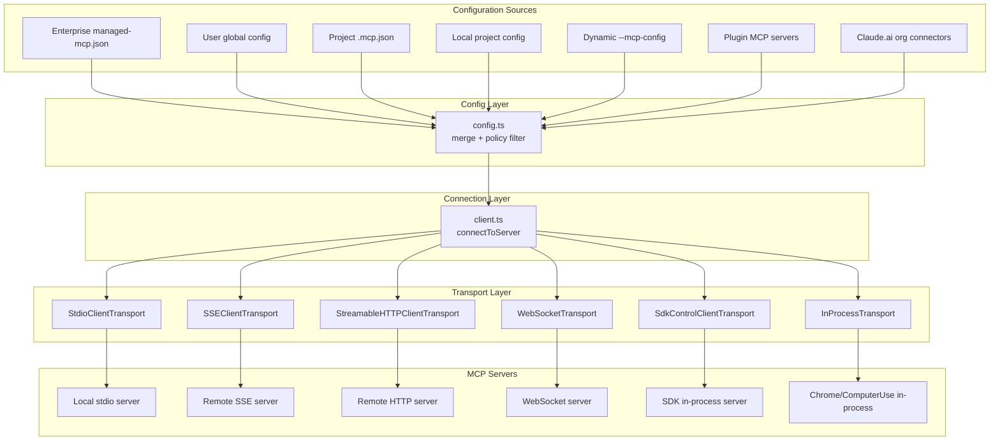
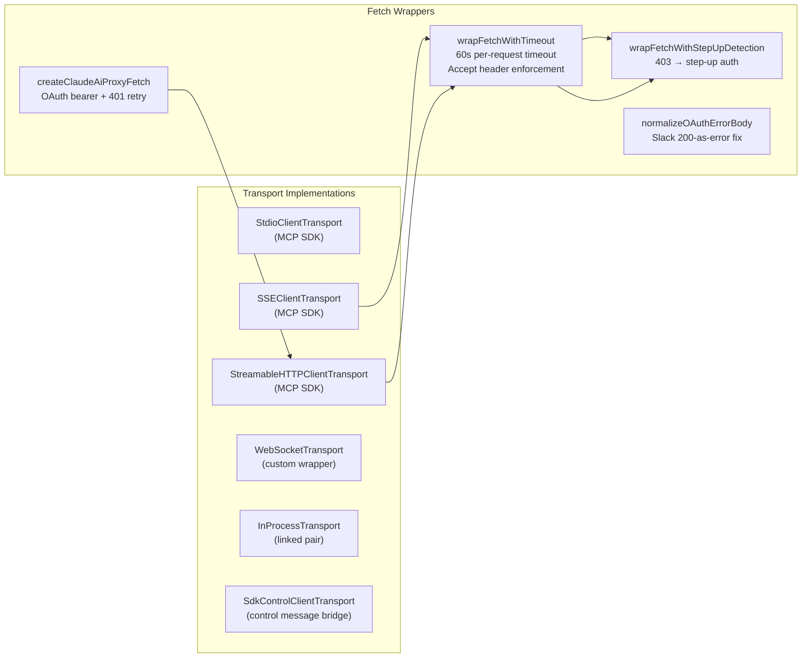
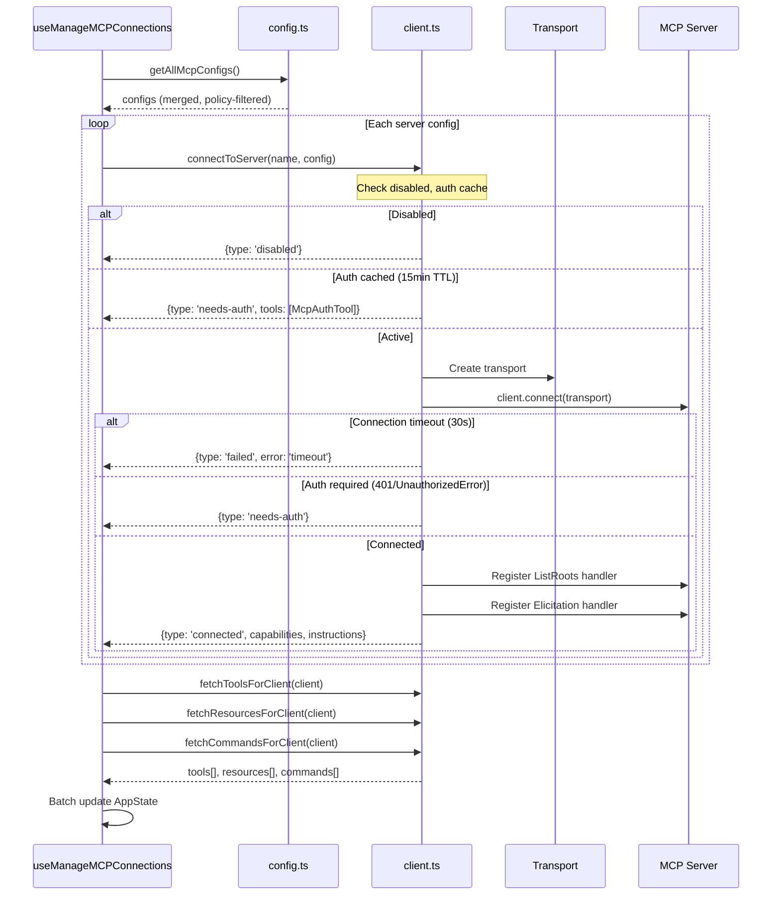
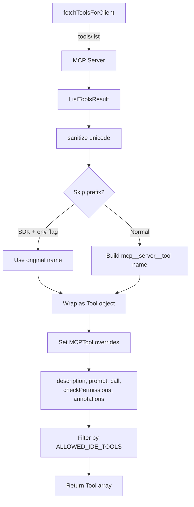
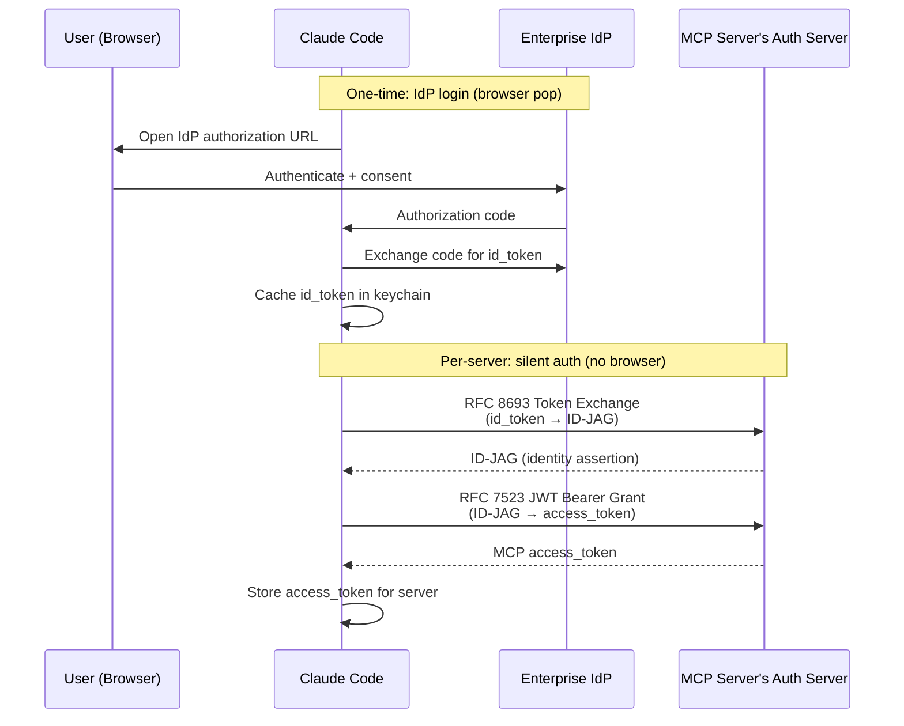

# MCP (Model Context Protocol) Integration

This document describes how Claude Code implements MCP client functionality: discovering, connecting to, authenticating with, and invoking tools/resources/prompts from external MCP servers.

---

## 1. Architectural Overview

Claude Code acts as an **MCP client**, connecting to one or more MCP servers that expose tools, resources, and prompts. The implementation lives primarily in `src/services/mcp/`, with tool surface-area files in `src/tools/MCPTool/`, `src/tools/McpAuthTool/`, `src/tools/ListMcpResourcesTool/`, and `src/tools/ReadMcpResourceTool/`.

### Key Modules

| File | Responsibility |
|------|----------------|
| `types.ts` | Zod schemas and TypeScript types for all config shapes, connection states, and serialized wire formats |
| `config.ts` | Multi-scope config discovery, merge, policy enforcement, env var expansion, add/remove operations |
| `client.ts` | Transport creation, connection lifecycle, tool/resource/prompt fetching, tool invocation, memoized caching |
| `auth.ts` | OAuth 2.1 client provider (`ClaudeAuthProvider`), PKCE flow, token storage/refresh, step-up detection |
| `xaa.ts` | Cross-App Access (XAA/SEP-990): RFC 8693 token exchange + RFC 7523 JWT bearer grant |
| `xaaIdpLogin.ts` | OIDC IdP login for XAA: one browser pop, cached `id_token`, reused across N MCP servers |
| `useManageMCPConnections.ts` | React hook: orchestrates connection lifecycle, batched state updates, auto-reconnection, channel integration |
| `MCPConnectionManager.tsx` | React context provider exposing `reconnectMcpServer` and `toggleMcpServer` to UI components |
| `InProcessTransport.ts` | Linked transport pair for running MCP servers in the same process (Chrome, Computer Use) |
| `SdkControlTransport.ts` | Bridge transport for SDK-hosted MCP servers communicating via structured control messages |
| `elicitationHandler.ts` | Server-initiated elicitation (form and URL modes), hooks integration, completion notifications |
| `headersHelper.ts` | Dynamic header injection via external scripts with workspace trust checks |
| `envExpansion.ts` | `${VAR}` and `${VAR:-default}` expansion in config values |
| `normalization.ts` | Server name normalization to `[a-zA-Z0-9_-]` for API compatibility |
| `mcpStringUtils.ts` | Tool name construction/parsing: `mcp__<server>__<tool>` |
| `channelPermissions.ts` | Permission approval relay over channel servers (Telegram, iMessage, Discord) |
| `channelAllowlist.ts` | GrowthBook-driven allowlist for approved channel plugins |
| `claudeai.ts` | Fetching MCP server configs from Claude.ai organization settings |
| `officialRegistry.ts` | Prefetching the official Anthropic MCP server registry for URL verification |
| `oauthPort.ts` | OAuth redirect port selection for loopback callback URIs |
| `vscodeSdkMcp.ts` | VS Code extension MCP integration (file update notifications, experiment gate sync) |
| `utils.ts` | Filtering tools/commands/resources by server, project approval status, scope helpers |



---

## 2. Configuration Schema and Discovery

### 2.1 Server Config Types

All config types are defined as Zod schemas in `types.ts`. The discriminated union `McpServerConfigSchema` covers:

**Stdio** (`McpStdioServerConfigSchema`) -- the default when `type` is omitted:
```json
{
  "command": "npx",
  "args": ["-y", "@modelcontextprotocol/server-filesystem"],
  "env": { "HOME": "/Users/me" }
}
```

**SSE** (`McpSSEServerConfigSchema`):
```json
{
  "type": "sse",
  "url": "https://mcp.example.com/sse",
  "headers": { "X-API-Key": "..." },
  "headersHelper": "/path/to/script.sh",
  "oauth": {
    "clientId": "abc",
    "callbackPort": 3118,
    "authServerMetadataUrl": "https://auth.example.com/.well-known/oauth-authorization-server",
    "xaa": true
  }
}
```

**Streamable HTTP** (`McpHTTPServerConfigSchema`):
```json
{
  "type": "http",
  "url": "https://mcp.example.com/mcp",
  "headers": {},
  "headersHelper": "/path/to/script.sh",
  "oauth": { "clientId": "..." }
}
```

**WebSocket** (`McpWebSocketServerConfigSchema`):
```json
{
  "type": "ws",
  "url": "wss://mcp.example.com/ws",
  "headers": {}
}
```

**SDK** (`McpSdkServerConfigSchema`) -- for IDE extension-hosted servers:
```json
{
  "type": "sdk",
  "name": "claude-vscode"
}
```

**IDE variants** (`sse-ide`, `ws-ide`) -- internal types for IDE extension connections.

**Claude.ai proxy** (`McpClaudeAIProxyServerConfigSchema`) -- organization-managed servers accessed through the Claude.ai MCP proxy.

### 2.2 Configuration Scopes

The `ConfigScope` enum defines seven scope levels:

| Scope | Source | Description |
|-------|--------|-------------|
| `enterprise` | `managed-mcp.json` in managed settings path | Managed IT-controlled; when present, has **exclusive control** -- all other scopes are ignored |
| `user` | Global Claude config (`~/.claude/config.json`) | Per-user settings |
| `project` | `.mcp.json` in project root | Shared across the team via version control; requires explicit approval |
| `local` | Project-local config (`.claude/settings.local.json`) | User-specific overrides per project, not committed |
| `dynamic` | `--mcp-config` CLI flag | Runtime config passed as JSON |
| `claudeai` | Claude.ai API (`/v1/mcp_servers`) | Organization connectors from Claude.ai web UI |
| `managed` | Managed file path | Policy-controlled settings |

### 2.3 Config Merge Order

`getClaudeCodeMcpConfigs()` in `config.ts` assembles the final config using this precedence (higher wins):

```
plugin < user < project(approved) < local
```

Enterprise mode short-circuits: if `managed-mcp.json` exists, only enterprise servers are used. Claude.ai servers are merged at lowest precedence via `getAllMcpConfigs()`.

Key behaviors during merge:
- **Plugin deduplication**: Plugin servers are namespaced as `plugin:<name>:<server>`. Content-based signature matching (`stdio:command+args` or `url:URL`) prevents duplicate connections when a plugin provides the same server a user already configured manually.
- **Claude.ai deduplication**: `dedupClaudeAiMcpServers()` suppresses claude.ai connectors whose URL signature matches an enabled manual server.
- **CCR proxy URL unwrapping**: In remote sessions, claude.ai connector URLs are rewritten to route through the CCR proxy. `unwrapCcrProxyUrl()` extracts the original vendor URL from the `mcp_url` query parameter for accurate dedup.
- **Policy filtering**: `isMcpServerAllowedByPolicy()` checks both `allowedMcpServers` and `deniedMcpServers` settings. Denylist takes absolute precedence. Matching supports name, command array, and URL patterns with wildcards.
- **Environment variable expansion**: `expandEnvVarsInString()` handles `${VAR}` and `${VAR:-default}` syntax in command, args, env, URL, and header values.

### 2.4 Project Server Approval

Servers from `.mcp.json` (project scope) require explicit user approval before they connect. `getProjectMcpServerStatus()` in `utils.ts` tracks approval state. Only servers with status `'approved'` pass through to the connection layer.

---

## 3. Transport Layer Architecture



### 3.1 Stdio Transport

For `type: "stdio"` (or unspecified type), `StdioClientTransport` from the MCP SDK spawns a child process. Key details:

- **Shell prefix**: If `CLAUDE_CODE_SHELL_PREFIX` is set, the command is wrapped (e.g., for Docker execution).
- **Environment**: Merges `subprocessEnv()` (sanitized parent environment) with config-level `env` overrides.
- **Stderr capture**: Piped and accumulated (up to 64MB cap) for debugging. Handler is cleaned up on disconnect to prevent memory leaks.
- **Graceful shutdown**: On cleanup, signals escalate SIGINT -> SIGTERM -> SIGKILL with 100ms/400ms grace periods. The 600ms total cap keeps CLI exit responsive.

### 3.2 SSE Transport

For `type: "sse"`, `SSEClientTransport` from the MCP SDK is configured with:

- **Auth provider**: `ClaudeAuthProvider` instance for OAuth token management.
- **Combined headers**: Static config headers merged with dynamic `headersHelper` output.
- **Separate fetch for EventSource**: The long-lived SSE stream uses a fetch without the 60-second timeout wrapper. Only POST requests (tool calls, auth) use the timeout.
- **Proxy support**: `getProxyFetchOptions()` injects HTTP/HTTPS proxy configuration.

### 3.3 Streamable HTTP Transport

For `type: "http"`, `StreamableHTTPClientTransport` from the MCP SDK implements the MCP Streamable HTTP specification:

- **Accept header**: `application/json, text/event-stream` is enforced on all POST requests per the spec.
- **Per-request timeout**: `wrapFetchWithTimeout()` creates a fresh `AbortController` per request (60s default), avoiding the stale-signal bug where a single `AbortSignal.timeout()` expires for the whole session.
- **Session ingress**: When `getSessionIngressAuthToken()` returns a JWT (remote sessions), it is set as `Authorization: Bearer` unless the server has stored OAuth tokens.

### 3.4 WebSocket Transport

For `type: "ws"`, a custom `WebSocketTransport` wraps a `ws.WebSocket` client (or Bun's native WebSocket):

- **Protocol**: Connects with `['mcp']` subprotocol.
- **TLS/mTLS**: `getWebSocketTLSOptions()` provides client certificate configuration.
- **Proxy**: Platform-specific proxy agent from `getWebSocketProxyAgent()`.

### 3.5 In-Process Transport

`InProcessTransport` in `InProcessTransport.ts` creates a linked transport pair for servers that run in the same process:

```
[clientTransport] <--microtask queue--> [serverTransport]
```

`send()` on one side delivers to `onmessage` on the other via `queueMicrotask()` (avoiding stack depth issues with synchronous request/response). `close()` on either side closes both. Used for:

- **Chrome MCP server** (`claude-in-chrome`): Avoids spawning a ~325MB subprocess.
- **Computer Use MCP server**: Same rationale; the actual dispatch goes through `wrapper.tsx`.

### 3.6 SDK Control Transport

`SdkControlClientTransport` and `SdkControlServerTransport` in `SdkControlTransport.ts` bridge communication between the CLI process and SDK-hosted MCP servers:

```
CLI Process                          SDK Process
-----------                          -----------
MCP Client                           MCP Server
    |                                     |
SdkControlClientTransport           SdkControlServerTransport
    |                                     |
    +-- control request (stdout) -------->+
    |<-- control response (stdin) --------+
```

The control request wrapper includes `server_name` for routing to the correct SDK server. Message IDs are preserved for correlation.

### 3.7 IDE Transports

Two internal transport types serve IDE extensions:

- **`sse-ide`**: SSE transport to a local IDE extension server; no authentication.
- **`ws-ide`**: WebSocket transport with an optional `X-Claude-Code-Ide-Authorization` header token and mTLS support.

Both are filtered to only expose specific tools (`mcp__ide__executeCode`, `mcp__ide__getDiagnostics`).

---

## 4. Connection Lifecycle



### 4.1 Connection Caching

`connectToServer` is wrapped in `lodash/memoize` keyed by `name + JSON.stringify(config)`. This means:

- **Subsequent calls** for the same server return the cached promise (no reconnection).
- **Config changes** invalidate the cache (different JSON key).
- **`onclose`** handler clears the cache entry, so the next `ensureConnectedClient()` call triggers a fresh connection.
- **Fetch caches** (`fetchToolsForClient`, `fetchResourcesForClient`, `fetchCommandsForClient`) are LRU-memoized by server name (cap: 20 entries) and cleared alongside the connection cache.

### 4.2 Batched Concurrency

`getMcpToolsCommandsAndResources()` processes servers in two concurrent pools:

| Pool | Default Concurrency | Configurable Via |
|------|-------------------|------------------|
| Local (stdio, sdk) | 3 | `MCP_SERVER_CONNECTION_BATCH_SIZE` |
| Remote (sse, http, ws, ide) | 20 | `MCP_REMOTE_SERVER_CONNECTION_BATCH_SIZE` |

Both pools use `pMap` for slot-based scheduling: each slot is freed when its server completes, preventing a single slow server from blocking a batch boundary.

### 4.3 Auto-Reconnection

For remote transports (SSE, HTTP, WebSocket, claude.ai proxy), `useManageMCPConnections` implements exponential backoff reconnection:

- **Max attempts**: 5
- **Backoff**: `min(INITIAL_BACKOFF_MS * 2^attempt, MAX_BACKOFF_MS)` where initial is 1s and max is 30s.
- **Terminal error detection**: Three consecutive errors matching `ECONNRESET`, `ETIMEDOUT`, `EPIPE`, `EHOSTUNREACH`, `ECONNREFUSED`, or `Body Timeout Error` trigger a close-and-reconnect cycle.
- **Session expiry**: HTTP 404 with JSON-RPC code `-32001` ("Session not found") triggers immediate transport close and reconnection.
- **SSE reconnection exhausted**: When the SDK's internal SSE reconnect reaches its max retries, the `onerror` handler calls `closeTransportAndRejectPending()` to unblock hung `callTool()` promises.

Stdio and SDK transports do not auto-reconnect (local processes / in-process -- reconnection would not help).

### 4.4 Connection States

`MCPServerConnection` is a discriminated union:

| State | Meaning |
|-------|---------|
| `connected` | Active connection with client, capabilities, cleanup function |
| `failed` | Connection attempt failed with error message |
| `needs-auth` | Server returned 401 or requires OAuth; `McpAuthTool` is surfaced |
| `pending` | Reconnection in progress (with attempt counter) |
| `disabled` | User explicitly disabled the server |

---

## 5. Tool Discovery and Invocation



### 5.1 Tool Name Convention

MCP tools are named using the pattern `mcp__<normalizedServerName>__<normalizedToolName>`:

- `normalizeNameForMCP()` replaces non-alphanumeric characters (except `-` and `_`) with underscores.
- For claude.ai servers, consecutive underscores are collapsed and leading/trailing underscores are stripped to avoid interfering with the `__` delimiter.
- `mcpInfoFromString()` parses the pattern back to `{serverName, toolName}`.

**Known limitation**: If a server name contains `__`, parsing will be incorrect. This is rare in practice.

### 5.2 Tool Wrapping

Each MCP tool returned from `tools/list` is wrapped as a `Tool` object that spreads over `MCPTool` (the base definition in `src/tools/MCPTool/MCPTool.ts`). Key overrides:

- **`name`**: Fully qualified `mcp__server__tool` (or bare name for SDK with `CLAUDE_AGENT_SDK_MCP_NO_PREFIX`).
- **`mcpInfo`**: `{ serverName, toolName }` for permission matching independent of the display name.
- **`description` / `prompt`**: Capped at 2048 characters (`MAX_MCP_DESCRIPTION_LENGTH`) to handle OpenAPI-generated servers that dump 15-60KB of endpoint docs.
- **`inputJSONSchema`**: Passed through directly from the MCP server.
- **`searchHint`**: From `tool._meta['anthropic/searchHint']` -- whitespace-collapsed for deferred tool list formatting.
- **`alwaysLoad`**: From `tool._meta['anthropic/alwaysLoad']` -- bypasses deferred loading.
- **`isConcurrencySafe` / `isReadOnly`**: From `tool.annotations.readOnlyHint`.
- **`isDestructive`**: From `tool.annotations.destructiveHint`.
- **`isOpenWorld`**: From `tool.annotations.openWorldHint`.
- **`checkPermissions`**: Returns `passthrough` with a suggestion to add the fully qualified tool name to `localSettings` allow rules.
- **`call`**: Invokes `callMCPToolWithUrlElicitationRetry`, which wraps `callMCPTool` with session retry and URL elicitation handling.

### 5.3 Tool Invocation Flow

```
Tool.call(args, context)
  |
  +-> ensureConnectedClient(client)     // reconnect if cache cleared
  |
  +-> callMCPToolWithUrlElicitationRetry
  |     |
  |     +-> callMCPTool                  // actual SDK callTool
  |     |     |
  |     |     +-> client.callTool(name, args, { signal, timeout, onprogress })
  |     |     +-> validate result (truncate if >100KB, handle binary blobs)
  |     |     +-> check isError flag -> throw McpToolCallError
  |     |
  |     +-> catch McpError(-32042)       // UrlElicitationRequired
  |           +-> process elicitations   // hook or UI prompt
  |           +-> retry tool call
  |
  +-> catch McpSessionExpiredError       // retry once with fresh client
  +-> return { data, mcpMeta }
```

**Timeout**: Default ~27.8 hours (`100_000_000`ms), overridable via `MCP_TOOL_TIMEOUT` env var. An independent `Promise.race` timeout ensures hung SDK calls are caught even when the SDK's internal timeout fails.

**Progress**: Every 30 seconds, a debug log is emitted for long-running tools. SDK `onprogress` events are forwarded to the caller.

### 5.4 The McpAuthTool

When a server is in `needs-auth` state, `createMcpAuthTool()` in `src/tools/McpAuthTool/McpAuthTool.ts` creates a pseudo-tool named `mcp__<server>__authenticate`. This tool:

1. Is auto-allowed (no permission prompt).
2. When called, starts `performMCPOAuthFlow` with `skipBrowserOpen: true`.
3. Returns the authorization URL for the model to present to the user.
4. In the background, awaits the OAuth callback, then calls `reconnectMcpServerImpl` to swap real tools into `AppState`.
5. For claude.ai proxy servers, directs the user to `/mcp` instead (different auth flow).
6. For XAA-enabled servers, the flow may complete silently with a cached IdP token.

---

## 6. Resource and Prompt Discovery

### 6.1 Resources

Two tools expose MCP resources to the model:

**`ListMcpResourcesTool`** (`src/tools/ListMcpResourcesTool/`):
- Calls `resources/list` on all connected servers (or a filtered server).
- Returns `[{uri, name, mimeType, description, server}]`.
- LRU-cached; invalidated on `onclose` and `resources/list_changed` notifications.
- Marked as `shouldDefer: true` (loaded only when needed by the model).

**`ReadMcpResourceTool`** (`src/tools/ReadMcpResourceTool/`):
- Calls `resources/read` with a specific URI.
- Text content is returned directly.
- Binary blobs are decoded from base64, written to disk with mime-derived extension, and replaced with a file path reference (preventing raw base64 from entering the context).
- Images are resized/compressed to meet API dimension limits.

Both tools are only added to the tool set if at least one connected server advertises the `resources` capability, and they are added once (not per-server).

### 6.2 Prompts

MCP prompts are discovered via `prompts/list` and converted to `Command` objects by `fetchCommandsForClient()`:

- Named as `mcp__<normalizedServer>__<promptName>`.
- Arguments are extracted from the prompt's `arguments` field and passed as space-separated values.
- `getPromptForCommand()` calls `client.getPrompt()` and transforms the result through `transformResultContent()`, which handles text, image (with resize), audio (persisted to disk), resource (text or blob), and resource_link content types.
- Prompts appear as slash commands in the UI with the format `/<server>:<promptName>`.

---

## 7. OAuth Authentication

### 7.1 ClaudeAuthProvider

`ClaudeAuthProvider` in `auth.ts` implements the MCP SDK's `OAuthClientProvider` interface. It manages the complete OAuth 2.1 lifecycle for a single MCP server:

**Token storage**: Uses the platform's secure storage (macOS Keychain, etc.) keyed by a hash of the server URL. Tokens, client info, and code verifiers are all stored securely.

**Token refresh**: `refreshAuthorization()` uses the stored refresh token and client info to obtain new access tokens. It handles:
- Transient errors (5xx, `temporarily_unavailable`, `slow_down`) with up to 3 retries with exponential backoff (1s, 2s, 4s).
- `invalid_grant` errors by invalidating stored tokens and returning `false` (triggers re-auth).
- Slack's non-standard error codes (`invalid_refresh_token`, `expired_refresh_token`, `token_expired`) via `normalizeOAuthErrorBody()`.

**Dynamic client registration (DCR)**: `saveClientInformation()` stores the registered client credentials. `clientInformation()` retrieves them.

**Step-up detection**: `wrapFetchWithStepUpDetection()` watches for HTTP 403 responses, which indicate the server's authorization server requires re-authentication (e.g., scope upgrade). It clears cached tokens and signals the auth flow.

### 7.2 OAuth Flow

`performMCPOAuthFlow()` orchestrates the browser-based OAuth flow:

1. Discovers the authorization server metadata.
2. Registers the client (DCR) if no stored client info exists.
3. Generates PKCE `code_verifier` and `code_challenge`.
4. Opens the user's browser to the authorization URL (or returns it via callback).
5. Starts a local HTTP server on a random port in the 49152-65535 range (configurable via `MCP_OAUTH_CALLBACK_PORT`).
6. Waits for the OAuth callback with the authorization code.
7. Exchanges the code for tokens and stores them securely.

The callback server uses `buildRedirectUri()` from `oauthPort.ts` to construct `http://localhost:<port>/callback`.

### 7.3 Auth Caching

`mcp-needs-auth-cache.json` in the Claude config home tracks servers that returned 401, with a 15-minute TTL. This prevents re-probing servers that cannot succeed until the user authenticates:

- Cache writes are serialized through a promise chain to prevent concurrent read-modify-write races.
- The read cache is memoized (single file read shared across N concurrent checks).
- `clearMcpAuthCache()` is called after successful OAuth completion.

Additionally, `hasMcpDiscoveryButNoToken()` provides a persistent check: if a server's OAuth metadata has been discovered but no token is stored, the server is treated as needs-auth without re-probing.

---

## 8. Cross-App Access (XAA / SEP-990)

XAA enables MCP server authentication **without a browser consent screen** by chaining two token exchanges:

```
id_token (from IdP) --RFC 8693 Token Exchange--> ID-JAG
ID-JAG --RFC 7523 JWT Bearer Grant--> access_token (for MCP server)
```

### 8.1 Architecture



### 8.2 Configuration

XAA is enabled per-server via the `oauth.xaa: true` flag and requires a global `xaaIdp` settings block:

```json
{
  "xaaIdp": {
    "issuer": "https://login.example.com",
    "clientId": "claude-code-xaa",
    "callbackPort": 3119
  }
}
```

The `CLAUDE_CODE_ENABLE_XAA` environment variable must also be truthy.

### 8.3 IdP Login (`xaaIdpLogin.ts`)

- `acquireIdpIdToken()` performs the OIDC authorization_code + PKCE flow against the enterprise IdP.
- The resulting `id_token` is cached in secure storage by normalized issuer URL.
- `getCachedIdpIdToken()` returns the cached token if it has not expired (with a 60-second buffer).
- Supports both public clients (PKCE only) and confidential clients (with `idpClientSecret`).

### 8.4 Token Exchange (`xaa.ts`)

- `performCrossAppAccess()` orchestrates the two-leg exchange.
- Discovers the MCP server's OAuth Protected Resource Metadata (RFC 9728) to find the authorization server.
- Performs RFC 8693 token exchange at the AS: `subject_token=id_token`, `requested_token_type=id-jag`.
- Performs RFC 7523 JWT bearer grant at the AS: `assertion=ID-JAG`, returns `access_token`.
- `XaaTokenExchangeError` includes `shouldClearIdToken` to distinguish between bad tokens (clear) and transient server errors (keep).

---

## 9. Permission Model

### 9.1 Enterprise Policy

`config.ts` implements a two-tier policy system:

**Allowlist** (`allowedMcpServers`):
- When defined, only listed servers can connect.
- Empty array means block all.
- Supports three entry types: `serverName`, `serverCommand` (exact array match for stdio), and `serverUrl` (wildcard patterns like `https://*.example.com/*`).
- When `allowManagedMcpServersOnly` is set, only managed (policy) settings control the allowlist.

**Denylist** (`deniedMcpServers`):
- Takes absolute precedence over allowlist.
- Same three entry types.
- Always merges from all sources (users can deny for themselves even under enterprise control).

SDK-type servers are exempt from policy filtering (they are transport placeholders, not user-controlled connections).

### 9.2 Tool-Level Permissions

Each MCP tool's `checkPermissions()` returns `{behavior: 'passthrough'}`, meaning the standard permission system applies. The suggested rule uses the fully qualified `mcp__server__tool` name, ensuring deny rules targeting built-in tools (e.g., "Write") do not match unprefixed MCP replacements.

`getToolNameForPermissionCheck()` in `mcpStringUtils.ts` constructs the canonical permission name from `mcpInfo` rather than `tool.name`, so SDK no-prefix mode still gets correct permission matching.

### 9.3 Dynamic Headers Security

`headersHelper.ts` enforces workspace trust before executing dynamic header scripts from project/local scope. In non-interactive mode (CI/CD), the trust check is skipped. The script receives `CLAUDE_CODE_MCP_SERVER_NAME` and `CLAUDE_CODE_MCP_SERVER_URL` environment variables for multi-server helpers.

### 9.4 Channel Permission Relay

`channelPermissions.ts` implements permission approval relay over channel servers (Telegram, iMessage, Discord). When Claude Code hits a permission dialog, it sends the prompt via active channels and races the reply against local UI, bridge, hooks, and the auto-classifier. The channel server must parse the user's reply and emit a structured `notifications/claude/channel/permission` event with `{request_id, behavior}`.

---

## 10. Elicitation

MCP servers can request user input via the elicitation mechanism (both form-based and URL-based).

### 10.1 Form Elicitation

Server sends `ElicitRequest` with a JSON schema. `registerElicitationHandler()` in `elicitationHandler.ts`:

1. Runs elicitation hooks first (programmatic resolution).
2. If no hook handles it, queues the request in `AppState.elicitation.queue`.
3. The UI renders the form and calls `respond()` with the user's input.
4. Elicitation result hooks can modify or block the response.

### 10.2 URL Elicitation

Two paths:

**Server-initiated** (via `ElicitRequest` with `mode: 'url'`): Handled the same as form elicitation, but the UI shows a "open URL" button and a waiting state. The server can send an `ElicitationComplete` notification to signal completion.

**Error-based** (via JSON-RPC error code `-32042` / `UrlElicitationRequired`): `callMCPToolWithUrlElicitationRetry()` catches this error from `callTool`, processes up to 3 elicitation rounds, and retries the tool call after each successful elicitation. In REPL mode, a two-phase UI shows consent then waiting; in print/SDK mode, the elicitation is delegated to the SDK's structured IO.

---

## 11. Claude.ai Integration

### 11.1 Claude.ai MCP Servers

`claudeai.ts` fetches organization-managed MCP server configs from the Claude.ai API:

- Requires the `user:mcp_servers` OAuth scope.
- Results are memoized for the session lifetime.
- Servers are returned as `claudeai-proxy` type configs, routed through `MCP_PROXY_URL`.
- Display names from the API are used as server names (prefixed with `claude.ai `).
- Collision handling: if multiple servers normalize to the same name, numeric suffixes are added.

### 11.2 Proxy Transport

`createClaudeAiProxyFetch()` wraps fetch for claude.ai proxy connections:

1. Attaches the current OAuth bearer token.
2. On 401, calls `handleOAuth401Error()` to attempt a token refresh.
3. If the token actually changed (keychain refresh succeeded), retries once.
4. If not, checks for concurrent refresh by another connector.

### 11.3 Official Registry

`officialRegistry.ts` prefetches the official Anthropic MCP server registry (`https://api.anthropic.com/mcp-registry/v0/servers`) at startup. `isOfficialMcpUrl()` checks if a server URL is in the registry (fail-closed: unknown registry returns false).

---

## 12. VS Code and IDE Integration

### 12.1 VS Code SDK MCP

`vscodeSdkMcp.ts` handles the `claude-vscode` SDK MCP server:

- Sends `file_updated` notifications when Claude edits files.
- Forwards `log_event` notifications from VS Code as analytics events.
- Sends experiment gate values (`experiment_gates` notification) so the extension can feature-flag consistently.

### 12.2 IDE Transport Filtering

IDE MCP servers (`sse-ide`, `ws-ide`) have tool filtering applied: only `mcp__ide__executeCode` and `mcp__ide__getDiagnostics` are exposed to the model. All other IDE tools are suppressed.

---

## 13. Error Handling

### 13.1 Error Classes

| Class | Purpose |
|-------|---------|
| `McpAuthError` | OAuth token expired during tool call; triggers `needs-auth` state |
| `McpSessionExpiredError` | HTTP 404 + JSON-RPC -32001; clears connection cache for retry |
| `McpToolCallError` | MCP tool returned `isError: true`; carries `_meta` for SDK consumers |
| `XaaTokenExchangeError` | IdP token exchange failed; `shouldClearIdToken` for cache management |

### 13.2 Session Expiry Detection

`isMcpSessionExpiredError()` checks for both HTTP 404 status and JSON-RPC error code `-32001` in the error message. Both signals are required to avoid false positives from generic 404s.

### 13.3 Tool Call Error Handling

- MCP SDK errors (`McpError`) with numeric error codes are wrapped as `TelemetrySafeError` with the code (e.g., `McpError -32000`).
- Generic `Error` instances get their message truncated to 200 chars for telemetry.
- `isError: true` results are thrown as `McpToolCallError` so the caller can handle them distinctly from transport errors.

### 13.4 Content Handling

`callMCPTool` processes results through:

1. **Size check**: `mcpContentNeedsTruncation()` checks if content exceeds the 100KB limit.
2. **Truncation**: `truncateMcpContentIfNeeded()` truncates text content with a `[truncated]` suffix.
3. **Binary persistence**: Non-text content (images, audio, blobs) is written to disk via `persistBinaryContent()` and replaced with file path references.
4. **Image processing**: Images are resized/compressed via `maybeResizeAndDownsampleImageBuffer()` to meet API dimension limits.
5. **Tool result persistence**: Large results are persisted to disk via `persistToolResult()` and referenced by path.

---

## 14. State Management

MCP state is stored in `AppState.mcp`:

```typescript
{
  clients: MCPServerConnection[]       // Connection status per server
  tools: Tool[]                        // All MCP tools across all servers
  commands: Command[]                  // All MCP prompts/skills
  resources: Record<string, ServerResource[]>  // Resources by server name
}
```

`useManageMCPConnections` uses **batched updates**: individual server completions are queued via `pendingUpdatesRef` and flushed in a single `setAppState` call every 16ms (one frame). The batch replaces existing entries by server name prefix (`mcp__<server>__*`), ensuring clean tool/command/resource replacement on reconnection.

The `MCPConnectionManager` React component provides the `reconnectMcpServer` and `toggleMcpServer` functions via context, available to any descendant component via `useMcpReconnect()` and `useMcpToggleEnabled()`.

---

## 15. Environment Variables Reference

| Variable | Default | Purpose |
|----------|---------|---------|
| `MCP_TIMEOUT` | 30000 | Connection timeout (ms) |
| `MCP_TOOL_TIMEOUT` | ~27.8h | Tool call timeout (ms) |
| `MCP_SERVER_CONNECTION_BATCH_SIZE` | 3 | Concurrency for local (stdio/sdk) servers |
| `MCP_REMOTE_SERVER_CONNECTION_BATCH_SIZE` | 20 | Concurrency for remote servers |
| `MCP_OAUTH_CALLBACK_PORT` | random | Fixed port for OAuth redirect |
| `CLAUDE_CODE_SHELL_PREFIX` | -- | Shell wrapper for stdio commands |
| `CLAUDE_AGENT_SDK_MCP_NO_PREFIX` | -- | Skip `mcp__` prefix for SDK servers |
| `CLAUDE_CODE_ENABLE_XAA` | -- | Enable Cross-App Access |
| `ENABLE_CLAUDEAI_MCP_SERVERS` | -- | Set to "0"/"false" to disable claude.ai connectors |
| `CLAUDE_CODE_DISABLE_NONESSENTIAL_TRAFFIC` | -- | Skip official registry prefetch |
