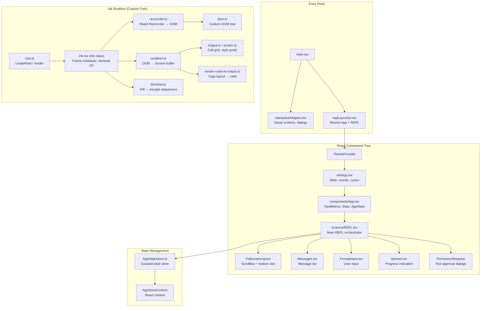
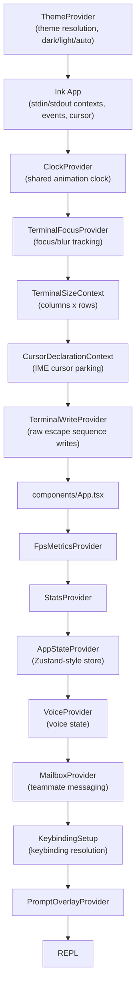
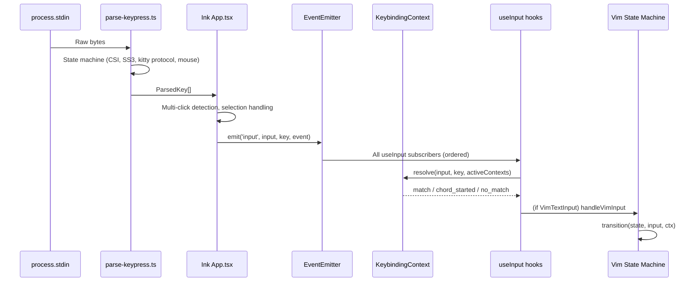
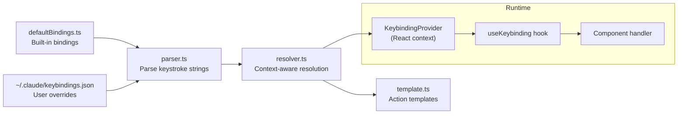
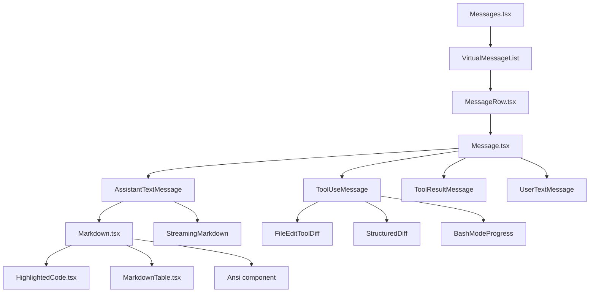
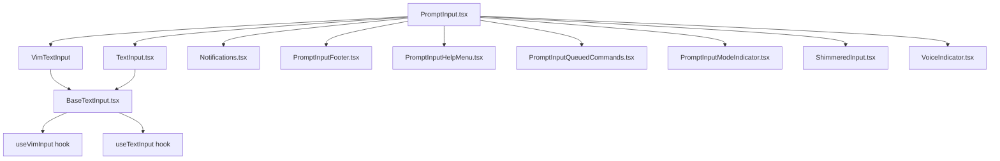
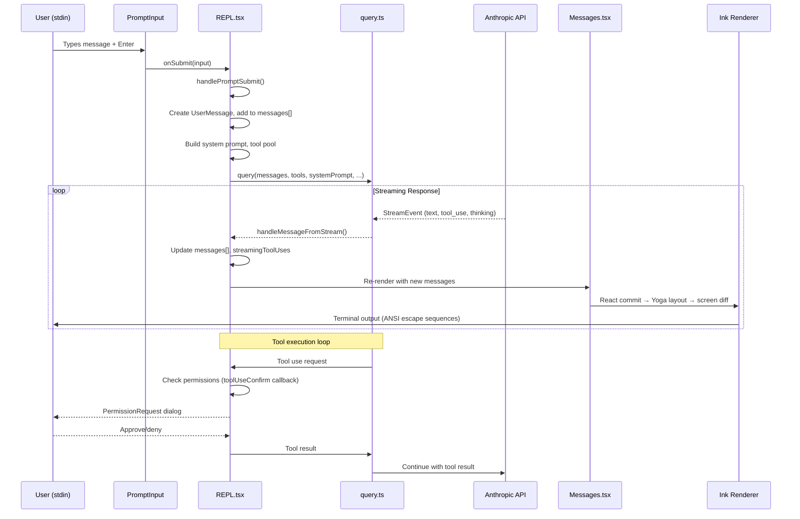

# Terminal UI System

Claude Code builds its interactive terminal interface using a **custom fork of Ink** (React for CLIs) backed by a full React 19 reconciler. The UI is rendered to terminal escape sequences rather than DOM nodes, with a Yoga-based layout engine computing flexbox positions for every frame. This document covers the complete architecture -- from the low-level rendering pipeline to the React component tree, input handling, and the data flow between the UI and the query engine.

---

## 1. Architecture Overview



### Rendering Pipeline Summary

1. **React commit** -- The reconciler updates the custom DOM tree (`dom.ts` nodes: `ink-root`, `ink-box`, `ink-text`, etc.)
2. **Yoga layout** -- `onComputeLayout` runs Yoga's `calculateLayout()` during React's commit phase
3. **Frame render** -- Throttled at `FRAME_INTERVAL_MS` via `scheduleRender`. Writes DOM → cell grid via `renderNodeToOutput`
4. **Screen diff** -- `writeDiffToTerminal` diffs front/back screen buffers, emitting only changed cells as ANSI escape sequences
5. **Terminal output** -- Writes to `stdout` wrapped in Begin/End Synchronized Update (BSU/ESU) when supported

---

## 2. The Ink Layer (`src/ink/`)

Claude Code ships a heavily customized fork of Ink. This is not an npm dependency -- it is vendored and extended in-tree.

### 2.1 Core Class: `Ink` (`ink.tsx`)

The `Ink` class is the runtime engine. One instance exists per stdout stream (tracked in `instances.ts`).

**Key responsibilities:**
- Owns the React `FiberRoot` via `react-reconciler` (Concurrent Mode)
- Manages the **double-buffered screen** (`frontFrame` / `backFrame`) for minimal-diff terminal writes
- Handles **stdin parsing** (keyboard, mouse, paste, escape sequences) via `parse-keypress.ts`
- Implements **text selection** (alt-screen only): word/line selection, drag extension, clipboard copy via OSC 52
- Manages **search highlighting**: `applySearchHighlight` inverts matching cells after the screen is rendered
- Drives **positional highlights** for transcript search navigation
- Schedules renders via `throttle(queueMicrotask(onRender), FRAME_INTERVAL_MS)` -- deferred to a microtask so `useLayoutEffect` cursor declarations land in the same frame
- Handles **SIGCONT** (resume after suspend), **resize**, and **alt-screen** enter/exit

**Double buffering flow:**
```
backFrame.screen ← renderNodeToOutput(rootNode)
                 ← applySelectionOverlay()
                 ← applySearchHighlight()
                 ← applyPositionedHighlight()
                 → writeDiffToTerminal(frontFrame.screen, backFrame.screen)
swap(frontFrame, backFrame)
```

### 2.2 Custom DOM (`dom.ts`)

The reconciler operates on a custom DOM, not browser DOM. Node types:

| Node Name | Purpose |
|---|---|
| `ink-root` | Root container, owns Yoga root node and `FocusManager` |
| `ink-box` | Flexbox container (maps to Yoga node) |
| `ink-text` | Text content with style attributes |
| `ink-virtual-text` | Nested styled text (bold/italic spans) |
| `ink-link` | OSC 8 hyperlinks |
| `ink-progress` | Progress indicators |
| `ink-raw-ansi` | Pre-formatted ANSI content (bypass layout) |

Each `DOMElement` carries:
- `yogaNode` -- Yoga layout node for flexbox computation
- `scrollTop` / `pendingScrollDelta` / `stickyScroll` -- scroll state for `overflow: scroll` boxes
- `_eventHandlers` -- click, hover, keyboard handlers (separate from attributes to avoid dirty-marking on identity changes)
- `dirty` flag -- signals the renderer to recompute this subtree

### 2.3 Layout Engine (`ink/layout/`)

The layout engine wraps **Yoga** (Facebook's flexbox implementation, compiled to native via `native-ts/yoga-layout`). Files:

- `engine.ts` -- Creates and manages `LayoutNode` wrappers around Yoga nodes
- `node.ts` -- `LayoutNode` type with display mode (`Flex`, `None`), measure modes, and overflow tracking
- `geometry.ts` -- Geometry helpers for position/size queries
- `yoga.ts` -- Direct Yoga bindings

Layout is computed **synchronously during React's commit phase** (`onComputeLayout` callback), so `useLayoutEffect` hooks read fresh layout data.

### 2.4 Reconciler (`reconciler.ts`)

Uses `createReconciler` from `react-reconciler` in **Concurrent Root** mode. Key operations:

- `createInstance` / `createTextInstance` -- Creates `ink-box` / `#text` DOM nodes with Yoga nodes
- `appendChild` / `insertBefore` / `removeChild` -- Maintains both the DOM tree and Yoga hierarchy
- `commitUpdate` -- Diffs props, applies style changes via `applyStyles()`, sets event handlers
- `resetAfterCommit` -- Triggers `scheduleRender` after React finishes its commit

### 2.5 Rendering to Screen

**`renderer.ts`** orchestrates per-frame rendering:
1. Reads Yoga-computed dimensions from the root node
2. Creates an `Output` grid (reused across frames for cache efficiency)
3. Calls `renderNodeToOutput` which walks the DOM tree, writes styled characters into the grid
4. Handles scrollable overflow nodes (viewport culling, scroll clamping)
5. Returns a `Frame` with cursor position and screen buffer

**`render-to-screen.ts`** applies post-processing:
- Search highlight overlays (inverts matching cells)
- Positional highlights (current match in yellow)

**`writeDiffToTerminal`** in `terminal.ts` performs the cell-by-cell diff between front and back buffers, emitting minimal escape sequences. Wrapped in **Synchronized Output** (`\x1b[?2026h` / `\x1b[?2026l`) on supported terminals to prevent flicker.

### 2.6 Ink Components (`ink/components/`)

Low-level primitives that the higher-level Claude Code components build on:

| Component | Purpose |
|---|---|
| `App.tsx` | **Root PureComponent** -- Sets up stdin/stdout contexts, raw mode, escape sequence parsing, mouse event dispatch, multi-click detection, terminal focus tracking, keyboard event dispatch, error boundary |
| `Box.tsx` | Flexbox container -- all CSS-like props map to Yoga properties |
| `Text.tsx` | Styled text -- color, bold, italic, dim, underline, strikethrough, inverse, wrap |
| `ScrollBox.tsx` | `Box` with `overflow: scroll` and an imperative scroll API (`scrollTo`, `scrollBy`, `scrollToElement`, `scrollToBottom`). Supports sticky scroll, viewport culling, clamp bounds for virtual scroll |
| `AlternateScreen.tsx` | Enters terminal alt-screen buffer (DEC 1049), constrains height to viewport, enables SGR mouse tracking. On unmount restores main screen |
| `Button.tsx` | Clickable button with hover/active states |
| `Link.tsx` | OSC 8 terminal hyperlinks |
| `Newline.tsx` | Explicit line break |
| `Spacer.tsx` | Flex-grow spacer |
| `NoSelect.tsx` | Marks content as unselectable (search highlight skips these cells) |
| `RawAnsi.tsx` | Renders pre-formatted ANSI strings, bypassing Ink's text processing |
| `ClockContext.tsx` | Shared animation clock -- all `useAnimationFrame` consumers share one clock, reducing timer overhead |

### 2.7 Ink Hooks (`ink/hooks/`)

| Hook | Purpose |
|---|---|
| `use-input.ts` | Subscribe to keyboard input. Callback receives `(input, key, event)`. Event supports `stopImmediatePropagation()`. Sets raw mode on mount |
| `use-stdin.ts` | Access stdin context (raw mode control, event emitter) |
| `use-app.ts` | Access app context (exit function) |
| `use-animation-frame.ts` | Synchronized animation timer that pauses when offscreen. Shares `ClockContext` so all spinners stay in sync. Clock slows when terminal is blurred |
| `use-interval.ts` | `useAnimationTimer` and `useInterval` for periodic updates |
| `use-terminal-viewport.ts` | Reports whether a DOM element is visible in the terminal viewport (for offscreen culling) |
| `use-terminal-focus.ts` | Tracks whether the terminal window has focus (via DEC focus events) |
| `use-terminal-title.ts` | Sets terminal tab title via escape sequences |
| `use-tab-status.ts` | Sets iTerm2/Kitty tab status indicators |
| `use-selection.ts` | Subscribe to text selection state changes |
| `use-search-highlight.ts` | Manage search highlight state on the Ink instance |
| `use-declared-cursor.ts` | Declare where the terminal cursor should park (for IME/a11y) |

### 2.8 Event System (`ink/events/`)

A custom event system modeled on DOM events:

- `Event` -- Base event class with `stopPropagation()` and `stopImmediatePropagation()`
- `InputEvent` -- Keyboard/paste input events (extends Event)
- `KeyboardEvent` -- Structured keyboard events dispatched through the DOM tree
- `ClickEvent` -- Mouse click events with position
- `TerminalFocusEvent` -- Terminal focus/blur events
- `FocusEvent` -- Component focus/blur
- `dispatcher.ts` -- Dispatches events through the DOM tree with capture/bubble phases
- `emitter.ts` -- EventEmitter for the legacy input path (all `useInput` subscribers)

Input flow:
```
stdin data → parse-keypress.ts → ParsedKey[]
  → EventEmitter (legacy path, all useInput subscribers)
  → dispatcher.dispatchDiscrete (DOM tree capture/bubble, for Button/ScrollBox click handlers)
```

---

## 3. Entry Points and Bootstrapping

### 3.1 `ink.ts` -- Public API

The thin wrapper that all Claude Code code imports from. Wraps every render call with `ThemeProvider` so themed components work without explicit mounting:

```typescript
export async function render(node, options) {
  return inkRender(withTheme(node), options)
}

export async function createRoot(options) {
  const root = await inkCreateRoot(options)
  return { ...root, render: node => root.render(withTheme(node)) }
}
```

Re-exports all primitives: `Box`, `Text`, `BaseBox`, `BaseText`, `Button`, `Link`, `Newline`, `Spacer`, `NoSelect`, `RawAnsi`, hooks, events, etc.

### 3.2 `replLauncher.tsx`

Minimal entry point that lazy-imports `App` and `REPL`, then renders:

```tsx
await renderAndRun(root, <App {...appProps}><REPL {...replProps} /></App>)
```

This separation enables code splitting -- the heavy REPL component is loaded only when needed.

### 3.3 `interactiveHelpers.tsx`

Orchestrates the pre-REPL setup sequence. Key functions:

- **`showDialog(root, renderer)`** -- Renders a React tree into the root, returns a Promise resolved by a `done` callback
- **`showSetupDialog(root, renderer)`** -- Wraps dialog in `AppStateProvider` + `KeybindingSetup`
- **`showSetupScreens(root, ...)`** -- Sequential dialog flow:
  1. `Onboarding` (if first run)
  2. `TrustDialog` (workspace trust boundary)
  3. MCP server approvals
  4. `ClaudeMdExternalIncludesDialog` (external include warnings)
  5. `GroveDialog` (policy acceptance, if qualified)
  6. Various channel/permission dialogs
- **`exitWithError(root, message)`** -- Renders error through Ink (since `console.error` is swallowed by `patchConsole`) then exits
- **`renderAndRun(root, element)`** -- Renders element, starts deferred prefetches, waits for exit, runs graceful shutdown

### 3.4 `dialogLaunchers.tsx`

Contains `showSetupScreens()` and the full pre-REPL dialog orchestration. Also exports `completeOnboarding()` for persisting onboarding state.

---

## 4. Component Architecture

### 4.1 Provider Hierarchy



### 4.2 `components/App.tsx` -- Application Shell

The top-level Claude Code wrapper. Composes three providers:

1. **`FpsMetricsProvider`** -- Exposes FPS measurement to dev tools
2. **`StatsProvider`** -- Token/cost statistics context
3. **`AppStateProvider`** -- The main application state store with `onChangeAppState` side-effect handler

Uses React Compiler (`_c()` memoization cache) for fine-grained re-render control. Every provider boundary is independently memoized.

### 4.3 `screens/REPL.tsx` -- The Main Orchestrator

The REPL is the largest component in the codebase (~3000+ lines compiled). It is the single-component orchestrator for the entire interactive session.

**State it manages:**

| Category | State | Mechanism |
|---|---|---|
| Conversation | `messages`, `streamingToolUses`, `streamingThinking` | `useState` / refs |
| UI Mode | `screen` (`'prompt'` / `'transcript'`), `showBashModeProgress` | `useState` |
| Query Engine | `isLoading`, `abortController`, `queryGuard` | `useState` / `useRef` |
| Input | `inputValue`, `vimMode`, `cursorOffset`, `promptMode` | `useState` |
| Tools | `tools`, `mcpClients`, `commands` | `useState` + merged hooks |
| Permissions | `toolUseConfirm`, `promptRequest`, `sandboxAsk` | `useState` callbacks |
| Session | `sessionId`, `fileHistory`, `attribution` | `useState` / refs |
| Dialogs | `costThresholdExceeded`, `idleReturn`, `elicitation` | `AppState` selectors |

**Key hooks used in REPL:**
- `useAppState` / `useSetAppState` -- Zustand-style selectors for global state
- `useMergedTools` / `useMergedClients` / `useMergedCommands` -- Combine built-in + MCP + plugin tools
- `useAssistantHistory` -- Lazy-loads older messages on scroll-up
- `useSwarmInitialization` -- Sets up teammate/agent infrastructure
- `useBackgroundTaskNavigation` -- Tab between background agent tasks
- `useVoiceIntegration` -- Voice mode (conditional import, DCE'd in external builds)
- `useQueueProcessor` -- Processes queued commands sequentially
- `useSkillImprovementSurvey` / `useFeedbackSurvey` -- In-session feedback collection
- `useMainLoopModel` -- Tracks the current model for the main conversation loop

**Render structure (simplified):**

```tsx
<KeybindingSetup>
  <GlobalKeybindingHandlers />
  <CommandKeybindingHandlers />
  <CancelRequestHandler />
  <VoiceKeybindingHandler />
  <ScrollKeybindingHandler />
  <AnimatedTerminalTitle />
  
  <FullscreenLayout
    scrollable={
      <VirtualMessageList>
        <LogoHeader />
        <Messages messages={messages} ... />
      </VirtualMessageList>
    }
    bottom={
      <>
        <SpinnerWithVerb />       {/* during loading */}
        <PermissionRequest />     {/* tool approval */}
        <PromptInput />           {/* user input */}
        <StatusLine />            {/* model/tokens/cost bar */}
      </>
    }
    overlay={<PermissionRequest />}
    modal={<TranscriptModeFooter /> | <TranscriptSearchBar />}
  />
  
  {/* Dialogs rendered conditionally */}
  <CostThresholdDialog />
  <IdleReturnDialog />
  <ElicitationDialog />
  <IdeOnboardingDialog />
  <FeedbackSurvey />
</KeybindingSetup>
```

### 4.4 Screens (`src/screens/`)

| Screen | Purpose |
|---|---|
| `REPL.tsx` | Main interactive conversation screen |
| `ResumeConversation.tsx` | Session picker for `--resume`. Shows `LogSelector` with session history, loads selected session, then mounts `REPL` with restored messages |
| `Doctor.tsx` | Diagnostic screen (`/doctor` command). Renders system info, settings validation, lock file status, context warnings in a `Pane` with `PressEnterToContinue` |

---

## 5. State Management

### 5.1 AppStateStore (`state/AppStateStore.ts`)

A Zustand-style store (via `state/store.ts`) holding the canonical application state. The store is a plain object with `getState()`, `setState()`, and `subscribe()`.

**Key state slices:**

```typescript
type AppState = {
  // UI
  verbose: boolean
  expandedView: 'tasks' | null
  screen: Screen
  viewingAgentTaskId: AgentId | null
  
  // Conversation
  messages: Message[]
  toolPermissionContext: ToolPermissionContext
  permissionMode: PermissionMode
  
  // Model
  model: ModelSetting
  thinkingEnabled: boolean
  effortLevel: EffortValue
  
  // Agents/Tasks
  tasks: Record<string, TaskState>
  teamContext: TeamContext | null
  
  // MCP
  mcp: { clients: MCPServerConnection[] }
  plugins: { loaded: LoadedPlugin[], errors: PluginError[] }
  
  // Settings
  settings: SettingsJson
  
  // Speculation
  speculation: SpeculationState
  promptSuggestionEnabled: boolean
  
  // ...many more fields
}
```

### 5.2 React Integration

```typescript
// Provider wraps the tree
<AppStateProvider initialState={state} onChangeAppState={handler}>

// Selector hook (re-renders only when selected slice changes)
const verbose = useAppState(s => s.verbose)

// Setter
const setAppState = useSetAppState()
setAppState(prev => ({ ...prev, verbose: !prev.verbose }))
```

The `onChangeAppState` callback in `state/onChangeAppState.ts` handles side effects: persisting settings, syncing with the file system, updating teammate state, etc.

### 5.3 Additional Context Providers

| Context | Location | Purpose |
|---|---|---|
| `NotificationsContext` | `context/notifications.ts` | In-app notification queue |
| `ModalContext` | `context/modalContext.ts` | Tracks whether a modal overlay is active |
| `PromptOverlayContext` | `context/promptOverlayContext.ts` | Manages overlay dialogs shown above the prompt |
| `VoiceContext` | `context/voice.ts` | Voice recording state, audio levels |
| `MailboxContext` | `context/mailbox.ts` | Teammate/agent messaging |

---

## 6. Input Handling

### 6.1 Keyboard Input Pipeline



**`parse-keypress.ts`** implements a state machine that handles:
- Standard escape sequences (CSI, SS3)
- Kitty keyboard protocol (extended key reporting)
- SGR mouse events (button, position, wheel)
- Bracketed paste mode
- Incomplete sequence timeouts (50ms normal, 250ms after known ambiguous prefixes)
- Multi-byte sequences in a single stdin chunk

### 6.2 Keybinding System (`src/keybindings/`)

A declarative, context-aware keybinding system with chord support.

**Architecture:**



**Contexts** define when bindings are active:

| Context | When Active |
|---|---|
| `Global` | Always |
| `Chat` | When the chat input is focused |
| `Autocomplete` | When autocomplete menu is visible |
| `Confirmation` | When a permission dialog is shown |
| `Transcript` | When viewing the transcript (ctrl+o) |
| `HistorySearch` | During ctrl+r history search |
| `Task` | When a task is running in the foreground |
| `Help` | When the help overlay is open |
| `MessageSelector` | When the rewind selector is open |
| `DiffDialog` | When viewing a diff |
| `ModelPicker` | When the model picker is open |
| `Select` | When a select/list component is focused |

**Default bindings (selection):**

```typescript
// Global
'ctrl+c': 'app:interrupt'
'ctrl+d': 'app:exit'
'ctrl+l': 'app:redraw'
'ctrl+t': 'app:toggleTodos'
'ctrl+o': 'app:toggleTranscript'
'ctrl+r': 'history:search'

// Chat
'enter': 'chat:submit'
'escape': 'chat:cancel'
'shift+tab': 'chat:cycleMode'
'meta+p': 'chat:modelPicker'
'ctrl+x ctrl+e': 'chat:externalEditor'  // chord!
'ctrl+x ctrl+k': 'chat:killAgents'      // chord!

// Autocomplete
'tab': 'autocomplete:accept'
'escape': 'autocomplete:dismiss'
```

**Chord support:** Sequences like `ctrl+x ctrl+k` are handled via `resolveKeyWithChordState()`. After the first key, `pendingChord` state is set and subsequent keys are matched against the remaining chord. ESC or invalid keys cancel the chord.

**`useKeybinding` hook:**
```typescript
useKeybinding('app:toggleTodos', () => {
  setShowTodos(prev => !prev)
}, { context: 'Global' })
```

Internally registers a handler with `KeybindingContext`, which the `ChordInterceptor` invokes when resolution completes. Uses `event.stopImmediatePropagation()` to prevent other handlers from firing.

### 6.3 Vim Mode (`src/vim/`)

A complete vim emulation for the text input, implemented as a **state machine**.

**State diagram:**

```
                              VimState
   ┌──────────────────────────────┬──────────────────────────────────────┐
   │  INSERT                      │  NORMAL                              │
   │  (tracks insertedText)       │  (CommandState machine)              │
   │                              │                                      │
   │                              │  idle ──┬─[d/c/y]──► operator        │
   │                              │         ├─[1-9]────► count           │
   │                              │         ├─[fFtT]───► find            │
   │                              │         ├─[g]──────► g               │
   │                              │         ├─[r]──────► replace         │
   │                              │         └─[><]─────► indent          │
   │                              │                                      │
   │                              │  operator ─┬─[motion]──► execute     │
   │                              │            ├─[0-9]────► operatorCount│
   │                              │            ├─[ia]─────► operatorTxtObj│
   │                              │            └─[fFtT]───► operatorFind │
   └──────────────────────────────┴──────────────────────────────────────┘
```

**Files:**
- `types.ts` -- Complete type definitions for the state machine (`VimState`, `CommandState`, `Operator`, `FindType`, `TextObjScope`)
- `transitions.ts` -- Transition table: `transition(state, input, ctx) -> { next?, execute? }`. Pure function, dispatches by state type
- `motions.ts` -- Motion resolvers (w, b, e, 0, $, ^, etc.) that compute cursor position changes
- `operators.ts` -- Operator executors (delete, change, yank) that combine with motions/text-objects
- `textObjects.ts` -- Text object selectors (iw, aw, i", a(, etc.)

**Integration via `useVimInput` hook:**
```typescript
// In useVimInput.ts
const textInput = useTextInput({ ...props, inputFilter: undefined })
// Wraps textInput with vim state machine
// handleVimInput checks mode, dispatches to transition()
// Operators call textInput methods (setValue, setOffset, etc.)
```

**`VimTextInput` component** (`components/VimTextInput.tsx`) wraps `BaseTextInput` with `useVimInput`, adding the mode indicator and cursor style changes (block cursor in NORMAL mode, line cursor in INSERT mode).

### 6.4 Voice Input (`src/voice/`)

Voice is a conditional feature (DCE'd from external builds via `feature('VOICE_MODE')`).

- `voiceModeEnabled.ts` -- Gate checks: GrowthBook kill-switch + OAuth token presence. Voice requires Anthropic OAuth (uses `voice_stream` endpoint on claude.ai)
- `useVoiceIntegration` hook (conditionally imported in REPL) -- Manages push-to-talk lifecycle, audio level tracking
- `VoiceKeybindingHandler` -- Registers `voice:pushToTalk` action (bound to `space` in Chat context)
- `VoiceIndicator` component (`PromptInput/VoiceIndicator.tsx`) -- Shows recording state
- `TextInput.tsx` -- When voice is recording, renders a waveform cursor using block characters (`BARS = ' ▁▂▃▄▅▆▇█'`) driven by `useAnimationFrame`, with audio level smoothing (EMA, `SMOOTH = 0.7`)

---

## 7. Output Rendering

### 7.1 Message Components



### 7.2 Markdown Rendering (`Markdown.tsx`)

The `Markdown` component renders assistant responses:

1. **Lexing** -- Uses `marked.lexer()` with an LRU token cache (500 entries, keyed by content hash). Fast path: if content has no markdown syntax chars (`#*\`|[>-_~` or `\n\n`), skips lexing entirely and emits a single paragraph token
2. **Token formatting** -- `formatToken()` converts marked tokens to ANSI strings (headings, bold, code spans, lists)
3. **Code blocks** -- Rendered via `HighlightedCode` with syntax highlighting (lazy-loaded color file). Width measured from DOM element, code sliced to fit
4. **Tables** -- Rendered via `MarkdownTable` as React components with flexbox layout (not pre-formatted ANSI)
5. **Streaming** -- `StreamingMarkdown` renders the final text block of an in-progress response, re-lexing on each update

**`HighlightedCode.tsx`** uses a Suspense-wrapped color file for syntax highlighting. Falls back to `HighlightedCodeFallback` (plain text) when disabled or unavailable.

### 7.3 Diff Rendering

File edits are rendered as structured diffs:

- `StructuredDiff.tsx` -- Main diff renderer. Shows file path header, before/after with syntax-highlighted hunks
- `FileEditToolDiff.tsx` -- Wraps StructuredDiff for the file edit tool use case
- Color diff support via `colorDiff.ts` for side-by-side colored output

### 7.4 Output Styles (`src/outputStyles/`)

User-configurable output formatting:

- `loadOutputStylesDir.ts` -- Scans `~/.claude/output-styles/*.md` and `.claude/output-styles/*.md` for custom style definitions
- Each `.md` file becomes a named style with frontmatter metadata (`name`, `description`, `keep-coding-instructions`)
- The selected style's prompt is injected into the system prompt to influence response formatting

### 7.5 Virtual Scrolling (`VirtualMessageList.tsx`)

For long conversations, `VirtualMessageList` implements virtualized rendering:

- Only messages visible in the viewport (plus overscan) are mounted as React components
- Height cache tracks measured heights per message (invalidated on column width change)
- `useVirtualScroll` hook manages the scroll window, computing which messages to render
- `ScrollBox` (Ink component) provides the scrollable container with imperative API
- **Sticky prompt header** -- Shows the user's prompt text pinned at the top when scrolled down
- **"N new" pill** -- Appears when user is scrolled up and new messages arrive, with click-to-jump

**Search in transcript:**
- `TranscriptSearchBar` -- `less`-style `/` search with incremental highlighting
- `warmSearchIndex()` -- Pre-extracts search text from all messages (one-time cost, cached)
- `setSearchQuery()` -- Scans for matches, updates positioned highlights
- `n/N` navigation jumps between matches

---

## 8. FullscreenLayout and Alternate Screen

### 8.1 `FullscreenLayout.tsx`

The primary layout container for the fullscreen (alt-screen) experience:

```
┌─────────────────────────────────────┐
│ [Sticky prompt header]              │  ← ScrollChromeContext
├─────────────────────────────────────┤
│                                     │
│  ScrollBox (messages)               │  ← scrollable slot
│                                     │
│              [N new ▼] pill         │  ← bottomFloat slot
├─────────────────────────────────────┤
│  Spinner / PermissionRequest        │  ← overlay slot (inside scroll)
├─────────────────────────────────────┤
│  PromptInput + StatusLine           │  ← bottom slot (pinned)
├─────────────────────────────────────┤
│  Modal dialog                       │  ← modal slot (absolute overlay)
└─────────────────────────────────────┘
```

**Features:**
- `ScrollChromeContext` -- VirtualMessageList writes sticky prompt data without re-rendering REPL
- Modal pane renders as an absolute-positioned bottom-anchored overlay with a divider
- Pill visibility tracked via `useSyncExternalStore` subscribing to `ScrollBox.subscribe()` -- per-frame scroll never re-renders REPL
- `PromptOverlayProvider` provides `PromptOverlayContext` for slash-command dialogs

### 8.2 `AlternateScreen.tsx`

Managed by `useInsertionEffect` (fires before layout):
1. Writes `ENTER_ALT_SCREEN + clear + home + ENABLE_MOUSE_TRACKING`
2. Notifies `Ink` instance via `setAltScreenActive(true, mouseTracking)`
3. Constrains height to terminal rows
4. On unmount: disables mouse tracking, exits alt screen, clears text selection

---

## 9. Animation and Progress

### 9.1 Spinner System (`components/Spinner.tsx`)

The `SpinnerWithVerb` component shows activity during API calls:

- **Animation frames** -- Bouncing dot pattern via `useAnimationFrame` (shared clock, 120ms intervals)
- **Shimmer effect** -- Rainbow shimmer on the status text via `computeShimmerSegments`, using HSL color rotation
- **Verb rotation** -- Cycles through context-aware verbs ("Thinking", "Analyzing", "Writing") from `spinnerVerbs.ts`
- **Task tree** -- When agents/teammates are running, shows `TeammateSpinnerTree` with nested status
- **Duration tracking** -- Shows elapsed time, pauses during permission dialogs
- **Tip display** -- Optionally shows tips from `tipScheduler.ts` below the spinner
- **Stall detection** -- Colors spinner red when the API call has been running unusually long

`BriefSpinner` -- Minimal variant for "brief mode" (Kairos) that shows only the essentials.

`BriefIdleStatus` -- Shown when the model has finished but agents are still running.

### 9.2 Animation Clock (`ink/components/ClockContext.tsx`)

All animations share a single clock:
- One `setInterval` drives all `useAnimationFrame` consumers
- Clock automatically slows when terminal loses focus
- `keepAlive` subscription pattern: clock only runs when at least one consumer is mounted
- Consumers that scroll offscreen auto-unsubscribe (via `useTerminalViewport`)

### 9.3 Terminal Title Animation

`AnimatedTerminalTitle` (extracted from REPL for performance):
- Isolated leaf component that returns `null` (pure side-effect)
- Animates prefix glyph (`['⠂', '⠐']` at 960ms intervals) while a query is running
- Prevents the animation tick from re-rendering the entire REPL tree

---

## 10. The Prompt Input System

### 10.1 Component Hierarchy



### 10.2 `PromptInput.tsx`

The main input component. Manages:

- **Input mode** -- Normal text, bash mode (`!`), vim mode
- **Autocomplete** -- Slash commands, file paths, teammate names, Slack channels
- **History navigation** -- `useArrowKeyHistory` for up/down through previous inputs
- **History search** -- `useHistorySearch` for ctrl+r fuzzy search
- **Prompt suggestions** -- `usePromptSuggestion` for speculative next-input suggestions
- **Image paste** -- `ctrl+v` / `alt+v` detects images in clipboard via `getImageFromClipboard()`
- **External editor** -- `ctrl+g` or `ctrl+x ctrl+e` opens `$EDITOR` with current input
- **Model/permission cycling** -- `shift+tab` cycles permission modes, `meta+p` opens model picker
- **Agent routing** -- When viewing a teammate, input is directed to that agent
- **Queued commands** -- Shows pending commands from `messageQueueManager`
- **Stash** -- `ctrl+s` saves current input for later

### 10.3 Text Rendering (`BaseTextInput.tsx`)

Handles the visual rendering of the input field:
- Multi-line support with visible line limit (`maxVisibleLines`)
- Cursor rendering (block in vim NORMAL mode, line in INSERT mode)
- Pasted text highlighting
- Syntax highlighting for embedded references (`@file`, `#context`)
- Width-aware wrapping

---

## 11. Design System (`components/design-system/`)

### 11.1 Theming

`ThemeProvider.tsx` manages the theme lifecycle:
- Resolves `'auto'` theme by querying the terminal's background color via OSC 11
- Tracks system theme changes and updates in real-time
- Provides `useTheme()` hook returning `[currentTheme, setTheme]`
- Preview support for the theme picker

`ThemedBox.tsx` / `ThemedText.tsx` -- Wrappers around Ink's `Box` and `Text` that resolve theme-aware color names (e.g., `'primary'`, `'error'`, `'success'`) to actual ANSI colors based on the current theme.

`color.ts` -- Color resolution: maps semantic color names to theme-specific hex/ANSI values.

### 11.2 Design System Components

| Component | Purpose |
|---|---|
| `Pane.tsx` | Bordered container with optional title and footer |
| `Dialog.tsx` | Modal dialog with title, body, and action buttons |
| `Tabs.tsx` | Tab navigation with keyboard support |
| `Divider.tsx` | Horizontal divider line |
| `ProgressBar.tsx` | ASCII progress bar |
| `FuzzyPicker.tsx` | Fuzzy-search selection list |
| `StatusIcon.tsx` | Semantic status icons (success, error, warning, info) |
| `KeyboardShortcutHint.tsx` | Rendered keyboard shortcut display |
| `ListItem.tsx` | Styled list item |
| `LoadingState.tsx` | Loading placeholder |
| `Byline.tsx` | Attribution/byline text |
| `Ratchet.tsx` | One-way state transition helper |

---

## 12. Data Flow: User Input to Rendered Output

### 12.1 Query Lifecycle



### 12.2 Key Interaction Points

1. **Input submission** -- `handlePromptSubmit()` in `utils/handlePromptSubmit.ts` processes the input (expands references, handles commands, creates messages)
2. **Query execution** -- `query()` in `query.ts` manages the streaming API call, tool execution loop, auto-compaction, and error recovery
3. **Stream handling** -- `handleMessageFromStream()` in REPL updates React state as events arrive
4. **Permission requests** -- The query engine calls back to REPL via `toolUseConfirm` callback, which renders `PermissionRequest` and awaits user decision
5. **Message rendering** -- `Messages.tsx` normalizes, groups, and renders messages through `MessageRow` -> `Message` -> specialized components
6. **Screen updates** -- React commit triggers Yoga layout, then Ink's throttled render pipeline diffs the screen buffer

---

## 13. Performance Patterns

### 13.1 React Compiler

The codebase uses the React Compiler (seen as `_c()` memoization caches in compiled output). This automatically memoizes:
- Component render results
- Hook dependencies
- Intermediate computations

Every component shows compiler-generated memoization slots (`$[0]`, `$[1]`, etc.) that track dependency changes and skip recomputation when inputs are stable.

### 13.2 Virtual Scrolling

`VirtualMessageList` prevents mounting all messages:
- Height cache per message (keyed by message + column width)
- Overscan above/below viewport
- Clamp bounds prevent blank screens during rapid scroll
- `OffscreenFreeze` wraps messages that should not re-render when offscreen

### 13.3 Screen Buffer Optimization

- **Double buffering** with cell-level diff -- only changed cells emit escape sequences
- **Synchronized output** (`BSU/ESU`) eliminates flicker on supported terminals
- **Pool reuse** -- `StylePool`, `CharPool`, `HyperlinkPool` reduce GC pressure. Generational reset prevents unbounded growth
- **Blit optimization** -- When the previous frame's screen is clean (no selection overlay contamination), unchanged subtrees are copied from the previous screen buffer without re-rendering
- **Throttled rendering** -- `FRAME_INTERVAL_MS` throttle with leading+trailing ensures smooth updates without overwhelming the terminal

### 13.4 Component Isolation

- `AnimatedTerminalTitle` -- Extracted to prevent animation ticks from re-rendering REPL
- `LogoHeader` -- `React.memo` prevents messages array changes from invalidating the logo subtree
- `SpinnerWithVerb` -- Animation frames only re-render the spinner leaf, not the REPL
- `OffscreenFreeze` -- Prevents re-renders for messages scrolled out of view
- Selector-based state access (`useAppState(s => s.field)`) limits re-renders to relevant state changes

---

## 14. Terminal Integration Details

### 14.1 Terminal Feature Detection

The system detects and adapts to terminal capabilities:
- **Kitty keyboard protocol** -- Extended key reporting for modifier detection
- **SGR mouse tracking** -- Click, drag, wheel events with cell-level precision
- **OSC 52** -- Clipboard write (for copy-on-select)
- **OSC 8** -- Hyperlinks in output
- **OSC 11** -- Background color query (for auto theme detection)
- **DEC focus events** -- Terminal focus/blur notifications
- **Synchronized output** -- Flicker-free rendering
- **Tab status** -- iTerm2/Kitty tab status indicators
- **xterm.js detection** -- Adjusts for VS Code terminal quirks

### 14.2 Alt-Screen vs Main-Screen

Two rendering modes:
- **Main screen** (default) -- Ink appends output below the cursor, uses `LogUpdate` for relative cursor movement. Content persists in terminal scrollback
- **Alt screen** (fullscreen) -- Entered via `AlternateScreen`. Full viewport control, cursor always at content-bottom, mouse tracking enabled. No scrollback -- `ScrollBox` provides virtual scrolling. On exit, main screen content is restored

### 14.3 Signal Handling

- **SIGCONT** -- After `ctrl+z` suspend/resume: re-enters alt screen, re-enables mouse tracking, resets frame buffers
- **Resize** -- Re-calculates Yoga layout, resets frame buffers, queues erase-before-paint (atomic with next frame via BSU/ESU)
- **SIGINT** (`ctrl+c`) -- Handled by the keybinding system. Double-press within timeout exits; single press interrupts current operation
- **Exit** -- `onExit` handler unmounts Ink, shows cursor, disables keyboard protocol, exits alt screen
