# Security Model & Permissions System

This document describes Claude Code's security architecture: how trust is established, permissions are evaluated, commands are sandboxed, and enterprise policies are enforced. It targets principal/senior engineers and AI security researchers who need to understand the threat model, trust boundaries, and permission evaluation logic.

---

## Table of Contents

1. [Threat Model Overview](#1-threat-model-overview)
2. [Permission Modes](#2-permission-modes)
3. [Permission Rules & Evaluation](#3-permission-rules--evaluation)
4. [Settings Hierarchy & Trust Sources](#4-settings-hierarchy--trust-sources)
5. [Workspace Trust Model](#5-workspace-trust-model)
6. [CLAUDE.md Trust Hierarchy](#6-claudemd-trust-hierarchy)
7. [Sandboxing](#7-sandboxing)
8. [Bash Security Checks](#8-bash-security-checks)
9. [Auto Mode Classifier](#9-auto-mode-classifier)
10. [Hook Security](#10-hook-security)
11. [Authentication & Credential Storage](#11-authentication--credential-storage)
12. [Policy Limits Service](#12-policy-limits-service)
13. [Remote Managed Settings](#13-remote-managed-settings)
14. [Bridge Security](#14-bridge-security)
15. [File System Security](#15-file-system-security)
16. [Security Architecture Diagrams](#16-security-architecture-diagrams)

---

## 1. Threat Model Overview

Claude Code operates in a unique threat landscape: an AI agent executes tools (shell commands, file edits, network requests) on a developer's machine with the developer's full privileges. The security model addresses several adversary classes:

### Adversaries

| Adversary | Attack Vector | Mitigation |
|-----------|--------------|------------|
| **Malicious repository content** | Crafted CLAUDE.md, .git hooks, or project files that trick Claude into executing harmful commands | Trust dialog, CLAUDE.md hierarchy restrictions, dangerous file protections |
| **Prompt injection via tool output** | Tool results containing instructions to exfiltrate data | Sandbox network restrictions, dangerous pattern detection |
| **Claude itself (misalignment)** | Model generates harmful commands autonomously | Permission modes, classifier review, sandbox enforcement at OS level |
| **Malicious MCP servers** | Third-party MCP tools that escalate privilege | Per-server permission rules, sandbox network containment |
| **Enterprise insider threat** | Users bypassing organizational security policies | Policy settings override, managed-only hooks, killswitch for bypass mode |
| **Supply chain attacks** | Compromised dependencies or settings files | Settings file write-deny in sandbox, bare git repo scrubbing |

### Security Boundaries

```
+-------------------------------------------------------------------+
|                        Developer's Machine                         |
|  +-------------------------------------------------------------+  |
|  |                     Claude Code Process                       |  |
|  |  +---------------------------+  +--------------------------+ |  |
|  |  |   Permission Engine       |  |   Sandbox Manager        | |  |
|  |  |   (app-level gates)       |  |   (OS-level enforcement) | |  |
|  |  +---------------------------+  +--------------------------+ |  |
|  |  +---------------------------+  +--------------------------+ |  |
|  |  |   Trust Manager           |  |   Policy Limits          | |  |
|  |  |   (workspace trust)       |  |   (enterprise control)   | |  |
|  |  +---------------------------+  +--------------------------+ |  |
|  +-------------------------------------------------------------+  |
|  +-------------------------------------------------------------+  |
|  |              bubblewrap / sandbox-runtime                     |  |
|  |   (filesystem restrictions, network isolation, process jail)  |  |
|  +-------------------------------------------------------------+  |
+-------------------------------------------------------------------+
```

**Key principle**: The sandbox is the security boundary, not the permission engine. The permission engine is a UX convenience layer; the OS-level sandbox enforces actual constraints. Settings file writes are denied at the sandbox level specifically to prevent sandbox escape via settings mutation.

---

## 2. Permission Modes

Permission modes control the global posture for tool approval. Defined in `src/types/permissions.ts`:

### External Modes (User-Facing)

| Mode | Behavior | Risk Level |
|------|----------|------------|
| `default` | Every tool invocation requires explicit user approval unless covered by an allow rule | Low |
| `acceptEdits` | File edits within the working directory are auto-approved; shell commands still require approval | Medium |
| `plan` | Read-only operations allowed; all writes blocked; used for planning phases | Low |
| `bypassPermissions` | All tools auto-approved without prompting (requires gate check, can be killswitched) | Critical |
| `dontAsk` | Like `bypassPermissions` but converts `ask` decisions to `deny` instead of `allow` -- auto-denies anything uncertain | Medium |

### Internal Modes (Not User-Addressable)

| Mode | Behavior |
|------|----------|
| `auto` | AI classifier decides whether to allow or deny; ant-only, gated by `TRANSCRIPT_CLASSIFIER` feature flag |
| `bubble` | Internal routing mode for nested permission contexts |

### Mode Cycling

Users cycle modes via `Shift+Tab`. The cycle order depends on context:

```
External users:  default -> acceptEdits -> plan -> [bypassPermissions] -> default
Ant users:       default -> [bypassPermissions] -> [auto] -> default
```

Bypass permissions mode availability is checked via a Statsig gate and can be remotely disabled via `bypassPermissionsKillswitch.ts`. The killswitch runs once before the first query and transitions the user to a safe fallback context if the gate is disabled.

**Source**: `src/utils/permissions/PermissionMode.ts`, `src/utils/permissions/getNextPermissionMode.ts`, `src/utils/permissions/bypassPermissionsKillswitch.ts`

---

## 3. Permission Rules & Evaluation

### Rule Structure

Every permission rule has three components:

```typescript
type PermissionRule = {
  source: PermissionRuleSource    // Where the rule came from
  ruleBehavior: PermissionBehavior // 'allow' | 'deny' | 'ask'
  ruleValue: PermissionRuleValue   // Which tool + optional content
}

type PermissionRuleValue = {
  toolName: string       // e.g., "Bash", "Edit", "mcp__server1__tool1"
  ruleContent?: string   // e.g., "npm test:*", "domain:github.com", "/src/**"
}
```

### Rule Sources (Precedence Order)

Rules are loaded from multiple sources. Later sources override earlier ones:

1. **`userSettings`** -- `~/.claude/settings.json` (global user preferences)
2. **`projectSettings`** -- `.claude/settings.json` (shared, checked into repo)
3. **`localSettings`** -- `.claude/settings.local.json` (gitignored, per-project)
4. **`flagSettings`** -- `--settings` CLI flag (session-scoped override)
5. **`policySettings`** -- Managed settings from MDM/remote API (enterprise override)

Additionally, rules can come from `cliArg`, `command`, or `session` sources for transient, runtime-scoped rules.

### Rule Matching

Rules match tools using several strategies:

1. **Tool-level match**: Rule `"Bash"` matches all Bash invocations
2. **Content-specific match**: Rule `"Bash(npm test:*)"` matches Bash commands starting with `npm test`
3. **MCP server-level match**: Rule `"mcp__server1"` matches all tools from `server1`
4. **MCP wildcard match**: Rule `"mcp__server1__*"` matches all tools from `server1`

### Evaluation Flow

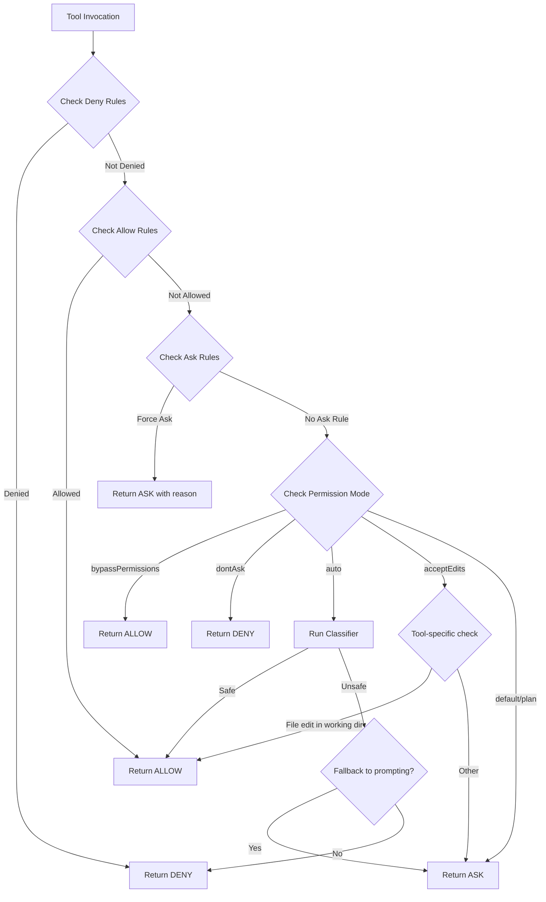

### Enterprise Override: `allowManagedPermissionRulesOnly`

When `policySettings.allowManagedPermissionRulesOnly` is `true`:
- Only rules from `policySettings` are respected
- "Always allow" options are hidden from permission prompts
- User/project rules are effectively ignored

**Source**: `src/utils/permissions/permissions.ts`, `src/utils/permissions/permissionsLoader.ts`

---

## 4. Settings Hierarchy & Trust Sources

Settings are loaded from five sources in a defined merge order. The merge strategy allows higher-precedence sources to override lower ones.

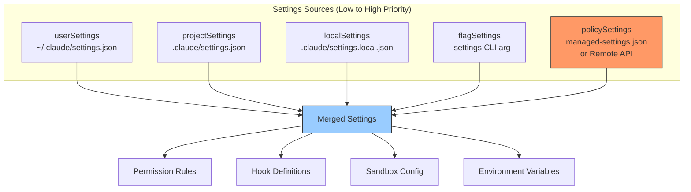

**Critical design decision**: `policySettings` (managed/enterprise) has highest priority and can restrict what other sources can do. It can:
- Force managed-only permission rules (`allowManagedPermissionRulesOnly`)
- Force managed-only hooks (`allowManagedHooksOnly`)
- Disable all hooks entirely (`disableAllHooks`)
- Force managed-only sandbox domains (`allowManagedDomainsOnly`)
- Restrict filesystem read paths (`allowManagedReadPathsOnly`)

The `--setting-sources` CLI flag can selectively enable/disable sources, but `policySettings` constraints are enforced regardless.

**Source**: `src/utils/settings/constants.ts`, `src/utils/settings/settings.ts`

---

## 5. Workspace Trust Model

Before Claude Code runs in a project directory, the workspace must be trusted. This prevents malicious repositories from automatically executing hooks, MCP servers, or instructions from project-level settings.

### Trust Establishment

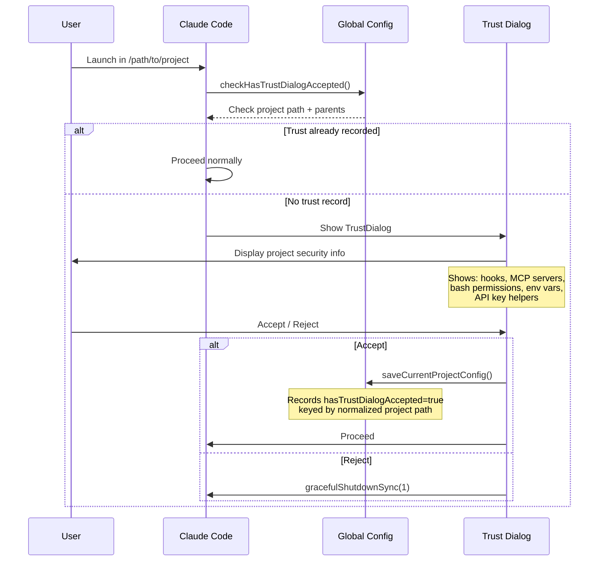

### Trust Persistence

Trust is stored in the global config file (`~/.claude.json`) keyed by normalized project path:

```json
{
  "projects": {
    "/path/to/project": {
      "hasTrustDialogAccepted": true
    }
  }
}
```

Trust traverses upward: if `/path/to` is trusted, `/path/to/project` inherits that trust.

**Special case: Home directory** -- When running from `$HOME`, trust is session-only (stored in memory via `setSessionTrustAccepted()`), not persisted to disk, because trusting `$HOME` would blanket-trust everything.

### Trust Checks

`checkHasTrustDialogAccepted()` is called before:
- Executing hooks
- Loading project CLAUDE.md files
- Starting MCP servers from project settings

The check follows this logic:
1. Check `getSessionTrustAccepted()` (in-memory session flag)
2. Check `config.projects[projectPath].hasTrustDialogAccepted`
3. Walk parent directories checking each
4. Return `false` if nothing found

**Source**: `src/utils/config.ts` (lines 697-761), `src/components/TrustDialog/TrustDialog.tsx`

---

## 6. CLAUDE.md Trust Hierarchy

CLAUDE.md files provide instructions to Claude but are a major injection surface. The loading order and trust model are carefully designed.

### Loading Order (Low to High Priority)

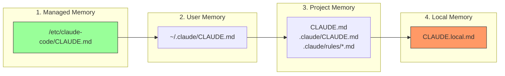

Files loaded later have higher priority -- the model pays more attention to them. Within project memory, files closer to the current directory have higher priority.

### Discovery Rules

- **User memory**: Loaded from `~/.claude/CLAUDE.md`
- **Project memory**: Discovered by traversing from CWD upward to the filesystem root, checking each directory for:
  - `CLAUDE.md`
  - `.claude/CLAUDE.md`
  - `.claude/rules/*.md`
- **Local memory**: `CLAUDE.local.md` in each traversed directory (gitignored, private)
- **@include directive**: Memory files can include other files using `@path`, `@./relative`, `@~/home`, `@/absolute` syntax. Circular references are tracked and prevented.

### Security Constraints

- Project memory files are only loaded if the workspace is trusted (trust dialog accepted)
- The `pathInWorkingPath()` check ensures included files don't escape the working directory
- `@include` resolves relative to the including file's directory
- Non-existent included files are silently ignored (no error-based information disclosure)
- Files are loaded via `safeResolvePath()` which prevents path traversal attacks

**Source**: `src/utils/claudemd.ts`, `src/context.ts`

---

## 7. Sandboxing

The sandbox is the primary OS-level security enforcement mechanism. It uses `bubblewrap` (Linux) or `sandbox-exec` (macOS) via the `@anthropic-ai/sandbox-runtime` package.

### Architecture

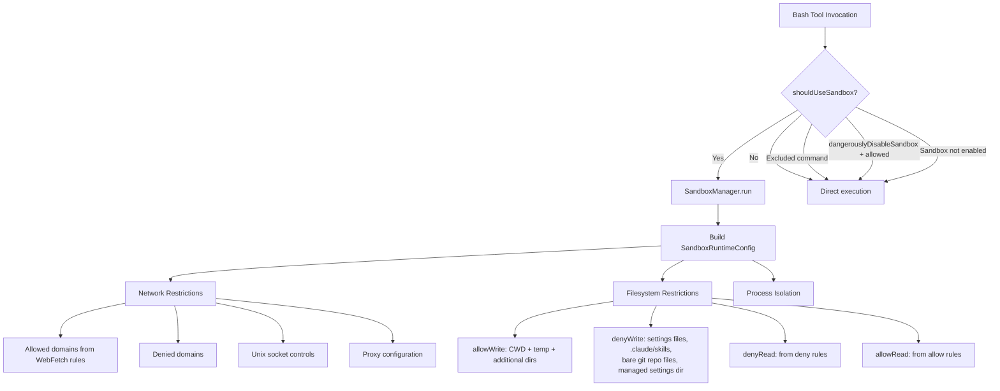

### Sandbox Decision Logic (`shouldUseSandbox`)

```typescript
// src/tools/BashTool/shouldUseSandbox.ts
function shouldUseSandbox(input): boolean {
  if (!SandboxManager.isSandboxingEnabled()) return false
  if (input.dangerouslyDisableSandbox && SandboxManager.areUnsandboxedCommandsAllowed()) return false
  if (!input.command) return false
  if (containsExcludedCommand(input.command)) return false
  return true
}
```

**Important design note**: `excludedCommands` is documented as a user-facing convenience feature, NOT a security boundary. The comment in the source explicitly states: "It is not a security bug to be able to bypass excludedCommands."

### Critical Write Denials

The sandbox **always** denies writes to:

| Path | Reason |
|------|--------|
| All `settings.json` files (all sources) | Prevents sandbox escape via settings mutation |
| Managed settings drop-in directory | Prevents policy bypass |
| `.claude/skills/` in CWD and original CWD | Skills have same privilege as agents |
| Bare git repo files (`HEAD`, `objects/`, `refs/`, `hooks/`, `config`) | Prevents `core.fsmonitor` escape (see below) |

### Bare Git Repo Attack Mitigation

A sandboxed command could plant `HEAD`, `objects/`, and `refs/` files at CWD, making it look like a bare git repo. When Claude's unsandboxed `git` commands later run, Git's `is_git_directory()` would treat CWD as a repo, and a planted `config` with `core.fsmonitor` would execute arbitrary code outside the sandbox.

**Mitigation**: For each bare git repo file that exists at CWD: deny writes (read-only bind mount). For files that don't exist: record them in `bareGitRepoScrubPaths` and scrub them after each sandboxed command completes.

### Git Worktree Support

If CWD is a git worktree, the sandbox detects the main repo path by reading `.git` (which is a file, not a directory, in worktrees) and adds the main repo to `allowWrite` so that git operations (which need write access to the main repo's `.git/` for `index.lock` etc.) work correctly.

### Network Restrictions

Network policy follows a domain-allowlist model:
- Domains from `WebFetch` allow rules are added to the sandbox allowlist
- `allowManagedDomainsOnly` (policy setting) restricts to enterprise-approved domains only
- Unix socket access is configurable (`allowUnixSockets`, `allowAllUnixSockets`)
- HTTP and SOCKS proxy ports are configurable for corporate environments

### Configuration Refresh

The sandbox configuration refreshes on settings changes via `settingsChangeDetector`. This means sandbox rules update mid-session if settings files are modified.

**Source**: `src/utils/sandbox/sandbox-adapter.ts`, `src/tools/BashTool/shouldUseSandbox.ts`

---

## 8. Bash Security Checks

Beyond sandboxing, Claude Code has an application-level security layer that detects dangerous shell patterns. This is defense-in-depth -- it catches attacks that could bypass permission rules through shell metacharacter tricks.

### Dangerous Pattern Categories

The bash security system (`src/tools/BashTool/bashSecurity.ts`) checks for:

| Category | Examples | Purpose |
|----------|----------|---------|
| Command substitution | `$()`, `${}`, `` `...` ``, `<()`, `>()` | Prevents hidden command execution |
| Zsh-specific attacks | `=cmd` (equals expansion), `zmodload`, `emulate -c` | Prevents Zsh-specific bypasses |
| Obfuscated flags | Encoded/obfuscated command-line arguments | Prevents flag injection |
| IFS injection | Modified IFS splitting arguments | Prevents word-splitting attacks |
| Control characters | Unicode whitespace, control chars in commands | Prevents visual deception |
| Proc environ access | `/proc/*/environ` reads | Prevents credential theft |
| Brace expansion | Complex brace expansions | Prevents command construction |
| Comment/quote desync | `#` in mid-word positions | Prevents parser confusion |

### Zsh Dangerous Commands

A hardcoded blocklist of Zsh builtins that can bypass security:

```typescript
const ZSH_DANGEROUS_COMMANDS = new Set([
  'zmodload',   // Gateway to dangerous modules
  'emulate',    // eval-equivalent with -c flag
  'sysopen',    // Fine-grained file I/O (zsh/system)
  'sysread', 'syswrite', 'sysseek',  // FD manipulation
  'zpty',       // Pseudo-terminal command execution
  'ztcp',       // TCP connections for exfiltration
  'zsocket',    // Unix/TCP sockets
  'zf_rm', 'zf_mv', 'zf_ln', 'zf_chmod', ...  // Builtin file ops
])
```

### Dangerous Permission Patterns

When entering auto mode, the system strips "dangerous" allow rules that would let the model bypass the classifier:

```typescript
const DANGEROUS_BASH_PATTERNS = [
  'python', 'python3', 'node', 'deno', 'tsx', 'ruby', 'perl', 'php',
  'npx', 'bunx', 'npm run', 'yarn run', 'pnpm run', 'bun run',
  'bash', 'sh', 'zsh', 'fish', 'eval', 'exec', 'env', 'xargs', 'sudo',
  'ssh',
  // Ant-only additions: gh, curl, wget, git, kubectl, aws, gcloud, ...
]
```

A rule like `Bash(python:*)` is flagged as dangerous because it lets the model run arbitrary Python code, completely bypassing the auto-mode classifier.

**Source**: `src/tools/BashTool/bashSecurity.ts`, `src/utils/permissions/dangerousPatterns.ts`, `src/utils/permissions/permissionSetup.ts`

---

## 9. Auto Mode Classifier

Auto mode replaces user prompting with an AI classifier that evaluates whether a tool invocation is safe. This is a two-stage system.

### Decision Flow

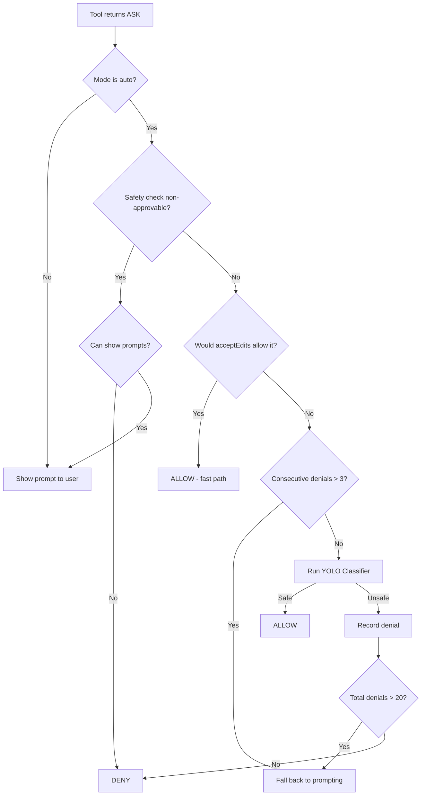

### Classifier Architecture

The classifier (`src/utils/permissions/yoloClassifier.ts`) is a side-query to the Claude API that evaluates the proposed action in context:

- **System prompt**: Loaded from `yolo-classifier-prompts/auto_mode_system_prompt.txt`
- **Permissions template**: External users get `permissions_external.txt`; Anthropic employees get `permissions_anthropic.txt`
- **Two-stage evaluation**: Fast stage (quick check) followed by thinking stage (deep analysis) if needed
- **Transcript context**: The classifier sees recent conversation context to understand intent

### Denial Tracking

To prevent the classifier from getting stuck in a denial loop:

```typescript
const DENIAL_LIMITS = {
  maxConsecutive: 3,  // Fall back after 3 consecutive denials
  maxTotal: 20,       // Fall back after 20 total denials in session
}
```

When limits are exceeded, the system falls back to interactive prompting.

### Gate Control

Auto mode availability is controlled by:
1. `TRANSCRIPT_CLASSIFIER` feature flag (build-time)
2. `tengu_auto_mode_config` GrowthBook dynamic config (runtime)
3. Model compatibility check (`modelSupportsAutoMode()`)
4. Per-session gate verification (`verifyAutoModeGateAccess()`)

The gate check runs once before the first query and can be re-verified after `/login` (org change).

**Source**: `src/utils/permissions/yoloClassifier.ts`, `src/utils/permissions/classifierDecision.ts`, `src/utils/permissions/denialTracking.ts`

---

## 10. Hook Security

Hooks are user-defined shell commands executed at lifecycle points (pre/post tool use, session start/end, etc.). They are a powerful extension mechanism but a significant attack surface.

### Hook Types

| Hook Event | When | Can Block? |
|------------|------|------------|
| `PreToolUse` | Before tool execution | Yes (can deny/allow/modify) |
| `PostToolUse` | After tool execution | No |
| `SessionStart` | Session initialization | No |
| `SessionEnd` | Session teardown | No |
| `PermissionRequest` | When permission prompt would show | Yes (can allow/deny) |
| `Notification` | On notifications | No |
| `Stop` | Before agent stops | Yes |

### Hook Source Hierarchy

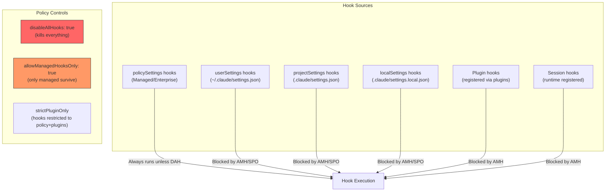

### Hook Security Controls

1. **`disableAllHooks`** (policySettings): Kills all hooks including managed ones. Nuclear option.
2. **`allowManagedHooksOnly`** (policySettings): Only hooks defined in policySettings execute. User, project, plugin, and session hooks are skipped.
3. **`strictPluginOnly`**: Blocks user/project/local hooks; only policy and plugin hooks run.
4. **Non-managed `disableAllHooks`**: If set in non-managed settings, managed hooks still run (non-managed settings cannot disable managed hooks).

### Hook Execution Safety

- Hooks run with a 10-minute timeout (`TOOL_HOOK_EXECUTION_TIMEOUT_MS`)
- `SessionEnd` hooks have a much tighter 1.5-second timeout (configurable via `CLAUDE_CODE_SESSIONEND_HOOKS_TIMEOUT_MS`)
- Hooks require the workspace to be trusted (`checkHasTrustDialogAccepted()`)
- Hook output is parsed via `hookJSONOutputSchema` -- malformed output is treated as no-op
- `PermissionRequest` hooks in headless/async agents can allow or deny tool use programmatically

### Hook Input/Output Schema

Hooks receive structured JSON input on stdin and can return structured JSON on stdout:

```typescript
// Output can control permission decisions
type HookJSONOutput = {
  // Sync hooks
  decision?: 'allow' | 'deny' | 'ask'
  reason?: string
  // Permission updates
  updatedPermissions?: PermissionUpdate[]
  // Async hooks (background processing)
  // ...
}
```

**Source**: `src/utils/hooks.ts`, `src/utils/hooks/hooksConfigSnapshot.ts`

---

## 11. Authentication & Credential Storage

### Authentication Methods

Claude Code supports multiple authentication paths:

1. **API Key** (`ANTHROPIC_API_KEY`): Direct Anthropic API key, stored in secure storage
2. **OAuth (Claude.ai)**: OAuth2 flow with token refresh, scoped by subscription type
3. **API Key Helper** (`apiKeyHelper` setting): External command that provides API keys dynamically
4. **AWS STS**: For Bedrock provider authentication
5. **File Descriptor Auth**: `--api-key-fd` / `--oauth-token-fd` for pipe-based key delivery (avoids env var exposure)

### Secure Storage

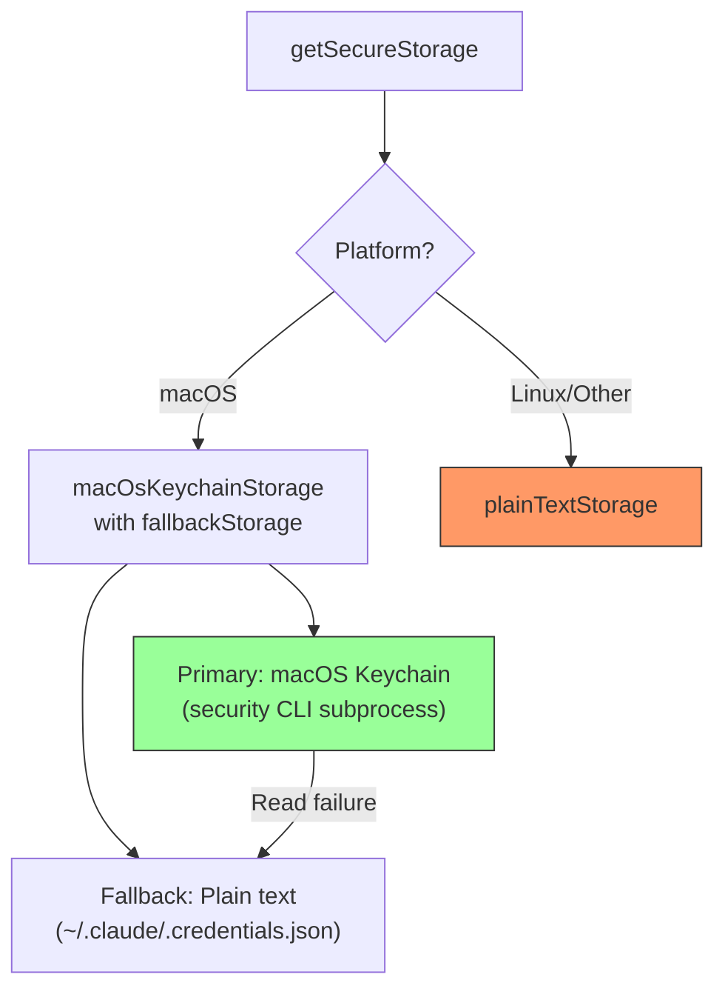

**macOS**: Credentials are stored in the system Keychain, accessed via the `security` CLI. A read-through memo cache (`memoize`) avoids spawning `security` subprocesses on every access (~40ms each).

**Linux/Other**: Falls back to plain text file storage at `~/.claude/.credentials.json`.

### Credential Data

The secure storage holds:

```typescript
type SecureStorageData = {
  apiKey?: string
  oauthTokens?: OAuthTokens
  trustedDeviceToken?: string  // For bridge sessions
  // ...
}
```

### OAuth Token Lifecycle

- Tokens are refreshed proactively before expiry
- `checkAndRefreshOAuthTokenIfNeeded()` is called before API requests
- Subscription type (`enterprise`, `team`, etc.) gates feature eligibility
- OAuth scopes control API access (`CLAUDE_AI_INFERENCE_SCOPE`, `CLAUDE_AI_PROFILE_SCOPE`)

### Environment Variable Stripping

When running via `claude ssh` (remote mode), sensitive auth env vars are stripped from settings-sourced environments to prevent credential override:

```typescript
// Stripped: ANTHROPIC_UNIX_SOCKET, ANTHROPIC_BASE_URL, ANTHROPIC_API_KEY,
//           ANTHROPIC_AUTH_TOKEN, CLAUDE_CODE_OAUTH_TOKEN
```

Similarly, when the host manages the provider (`CLAUDE_CODE_PROVIDER_MANAGED_BY_HOST`), provider-selection env vars from user settings are stripped.

**Source**: `src/utils/auth.ts`, `src/utils/secureStorage/`, `src/utils/managedEnv.ts`

---

## 12. Policy Limits Service

Policy limits are organization-level restrictions fetched from Anthropic's API. They gate features on/off for enterprise customers.

### Architecture

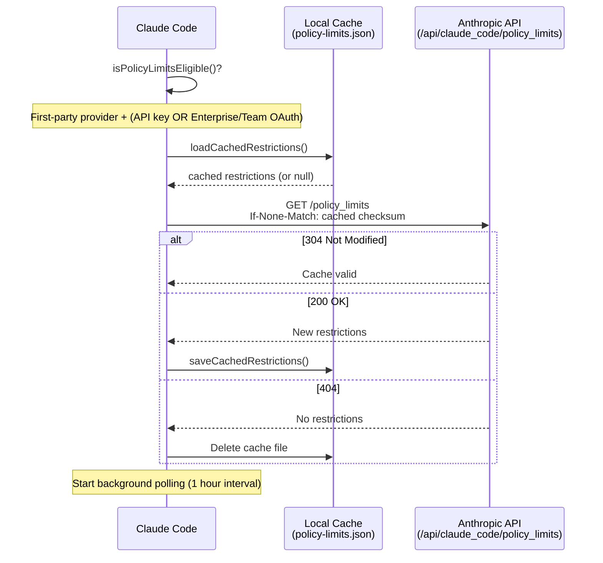

### Fail-Open Design

The policy limits system fails open by default:
- If the API is unreachable, stale cached data is used
- If no cache exists and the API fails, all policies are allowed
- **Exception**: `allow_product_feedback` fails closed in essential-traffic-only mode (HIPAA compliance)

### Policy Checking

```typescript
function isPolicyAllowed(policy: string): boolean {
  const restrictions = getRestrictionsFromCache()
  if (!restrictions) {
    // Fail open, except for ESSENTIAL_TRAFFIC_DENY_ON_MISS policies
    if (isEssentialTrafficOnly() && ESSENTIAL_TRAFFIC_DENY_ON_MISS.has(policy)) {
      return false
    }
    return true
  }
  const restriction = restrictions[policy]
  if (!restriction) return true  // Unknown policy = allowed
  return restriction.allowed
}
```

### Retry & Caching

- 5 retries with exponential backoff
- 10-second fetch timeout
- SHA-256 checksum-based ETag caching
- Cache file has restrictive permissions (`0o600`)
- 30-second timeout on loading promise to prevent deadlocks

**Source**: `src/services/policyLimits/index.ts`, `src/services/policyLimits/types.ts`

---

## 13. Remote Managed Settings

Enterprise administrators can push settings to Claude Code installations via a remote API. This is the enforcement mechanism for organizational policies.

### Flow

1. **Eligibility**: Same as policy limits (first-party provider + API key or Enterprise/Team OAuth)
2. **Fetch**: `GET /api/claude_code/managed_settings` with checksum-based caching
3. **Validation**: Response validated against `SettingsSchema`
4. **Security check**: If settings contain "dangerous" configurations, a blocking dialog is shown
5. **Persistence**: Cached locally and used as `policySettings` source

### Dangerous Settings Detection

Remote settings that include hooks, env vars, or other code-execution vectors trigger a security dialog:

```typescript
async function checkManagedSettingsSecurity(
  cachedSettings: SettingsJson | null,
  newSettings: SettingsJson | null
): Promise<'approved' | 'rejected' | 'no_check_needed'>
```

The dialog:
- Shows only when dangerous settings have **changed** (not on every sync)
- Is skipped in non-interactive mode (consistent with trust dialog)
- Blocks the entire application until the user responds
- Exits the process if rejected

### What Managed Settings Can Control

| Setting | Impact |
|---------|--------|
| `permissions.allow/deny/ask` | Override permission rules |
| `hooks` | Define lifecycle hooks |
| `sandbox.*` | Configure sandbox behavior |
| `env` | Set environment variables |
| `allowManagedPermissionRulesOnly` | Restrict to managed rules only |
| `allowManagedHooksOnly` | Restrict to managed hooks only |
| `disableAllHooks` | Kill all hooks |
| `disableBypassPermissions` | Remove bypass permissions option |
| `sandbox.network.allowManagedDomainsOnly` | Restrict network to managed domains |

**Source**: `src/services/remoteManagedSettings/index.ts`, `src/services/remoteManagedSettings/securityCheck.tsx`

---

## 14. Bridge Security

The bridge enables remote control of Claude Code sessions (e.g., from Claude.ai or other frontends). It adds additional security layers.

### JWT Authentication

Session ingress tokens use JWT format with `sk-ant-si-` prefix:

```typescript
function decodeJwtPayload(token: string): unknown | null {
  const jwt = token.startsWith('sk-ant-si-')
    ? token.slice('sk-ant-si-'.length)
    : token
  // Decode payload without signature verification
  // (validation happens server-side)
}
```

Token refresh runs proactively:
- 5-minute buffer before expiry
- 30-minute fallback refresh interval
- Max 3 consecutive failures before giving up

### Work Secrets

Work secrets are base64url-encoded JSON objects that contain session credentials:

```typescript
type WorkSecret = {
  version: 1
  session_ingress_token: string  // JWT for session auth
  api_base_url: string           // API endpoint
  // ...
}
```

Validation is strict: version must be `1`, `session_ingress_token` must be non-empty, `api_base_url` must be present.

### Trusted Device Tokens

Bridge sessions use elevated security (SecurityTier=ELEVATED). Trusted device tokens provide device-level authentication:

- Stored in secure storage (macOS Keychain)
- Enrolled during `/login` (POST `/auth/trusted_devices`), must happen within 10 minutes of account creation
- 90-day rolling expiry
- Sent as `X-Trusted-Device-Token` header on bridge API calls
- Gated by `tengu_sessions_elevated_auth_enforcement` flag
- Cache cleared on logout and before re-enrollment

### Session ID Security

Session IDs use tagged-ID format (`session_*` or `cse_*`). The `sameSessionId()` function compares sessions by their UUID body (after the last underscore), handling CCR v2 compatibility where different prefixes can refer to the same underlying session.

**Source**: `src/bridge/jwtUtils.ts`, `src/bridge/workSecret.ts`, `src/bridge/trustedDevice.ts`

---

## 15. File System Security

### Dangerous Files and Directories

Auto-editing is blocked or requires explicit approval for sensitive paths:

```typescript
const DANGEROUS_FILES = [
  '.gitconfig', '.gitmodules',
  '.bashrc', '.bash_profile', '.zshrc', '.zprofile', '.profile',
  '.ripgreprc', '.mcp.json', '.claude.json'
]

const DANGEROUS_DIRECTORIES = [
  '.git', '.vscode', '.idea', '.claude'
]
```

### Path Validation

All file operations go through `pathValidation.ts`:

1. **Path traversal detection**: `containsPathTraversal()` blocks `../` sequences
2. **UNC path protection**: `containsVulnerableUncPath()` blocks Windows UNC path attacks
3. **Working directory scope**: `pathInWorkingPath()` ensures paths are within the allowed workspace
4. **Symlink resolution**: `safeResolvePath()` resolves symlinks before checking permissions
5. **Glob base directory extraction**: For glob patterns like `/path/to/*.txt`, validates the base directory

### Internal Path Protections

Certain internal paths have special rules:

- **`.claude/` directory**: Edit tool has a special permission pattern (`CLAUDE_FOLDER_PERMISSION_PATTERN`) for allowing edits to CLAUDE.md files within the project
- **`~/.claude/` directory**: Global config directory has its own permission pattern (`GLOBAL_CLAUDE_FOLDER_PERMISSION_PATTERN`)
- **Settings files**: Always deny-written in sandbox regardless of other rules
- **Skills directory**: `.claude/skills/` is sandbox-denied to prevent privilege escalation (skills are auto-discovered and auto-loaded)

**Source**: `src/utils/permissions/pathValidation.ts`, `src/utils/permissions/filesystem.ts`

---

## 16. Security Architecture Diagrams

### End-to-End Permission Check

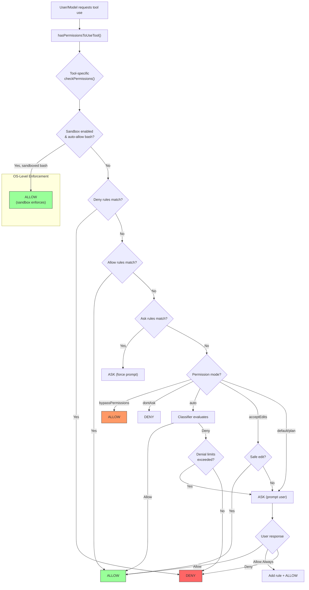

### Trust Hierarchy

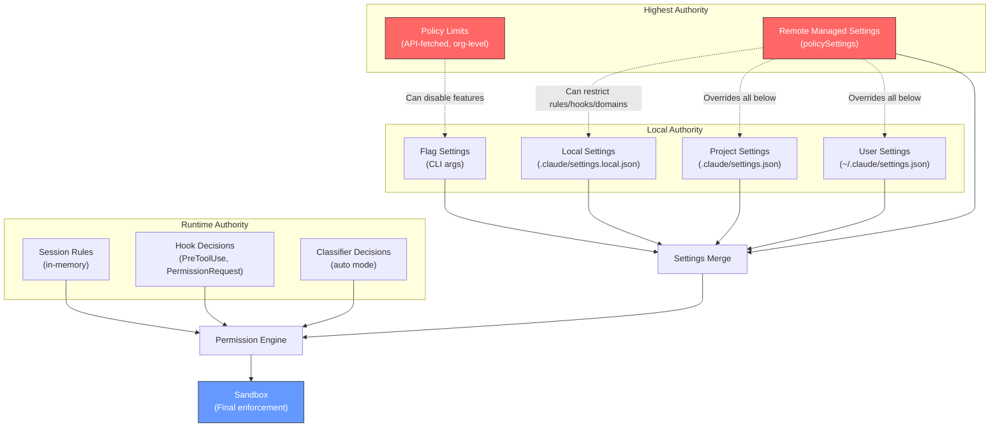

### Threat Mitigation Map

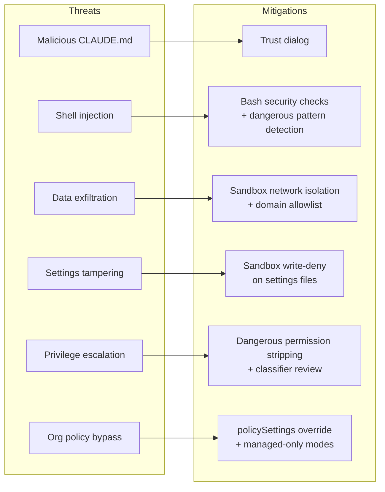

---

## Appendix: Key Source Files

| Component | Path |
|-----------|------|
| Permission types | `src/types/permissions.ts` |
| Permission modes | `src/utils/permissions/PermissionMode.ts` |
| Permission evaluation | `src/utils/permissions/permissions.ts` |
| Permission rules | `src/utils/permissions/PermissionRule.ts` |
| Permission setup | `src/utils/permissions/permissionSetup.ts` |
| Permission loading | `src/utils/permissions/permissionsLoader.ts` |
| Path validation | `src/utils/permissions/pathValidation.ts` |
| Filesystem security | `src/utils/permissions/filesystem.ts` |
| Dangerous patterns | `src/utils/permissions/dangerousPatterns.ts` |
| Bash security checks | `src/tools/BashTool/bashSecurity.ts` |
| Sandbox adapter | `src/utils/sandbox/sandbox-adapter.ts` |
| Sandbox decision | `src/tools/BashTool/shouldUseSandbox.ts` |
| Shell rule matching | `src/utils/permissions/shellRuleMatching.ts` |
| Auto-mode classifier | `src/utils/permissions/yoloClassifier.ts` |
| Classifier decisions | `src/utils/permissions/classifierDecision.ts` |
| Denial tracking | `src/utils/permissions/denialTracking.ts` |
| Bypass killswitch | `src/utils/permissions/bypassPermissionsKillswitch.ts` |
| Mode cycling | `src/utils/permissions/getNextPermissionMode.ts` |
| Hooks engine | `src/utils/hooks.ts` |
| Hooks config | `src/utils/hooks/hooksConfigSnapshot.ts` |
| Trust dialog | `src/components/TrustDialog/TrustDialog.tsx` |
| Trust checks | `src/utils/config.ts` |
| CLAUDE.md loading | `src/utils/claudemd.ts` |
| Settings constants | `src/utils/settings/constants.ts` |
| Policy limits | `src/services/policyLimits/index.ts` |
| Remote managed settings | `src/services/remoteManagedSettings/index.ts` |
| Managed settings security | `src/services/remoteManagedSettings/securityCheck.tsx` |
| Authentication | `src/utils/auth.ts` |
| Secure storage | `src/utils/secureStorage/index.ts` |
| Managed env | `src/utils/managedEnv.ts` |
| Bridge JWT | `src/bridge/jwtUtils.ts` |
| Trusted device | `src/bridge/trustedDevice.ts` |
| Work secrets | `src/bridge/workSecret.ts` |
| Shadowed rule detection | `src/utils/permissions/shadowedRuleDetection.ts` |
