# Data Flow, State Management & Type System

This document describes how data flows through Claude Code, how state is managed, and the type system that underpins the entire application. It is the single reference for understanding the full lifecycle of a request, from user keystroke to rendered output.

---

## Table of Contents

1. [Core Type System](#1-core-type-system)
2. [Message Types](#2-message-types)
3. [Tool Type System](#3-tool-type-system)
4. [Configuration Types](#4-configuration-types)
5. [Permission Types](#5-permission-types)
6. [State Management](#6-state-management)
7. [End-to-End Data Flow](#7-end-to-end-data-flow)
8. [Streaming Response Pipeline](#8-streaming-response-pipeline)
9. [Conversation History & Compaction](#9-conversation-history--compaction)
10. [Session Persistence](#10-session-persistence)
11. [Input History Management](#11-input-history-management)
12. [Project Onboarding State](#12-project-onboarding-state)
13. [Hook System Data Flow](#13-hook-system-data-flow)
14. [Constants & System Configuration](#14-constants--system-configuration)

---

## 1. Core Type System

### Type File Layout

```
src/types/
  command.ts          # Command/skill definitions (slash commands, prompt commands)
  hooks.ts            # Hook system types (sync/async hook responses, hook results)
  ids.ts              # Branded types: SessionId, AgentId
  logs.ts             # Transcript/session persistence types (Entry union, SerializedMessage)
  permissions.ts      # Permission system types (modes, rules, decisions, results)
  plugin.ts           # Plugin ecosystem types (LoadedPlugin, PluginError, PluginConfig)
  textInputTypes.ts   # UI text input types (BaseTextInputProps, VimMode, QueuedCommand)
  generated/          # Protobuf-generated types (analytics events, GrowthBook)
```

The `types/message.js` module (imported throughout the codebase) contains the core `Message`, `UserMessage`, `AssistantMessage`, and related types. This module is produced at build time and does not exist as a source `.ts` file in the repository -- its types are inferred from import sites throughout the codebase.

### Branded ID Types (`types/ids.ts`)

The system uses TypeScript branded types to prevent accidentally mixing up session IDs and agent IDs at compile time:

```typescript
type SessionId = string & { readonly __brand: 'SessionId' }
type AgentId   = string & { readonly __brand: 'AgentId' }
```

- `SessionId` -- uniquely identifies a Claude Code session (main process).
- `AgentId` -- uniquely identifies a subagent within a session. Its presence signals the context is a subagent, not the main thread.
- The `AgentId` format is validated by `toAgentId()` against the pattern `/^a(?:.+-)?[0-9a-f]{16}$/`.

---

## 2. Message Types

The message system is the backbone of the entire application. All conversation data, API interactions, UI events, and tool results flow through the `Message` discriminated union.

### Message Hierarchy

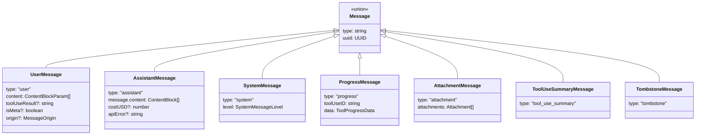

### Key Message Subtypes

**System messages** carry a `level` discriminator. Some important variants:

| Type | Purpose |
|------|---------|
| `SystemCompactBoundaryMessage` | Marks where compaction occurred in conversation |
| `SystemMicrocompactBoundaryMessage` | Boundary for micro-compaction |
| `SystemLocalCommandMessage` | Output from a slash command |
| `SystemAPIErrorMessage` | API error displayed to user |
| `SystemInformationalMessage` | General UI informational messages |
| `SystemMemorySavedMessage` | Notification that memory was persisted |
| `SystemTurnDurationMessage` | Turn timing display |
| `SystemStopHookSummaryMessage` | Stop-hook outcome summary |

**Normalized messages** -- The API requires messages in a specific format. `NormalizedUserMessage` and `NormalizedAssistantMessage` represent the cleaned API-ready form, stripping system messages, progress, and attachments.

### Message Origin Tracking

Messages carry an `origin` field indicating provenance:

- `undefined` -- human (keyboard input)
- Defined values include bridge, scheduled task, teammate, and other automated sources

This distinction is used for analytics attribution, security (classifier decisions), and UI rendering.

### Serialized Messages for Persistence

When messages are persisted to the transcript, they are extended into `SerializedMessage`:

```typescript
type SerializedMessage = Message & {
  cwd: string
  userType: string
  entrypoint?: string      // cli/sdk-ts/sdk-py/etc.
  sessionId: string
  timestamp: string
  version: string
  gitBranch?: string
  slug?: string            // Session slug for resume
}
```

And further into `TranscriptMessage` with tree structure:

```typescript
type TranscriptMessage = SerializedMessage & {
  parentUuid: UUID | null
  logicalParentUuid?: UUID | null
  isSidechain: boolean
  agentId?: string
  teamName?: string
  agentName?: string
}
```

---

## 3. Tool Type System

### Tool Definition (`Tool.ts`)

Every tool in Claude Code implements the `Tool<Input, Output, P>` interface:

```typescript
type Tool<
  Input extends AnyObject = AnyObject,
  Output = unknown,
  P extends ToolProgressData = ToolProgressData,
> = {
  name: string
  aliases?: string[]
  inputSchema: Input                    // Zod schema
  inputJSONSchema?: ToolInputJSONSchema // For MCP tools
  maxResultSizeChars: number

  // Lifecycle methods
  call(args, context, canUseTool, parentMessage, onProgress?): Promise<ToolResult<Output>>
  validateInput?(input, context): Promise<ValidationResult>
  checkPermissions(input, context): Promise<PermissionResult>
  description(input, options): Promise<string>
  prompt(options): Promise<string>

  // Classification
  isEnabled(): boolean
  isReadOnly(input): boolean
  isConcurrencySafe(input): boolean
  isDestructive?(input): boolean
  interruptBehavior?(): 'cancel' | 'block'
  shouldDefer?: boolean
  alwaysLoad?: boolean

  // Rendering
  renderToolUseMessage(input, options): React.ReactNode
  renderToolResultMessage?(content, progress, options): React.ReactNode
  mapToolResultToToolResultBlockParam(content, toolUseID): ToolResultBlockParam
}
```

### ToolUseContext -- The God Object

`ToolUseContext` is the central context object threaded through every tool call, query loop iteration, and hook invocation. It carries:

```typescript
type ToolUseContext = {
  options: {
    commands: Command[]
    tools: Tools
    mainLoopModel: string
    thinkingConfig: ThinkingConfig
    mcpClients: MCPServerConnection[]
    mcpResources: Record<string, ServerResource[]>
    isNonInteractiveSession: boolean
    agentDefinitions: AgentDefinitionsResult
    maxBudgetUsd?: number
    customSystemPrompt?: string
    appendSystemPrompt?: string
  }
  abortController: AbortController
  readFileState: FileStateCache
  getAppState(): AppState
  setAppState(f: (prev: AppState) => AppState): void
  messages: Message[]
  agentId?: AgentId
  agentType?: string
  contentReplacementState?: ContentReplacementState

  // Callbacks
  setToolJSX?: SetToolJSXFn
  appendSystemMessage?: (msg) => void
  updateFileHistoryState: (updater) => void
  updateAttributionState: (updater) => void
  setInProgressToolUseIDs: (f) => void
}
```

### Tool Categories and Access Control

Tools are partitioned by category via constants in `constants/tools.ts`:

| Set | Purpose |
|-----|---------|
| `ALL_AGENT_DISALLOWED_TOOLS` | Tools blocked for any subagent |
| `ASYNC_AGENT_ALLOWED_TOOLS` | Whitelist for async agents |
| `IN_PROCESS_TEAMMATE_ALLOWED_TOOLS` | Extra tools for in-process teammates |
| `COORDINATOR_MODE_ALLOWED_TOOLS` | Coordinator-only tools |

### Command Types (`types/command.ts`)

Commands (slash commands, skills) form a discriminated union:

```typescript
type Command = CommandBase & (PromptCommand | LocalCommand | LocalJSXCommand)
```

- `PromptCommand` -- sends content to the model (type: `'prompt'`). Can run inline or as a forked sub-agent.
- `LocalCommand` -- executes locally and returns text/compact/skip results (type: `'local'`).
- `LocalJSXCommand` -- renders a React component for interactive UI (type: `'local-jsx'`).

Commands carry availability constraints (`CommandAvailability`), enablement checks, and lazy-loading semantics.

---

## 4. Configuration Types

### Settings Hierarchy

Configuration is layered from multiple sources with strict precedence:

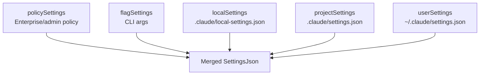

The `SettingsJson` type (derived from a Zod schema in `utils/settings/types.ts`) covers:

- `permissions` -- allow/deny/ask rules, default mode, additional directories
- `hooks` -- event-driven hooks (PreToolUse, PostToolUse, etc.)
- `mcpServers` -- MCP server configurations
- `env` -- environment variables to inject
- `model` -- model override
- `enabledPlugins`, `disabledPlugins` -- plugin state
- `customInstructions`, `appendSystemPrompt` -- prompt customization

### GlobalConfig (`utils/config.ts`)

Per-user machine-wide configuration persisted at `~/.claude/config.json`:

```typescript
type GlobalConfig = {
  numStartups: number
  theme: ThemeSetting
  editorMode?: EditorMode
  verbose: boolean
  autoCompactEnabled: boolean
  showTurnDuration: boolean
  oauthAccount?: AccountInfo
  projects?: Record<string, ProjectConfig>
  env: Record<string, string>
  primaryApiKey?: string
  preferredNotifChannel: NotificationChannel
  // ... ~40 more fields
}
```

### ProjectConfig (`utils/config.ts`)

Per-project configuration stored at `~/.claude/projects/<hash>/config.json`:

```typescript
type ProjectConfig = {
  allowedTools: string[]
  mcpServers?: Record<string, McpServerConfig>
  hasTrustDialogAccepted?: boolean
  hasCompletedProjectOnboarding?: boolean
  projectOnboardingSeenCount: number
  activeWorktreeSession?: { ... }
  // ... performance metrics, MCP server approval state
}
```

---

## 5. Permission Types

### Permission Mode State Machine

```mermaid
stateDiagram-v2
    [*] --> default : Session start

    default --> plan : Model enters plan mode
    default --> bypassPermissions : User activates
    default --> acceptEdits : User selects
    default --> dontAsk : User selects
    default --> auto : Auto-mode gate active

    plan --> default : ExitPlanMode tool
    bypassPermissions --> default : User reverts
    acceptEdits --> default : User reverts
    dontAsk --> default : User reverts
    auto --> default : User reverts

    default --> bubble : Subagent inheritance
    bubble --> default : Subagent returns
```

**External modes** (user-visible): `default`, `plan`, `acceptEdits`, `bypassPermissions`, `dontAsk`

**Internal modes** (not user-addressable): `auto`, `bubble`

### Permission Decision Flow

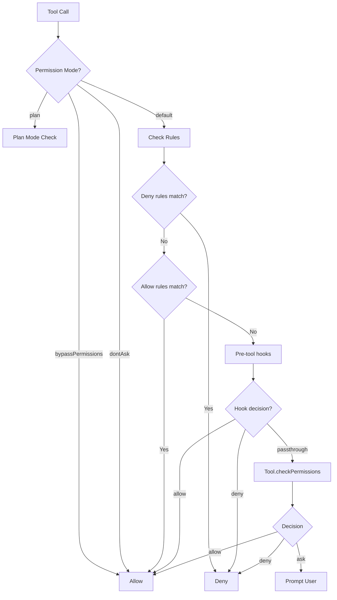

### Permission Result Types

```typescript
type PermissionResult<Input> =
  | { behavior: 'allow'; updatedInput?: Input; userModified?: boolean }
  | { behavior: 'ask'; message: string; suggestions?: PermissionUpdate[]; pendingClassifierCheck?: ... }
  | { behavior: 'deny'; message: string; decisionReason: PermissionDecisionReason }
  | { behavior: 'passthrough'; message: string }
```

The `PermissionDecisionReason` discriminated union tracks _why_ a decision was made (rule match, mode, hook, classifier, sandbox override, etc.) for auditability.

---

## 6. State Management

### Store Architecture

The state management system uses a minimal custom store implementation (`state/store.ts`):

```typescript
type Store<T> = {
  getState: () => T
  setState: (updater: (prev: T) => T) => void
  subscribe: (listener: () => void) => () => void
}
```

`createStore` is implemented in 15 lines -- it holds state in a closure, notifies listeners on change (with referential equality check via `Object.is`), and invokes an optional `onChange` callback. There is no middleware, no action dispatch, no reducers. State transitions are plain function calls.

### AppState -- The Root State Shape

`AppState` (`state/AppStateStore.ts`) is the single source of truth for the entire application. It is wrapped in `DeepImmutable<>` for the core configuration fields, with mutable exceptions for function-typed subsystems.

```mermaid
graph TB
    AppState --> Settings["settings: SettingsJson"]
    AppState --> Permissions["toolPermissionContext: ToolPermissionContext"]
    AppState --> MCP["mcp: { clients, tools, commands, resources }"]
    AppState --> Plugins["plugins: { enabled, disabled, commands, errors }"]
    AppState --> Tasks["tasks: Record&lt;string, TaskState&gt;"]
    AppState --> FileHistory["fileHistory: FileHistoryState"]
    AppState --> Attribution["attribution: AttributionState"]
    AppState --> Todos["todos: Record&lt;string, TodoList&gt;"]
    AppState --> Speculation["speculation: SpeculationState"]
    AppState --> Session["sessionHooks, initialMessage, denialTracking"]
    AppState --> Bridge["replBridge*: remote control state"]
    AppState --> UI["expandedView, footerSelection, viewSelectionMode"]
    AppState --> Notifications["notifications, elicitation, inbox"]
    AppState --> Team["teamContext, agentNameRegistry"]
```

### Key AppState Subsections

**Speculation state** tracks predictive execution:

```typescript
type SpeculationState =
  | { status: 'idle' }
  | { status: 'active'; id: string; abort: () => void; startTime: number;
      messagesRef: { current: Message[] }; boundary: CompletionBoundary | null; ... }
```

**Task state** is a flat map keyed by task ID. Tasks are polymorphic (`TaskState` is a union of `LocalAgentTaskState`, `InProcessTeammateTaskState`, etc.).

**Bridge state** manages the always-on remote control connection to claude.ai, tracking: enabled, connected, session active, reconnecting, URLs, IDs, and error state.

### State Initialization

`getDefaultAppState()` constructs the initial state tree:

1. Loads `getInitialSettings()` from the merged settings hierarchy
2. Resolves initial permission mode (considering teammate `plan_mode_required`)
3. Sets empty defaults for all subsections
4. Applies `shouldEnableThinkingByDefault()` and `shouldEnablePromptSuggestion()`

### State Change Side Effects (`state/onChangeAppState.ts`)

The store's `onChange` callback fires on every state transition and handles critical side effects:

| State Change | Side Effect |
|-------------|-------------|
| `toolPermissionContext.mode` changed | Notifies CCR (remote session), notifies SDK status stream |
| `mainLoopModel` changed | Updates settings.json, sets bootstrap override |
| `expandedView` changed | Persists to GlobalConfig |
| `verbose` changed | Persists to GlobalConfig |
| `settings` changed | Clears auth caches, re-applies environment variables |

This is the single choke point for mode-change synchronization. Prior to this pattern, 8+ mutation paths independently relayed mode changes (or forgot to), leaving CCR metadata stale.

### Selectors (`state/selectors.ts`)

Pure selectors derive computed state:

- `getViewedTeammateTask(appState)` -- returns the teammate task being viewed, if any
- `getActiveAgentForInput(appState)` -- returns `{ type: 'leader' | 'viewed' | 'named_agent', task? }` for input routing

### Teammate View Helpers (`state/teammateViewHelpers.ts`)

Manages the retain/release lifecycle for agent transcript viewing:

- `enterTeammateView(taskId)` -- sets `retain: true` (blocks eviction, enables stream-append), releases previous agent
- `exitTeammateView()` -- sets `retain: false`, clears messages, schedules eviction via `evictAfter`
- `stopOrDismissAgent(taskId)` -- context-sensitive: abort if running, dismiss if terminal

---

## 7. End-to-End Data Flow

### Complete Request Lifecycle

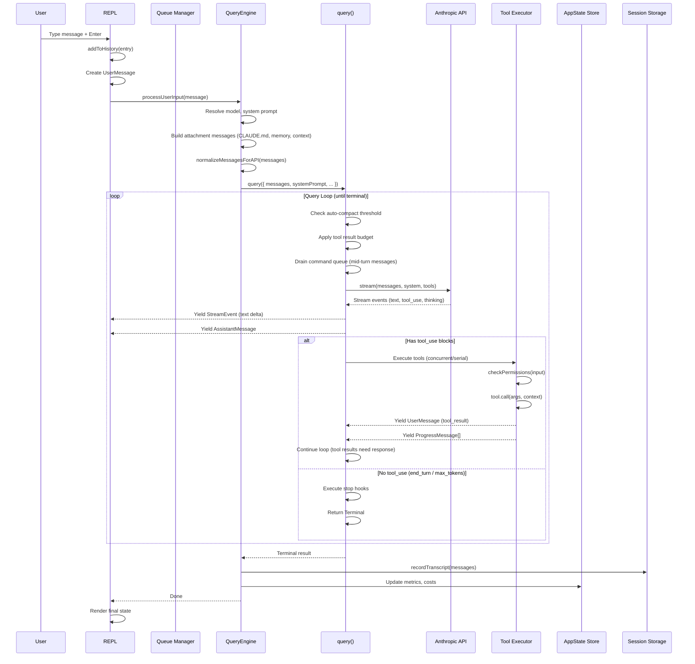

### Message Flow Through the Query Loop

The query loop (`query.ts`) is an async generator that yields messages as they are produced. Each iteration:

1. **Config snapshot** -- `buildQueryConfig()` freezes env/statsig/session state once at entry
2. **Budget tracking** -- `createBudgetTracker()` monitors token budget across iterations
3. **API call** -- streams response, yielding `StreamEvent`s for live text rendering
4. **Tool execution** -- via `StreamingToolExecutor` (streaming, concurrent) or `runTools` (batch)
5. **Recovery loops** -- handles `max_output_tokens` errors (up to 3 retries), reactive compaction
6. **Command queue drain** -- between iterations, checks for queued user messages at various priorities
7. **Stop hooks** -- on end_turn, executes registered stop hooks that may force continuation

### Query Parameters

```typescript
type QueryParams = {
  messages: Message[]
  systemPrompt: SystemPrompt
  userContext: Record<string, string>
  systemContext: Record<string, string>
  canUseTool: CanUseToolFn
  toolUseContext: ToolUseContext
  fallbackModel?: string
  querySource: QuerySource
  maxOutputTokensOverride?: number
  maxTurns?: number
  taskBudget?: { total: number }
}
```

### Query Loop Internal State

```typescript
type State = {
  messages: Message[]
  toolUseContext: ToolUseContext
  autoCompactTracking: AutoCompactTrackingState | undefined
  maxOutputTokensRecoveryCount: number
  hasAttemptedReactiveCompact: boolean
  maxOutputTokensOverride: number | undefined
  pendingToolUseSummary: Promise<ToolUseSummaryMessage | null> | undefined
  stopHookActive: boolean | undefined
  turnCount: number
  transition: Continue | undefined      // Why the previous iteration continued
}
```

---

## 8. Streaming Response Pipeline

### Streaming Architecture

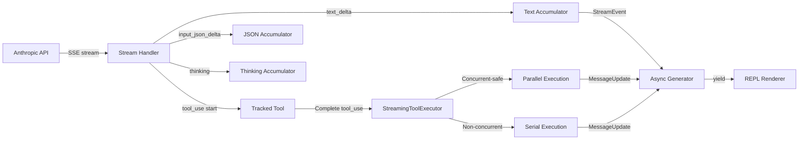

### StreamingToolExecutor

The `StreamingToolExecutor` class manages tool execution as tools stream in:

```typescript
class StreamingToolExecutor {
  // Tracks tools with status: 'queued' | 'executing' | 'completed' | 'yielded'
  addTool(block: ToolUseBlock, assistantMessage: AssistantMessage): void
  async *getRemainingResults(): AsyncGenerator<MessageUpdate>
  discard(): void   // Called on streaming fallback
}
```

Concurrency rules:
- **Concurrent-safe tools** (read-only: Read, Grep, Glob, etc.) execute in parallel
- **Non-concurrent tools** (Bash, Write, Edit) execute serially with exclusive access
- Results are buffered and emitted in the order tools were received (preserving API-specified order)
- A child `AbortController` fires when a Bash tool errors, aborting sibling subprocesses immediately

### Tool Execution Pipeline (`services/tools/toolExecution.ts`)

Each tool call passes through:

1. **Input validation** -- `tool.validateInput(input, context)`
2. **Pre-tool hooks** -- fires `PreToolUse` hook event
3. **Permission check** -- `tool.checkPermissions(input, context)`
4. **Execution** -- `tool.call(args, context, canUseTool, parentMessage, onProgress)`
5. **Post-tool hooks** -- fires `PostToolUse` hook event
6. **Result mapping** -- `tool.mapToolResultToToolResultBlockParam(content, toolUseID)`
7. **Context modification** -- tool may return context modifiers (e.g., cwd change from Bash)

---

## 9. Conversation History & Compaction

### Auto-Compaction

When context grows large, auto-compaction triggers:

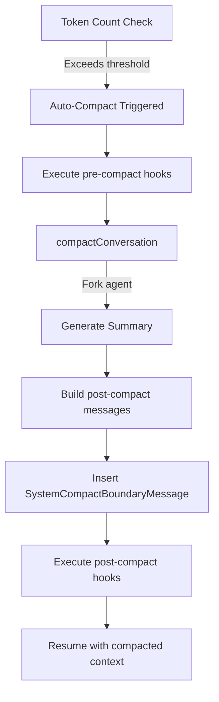

Key parameters:
- Effective context window = `contextWindowForModel - MAX_OUTPUT_TOKENS_FOR_SUMMARY`
- `MAX_OUTPUT_TOKENS_FOR_SUMMARY` = 20,000 tokens (based on p99.99 of summary output)
- Token counting uses estimation heuristics (`tokenCountWithEstimation`) for speed

### Compaction Result

```typescript
type CompactionResult = {
  messages: Message[]           // The compacted message array
  summary: string               // Human-readable summary
  tokensBeforeCompact: number   // Context tokens before
  tokensAfterCompact: number    // Context tokens after
}
```

### Context Collapse

A more sophisticated compaction mechanism that maintains navigable history:

```typescript
type ContextCollapseCommitEntry = {
  type: 'marble-origami-commit'
  collapseId: string
  summaryUuid: string
  summaryContent: string        // <collapsed id="...">text</collapsed>
  summary: string               // Plain text for inspection
  firstArchivedUuid: string
  lastArchivedUuid: string
}

type ContextCollapseSnapshotEntry = {
  type: 'marble-origami-snapshot'
  staged: Array<{ startUuid, endUuid, summary, risk, stagedAt }>
  armed: boolean
  lastSpawnTokens: number
}
```

Commits are append-only (replay all on restore). Snapshots are last-wins (only the most recent applies).

---

## 10. Session Persistence

### Transcript Storage

Sessions are persisted as JSONL files in `~/.claude/projects/<hash>/sessions/`:

```mermaid
graph TD
    RecordTranscript[recordTranscript] -->|appendEntry| SessionFile[session-{id}.jsonl]

    SessionFile -->|Entry types| Entries

    Entries --> TranscriptMsg[TranscriptMessage<br>User/Assistant/System messages]
    Entries --> SummaryMsg[SummaryMessage<br>Conversation summary]
    Entries --> CustomTitle[CustomTitleMessage / AiTitleMessage]
    Entries --> LastPrompt[LastPromptMessage]
    Entries --> TaskSummary[TaskSummaryMessage<br>Periodic fork-generated summaries]
    Entries --> FileHistory[FileHistorySnapshotMessage]
    Entries --> Attribution[AttributionSnapshotMessage]
    Entries --> WorktreeState[WorktreeStateEntry]
    Entries --> QueueOp[QueueOperationMessage]
    Entries --> PRLink[PRLinkMessage]
    Entries --> ContextCollapse[ContextCollapseCommit/Snapshot]
    Entries --> ContentRepl[ContentReplacementEntry]
```

### Entry Union

The `Entry` type is a discriminated union of all transcript entry types:

```typescript
type Entry =
  | TranscriptMessage
  | SummaryMessage
  | CustomTitleMessage
  | AiTitleMessage
  | LastPromptMessage
  | TaskSummaryMessage
  | TagMessage
  | AgentNameMessage
  | AgentColorMessage
  | AgentSettingMessage
  | PRLinkMessage
  | FileHistorySnapshotMessage
  | AttributionSnapshotMessage
  | QueueOperationMessage
  | SpeculationAcceptMessage
  | ModeEntry
  | WorktreeStateEntry
  | ContentReplacementEntry
  | ContextCollapseCommitEntry
  | ContextCollapseSnapshotEntry
```

### LogOption -- Session Index

The `LogOption` type represents a session in the resume picker:

```typescript
type LogOption = {
  date: string
  messages: SerializedMessage[]
  fullPath?: string
  created: Date
  modified: Date
  firstPrompt: string
  messageCount: number
  isSidechain: boolean
  sessionId?: string
  summary?: string
  customTitle?: string
  tag?: string
  gitBranch?: string
  projectPath?: string
  prNumber?: number
  mode?: 'coordinator' | 'normal'
  worktreeSession?: PersistedWorktreeSession | null
  contentReplacements?: ContentReplacementRecord[]
}
```

Sessions are sorted by modified date descending, with creation date as tiebreaker.

### Persistence Flow

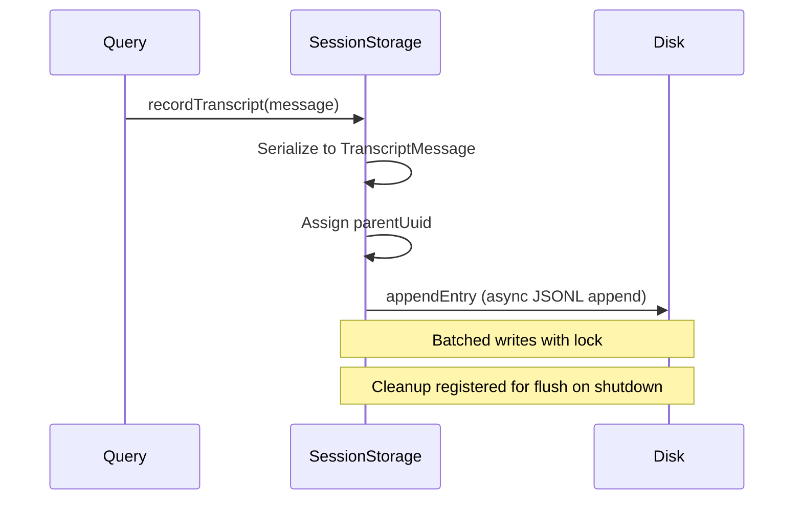

### Session File Operations

- **Write path**: `appendEntry()` -> `appendEntryToFile()` -> `fsAppendFile()` with JSONL format
- **Read path**: `readTranscriptForLoad()` -> `parseJSONL()` -> reconstruct `LogOption`
- **Lite read**: `readHeadAndTail()` scans file boundaries to extract metadata without loading all messages (for the session picker)
- **Flush**: `flushSessionStorage()` ensures all pending entries are written to disk; registered as a cleanup handler

---

## 11. Input History Management

### History Architecture (`history.ts`)

Input history is separate from session transcripts. It records what the user typed (for up-arrow recall and ctrl+r search).

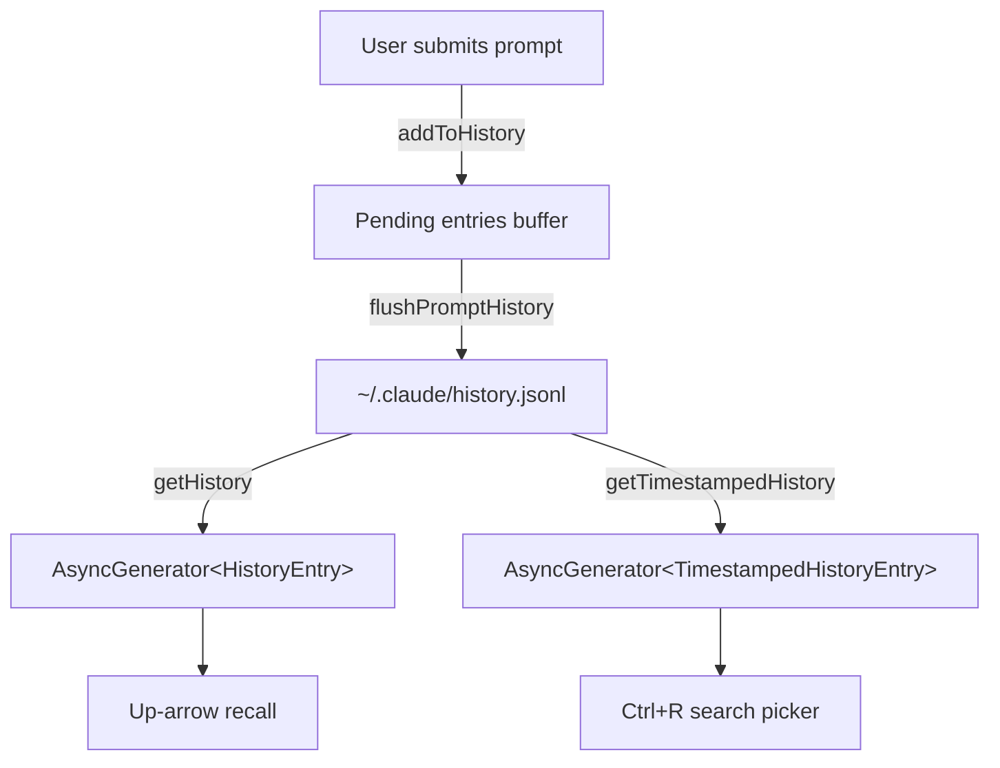

### History Entry Format

```typescript
// On disk:
type LogEntry = {
  display: string
  pastedContents: Record<number, StoredPastedContent>
  timestamp: number
  project: string
  sessionId?: string
}

// In memory (after resolution):
type HistoryEntry = {
  display: string
  pastedContents: Record<number, PastedContent>
}
```

### Pasted Content Handling

Large pasted text is stored externally:

1. Content <= 1024 chars: stored inline in the history entry
2. Content > 1024 chars: SHA-256 hashed, stored in paste store, referenced by hash
3. Images: filtered out (stored separately in image-cache)

### History Session Ordering

`getHistory()` yields current-session entries first, then other sessions. This prevents concurrent sessions from interleaving up-arrow history. Maximum of 100 entries scanned.

### Undo Support

`removeLastFromHistory()` supports rewind-on-interrupt. Fast path pops from the pending buffer. If the entry was already flushed to disk, its timestamp is added to a skip-set consulted by `getHistory()`.

---

## 12. Project Onboarding State

### Onboarding Steps (`projectOnboardingState.ts`)

Project onboarding tracks whether the user has set up their workspace:

```typescript
type Step = {
  key: string           // 'workspace' | 'claudemd'
  text: string
  isComplete: boolean
  isCompletable: boolean
  isEnabled: boolean
}
```

Two steps:
1. **workspace** -- enabled when cwd is empty; asks user to create an app or clone a repo
2. **claudemd** -- enabled when cwd is non-empty; checks for CLAUDE.md file existence

### State Transitions

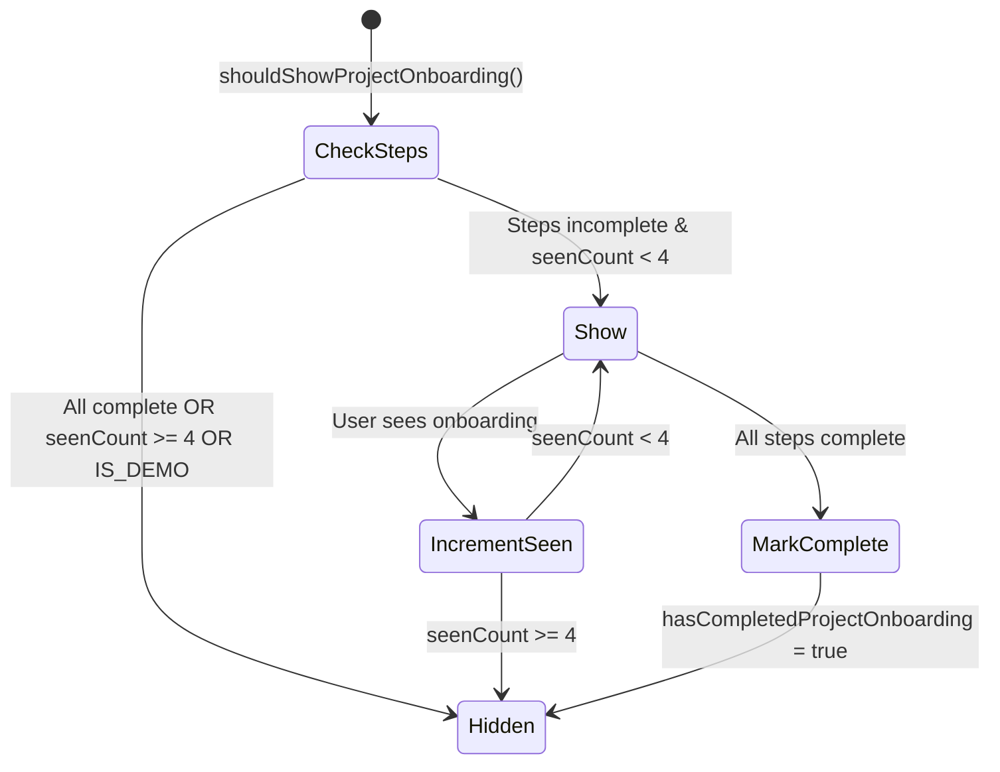

Onboarding state is persisted in `ProjectConfig`:
- `hasCompletedProjectOnboarding: boolean`
- `projectOnboardingSeenCount: number`

`shouldShowProjectOnboarding()` is memoized for first-render performance. `maybeMarkProjectOnboardingComplete()` is called on every prompt submit but short-circuits on cached config to avoid filesystem hits.

---

## 13. Hook System Data Flow

### Hook Schema (`schemas/hooks.ts`)

Hooks are configured via settings.json and validated with Zod schemas:

```typescript
type HookCommand =
  | { type: 'command'; command: string; shell?: 'bash' | 'powershell'; if?: string; timeout?: number; async?: boolean }
  | { type: 'prompt'; prompt: string; model?: string; if?: string; timeout?: number }
  | { type: 'agent'; prompt: string; model?: string; if?: string; timeout?: number }
  | { type: 'http'; url: string; headers?: Record<string, string>; if?: string; timeout?: number }
```

Each hook event maps to an array of matchers, each with a pattern and hooks array:

```typescript
type HooksSettings = Partial<Record<HookEvent, HookMatcher[]>>
type HookMatcher = { matcher?: string; hooks: HookCommand[] }
```

### Hook Event Flow

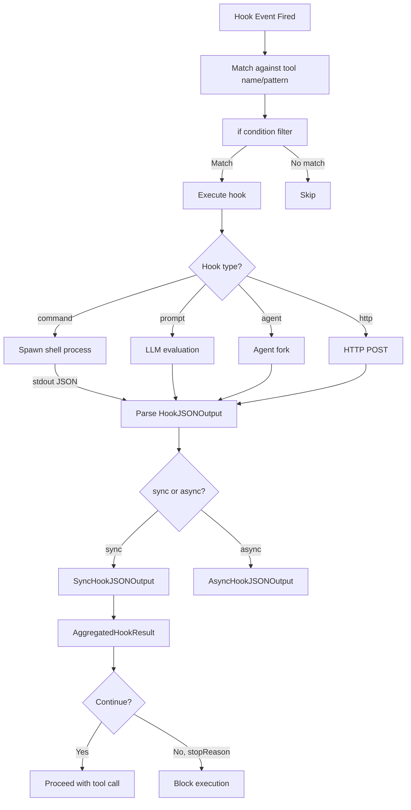

### Hook Result Types

```typescript
type HookResult = {
  outcome: 'success' | 'blocking' | 'non_blocking_error' | 'cancelled'
  message?: Message
  preventContinuation?: boolean
  stopReason?: string
  permissionBehavior?: 'ask' | 'deny' | 'allow' | 'passthrough'
  additionalContext?: string
  updatedInput?: Record<string, unknown>
  updatedMCPToolOutput?: unknown
}

type AggregatedHookResult = {
  blockingErrors?: HookBlockingError[]
  preventContinuation?: boolean
  permissionBehavior?: PermissionResult['behavior']
  additionalContexts?: string[]
  updatedInput?: Record<string, unknown>
}
```

### Hook Callback Context

Internal hooks receive `HookCallbackContext`:

```typescript
type HookCallbackContext = {
  getAppState: () => AppState
  updateAttributionState: (updater: (prev: AttributionState) => AttributionState) => void
}
```

---

## 14. Constants & System Configuration

### Constants Layout

```
src/constants/
  apiLimits.ts        # API-enforced limits (image/PDF sizes, media counts)
  betas.ts            # Beta feature flags for API headers
  common.ts           # Date utilities (getLocalISODate, getSessionStartDate)
  cyberRiskInstruction.ts  # Security-related prompt instructions
  errorIds.ts         # Standardized error identifiers
  figures.ts          # ASCII art / branding
  files.ts            # File-related constants
  github-app.ts       # GitHub integration constants
  keys.ts             # GrowthBook client keys
  messages.ts         # Message constants (NO_CONTENT_MESSAGE)
  oauth.ts            # OAuth configuration
  outputStyles.ts     # Output styling configuration
  product.ts          # Product URLs (claude.ai base URLs, remote session URLs)
  prompts.ts          # Prompt constants
  spinnerVerbs.ts     # Spinner animation text
  system.ts           # System prompt prefix, attribution header
  systemPromptSections.ts  # System prompt section constants
  toolLimits.ts       # Tool-specific limits
  tools.ts            # Tool access control sets
  turnCompletionVerbs.ts   # Turn completion display text
  xml.ts              # XML tag constants for structured output
```

### API Limits (`constants/apiLimits.ts`)

| Constant | Value | Description |
|----------|-------|-------------|
| `API_IMAGE_MAX_BASE64_SIZE` | 5 MB | Max base64-encoded image size |
| `IMAGE_TARGET_RAW_SIZE` | 3.75 MB | Target raw size after encoding overhead |
| `IMAGE_MAX_WIDTH` / `HEIGHT` | 2000 px | Client-side resize dimensions |
| `PDF_TARGET_RAW_SIZE` | 20 MB | Max raw PDF for API |
| `API_PDF_MAX_PAGES` | 100 | Max PDF pages per request |
| `PDF_EXTRACT_SIZE_THRESHOLD` | 3 MB | Above this, PDFs are page-extracted |
| `PDF_MAX_EXTRACT_SIZE` | 100 MB | Absolute PDF size limit |
| `API_MAX_MEDIA_PER_REQUEST` | 100 | Max images + PDFs per request |

### System Prompt Prefix (`constants/system.ts`)

Three variants depending on context:

```typescript
// Interactive CLI
"You are Claude Code, Anthropic's official CLI for Claude."

// Agent SDK with custom system prompt
"You are Claude Code, Anthropic's official CLI for Claude, running within the Claude Agent SDK."

// Agent SDK without custom system prompt
"You are a Claude agent, built on Anthropic's Claude Agent SDK."
```

### QueuedCommand & Message Queue

The `QueuedCommand` type (`types/textInputTypes.ts`) is the fundamental unit for queuing user input:

```typescript
type QueuedCommand = {
  value: string | Array<ContentBlockParam>
  mode: PromptInputMode               // 'bash' | 'prompt' | 'orphaned-permission' | 'task-notification'
  priority?: QueuePriority             // 'now' | 'next' | 'later'
  uuid?: UUID
  pastedContents?: Record<number, PastedContent>
  skipSlashCommands?: boolean          // For remote-received messages
  bridgeOrigin?: boolean               // Filters to bridge-safe commands
  isMeta?: boolean                     // Hidden in UI, visible to model
  origin?: MessageOrigin               // Provenance tracking
  workload?: string                    // Billing attribution
  agentId?: AgentId                    // Target agent (undefined = main thread)
}
```

Priority semantics:
- **`now`** -- interrupt and send immediately, aborts in-flight tool call
- **`next`** -- wait for current tool call to finish, then inject before next API call
- **`later`** -- wait for turn to finish, then process as a new query

---

## Appendix: Key File Reference

| File | Purpose |
|------|---------|
| `src/types/command.ts` | Command/skill type definitions |
| `src/types/hooks.ts` | Hook system types and schemas |
| `src/types/ids.ts` | Branded SessionId/AgentId types |
| `src/types/logs.ts` | Transcript persistence types (Entry union) |
| `src/types/permissions.ts` | Permission modes, rules, decisions |
| `src/types/plugin.ts` | Plugin ecosystem types |
| `src/types/textInputTypes.ts` | Input/queue types |
| `src/schemas/hooks.ts` | Hook Zod schemas (command, prompt, agent, http) |
| `src/state/store.ts` | Minimal store implementation |
| `src/state/AppStateStore.ts` | AppState shape and defaults |
| `src/state/AppState.tsx` | React context provider |
| `src/state/onChangeAppState.ts` | State change side effects |
| `src/state/selectors.ts` | Computed state selectors |
| `src/state/teammateViewHelpers.ts` | Agent transcript view lifecycle |
| `src/Tool.ts` | Tool interface and ToolUseContext |
| `src/query.ts` | Core query loop (async generator) |
| `src/QueryEngine.ts` | High-level query orchestrator |
| `src/history.ts` | Input history (up-arrow, ctrl+r) |
| `src/projectOnboardingState.ts` | Project onboarding state machine |
| `src/utils/config.ts` | GlobalConfig/ProjectConfig persistence |
| `src/utils/sessionStorage.ts` | Transcript JSONL persistence |
| `src/utils/messages.ts` | Message creation/normalization helpers |
| `src/utils/settings/types.ts` | SettingsJson Zod schema |
| `src/services/compact/compact.ts` | Conversation compaction |
| `src/services/compact/autoCompact.ts` | Auto-compaction trigger logic |
| `src/services/tools/StreamingToolExecutor.ts` | Concurrent streaming tool execution |
| `src/services/tools/toolOrchestration.ts` | Tool execution orchestration |
| `src/services/tools/toolExecution.ts` | Individual tool execution pipeline |
| `src/constants/apiLimits.ts` | API-enforced size/count limits |
| `src/constants/tools.ts` | Tool access control sets |
| `src/constants/system.ts` | System prompt prefix, attribution header |
